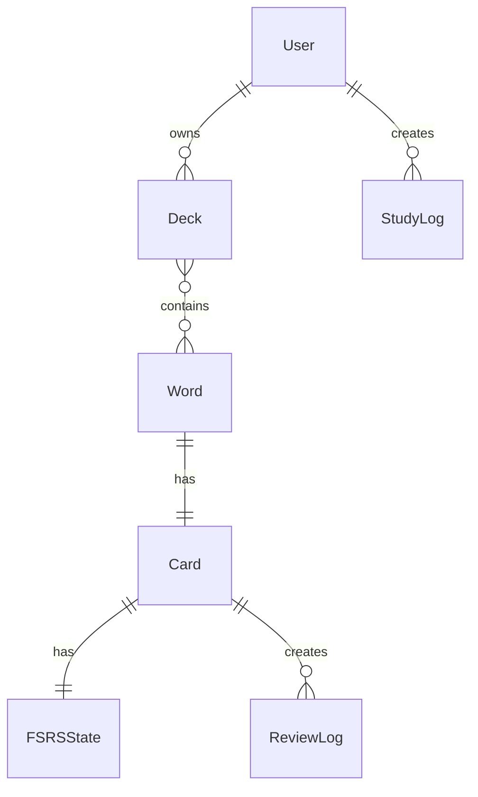

# English Learning Tool

FSRS（Free Spaced Repetition Scheduler）を利用した個別最適型英単語学習プラットフォームです。

英単語学習において、学習者ごとの記憶状態に応じた最適な復習タイミングを提示し、効率的な長期記憶形成を支援することを目的として開発しました。

---

## 目次

- [概要](#概要)
- [主な機能](#主な機能)
- [システム構成](#システム構成)
- [技術スタック](#技術スタック)
- [利用方法](#利用方法)
- [開発環境構築](#開発環境構築)
- [画面一覧](#画面一覧)
- [データモデル](#データモデル)
- [FSRSによる学習管理](#fsrsによる学習管理)
- [API](#api)
- [制約事項](#制約事項)
- [今後の改善予定](#今後の改善予定)

---

# 概要

## システム名称

English Learning Tool

## 開発目的

本システムでは、以下の課題解決を目的としています。

- 英単語学習における復習タイミングの最適化
- 学習者ごとの記憶状態に応じた個別学習
- 英語学習履歴の可視化
- 複数の学習形式への対応

従来型の単語帳では、すべての単語を一定周期で復習するため、既に定着した単語に時間を使う一方で、忘れやすい単語への復習量が不足する問題があります。

本システムでは FSRS を利用することで、各単語の記憶状態を推定し、適切なタイミングで復習対象として提示します。

---

# 主な機能

## 1. 認証機能

- Google OAuthログイン
- デモログイン
- セッション管理
- 認証ユーザーごとのデータ分離

---

## 2. デッキ管理

単語をまとめる単位としてデッキを管理します。

### 利用可能な機能

- デッキ作成
- デッキ編集
- デッキ削除
- デッキ検索
- デッキ詳細表示

また、単語とデッキの関係は M:N として設計されています。

つまり、

- 1つの単語を複数デッキへ登録可能
- 1つのデッキに複数単語を登録可能

という柔軟な管理が可能です。

---

## 3. 単語管理

### 登録可能情報

| 項目       | 内容           |
| ---------- | -------------- |
| 単語       | 英単語         |
| 意味       | 日本語訳       |
| 品詞       | 名詞・動詞など |
| 定義       | 詳細説明       |
| 例文       | 使用例         |
| 所属デッキ | 複数指定可能   |

---

## 4. 学習機能

以下の学習モードに対応しています。

| モード     | 内容                     |
| ---------- | ------------------------ |
| 英日       | 英単語から意味を回答     |
| 日英       | 日本語から英単語を回答   |
| リスニング | 音声を利用した学習       |
| 発音       | 発音確認を目的とした学習 |

---

## 5. FSRSによる復習管理

学習後の回答結果を利用し、FSRSにより以下を更新します。

- 次回復習予定日
- 難易度
- 安定度
- 学習状態

これにより、単語ごとに異なる復習周期を設定します。

---

## 6. 学習履歴・統計

学習結果を保存し、以下を確認できます。

- 学習回数
- 正答率
- 学習時間
- 継続日数
- 期間別統計

---

# システム構成

```mermaid
flowchart TB

Client[Next.js Client]

Server[Next.js Server Actions / API]

Auth[Auth.js]

Prisma[Prisma ORM]

DB[(MySQL)]

Client --> Server
Server --> Auth
Server --> Prisma
Prisma --> DB
````

---

# 技術スタック

## Frontend

| 技術                             | バージョン | 用途                                |
| -------------------------------- | ---------- | ----------------------------------- |
| **Next.js**                      | `v15.3.3`  | Webアプリケーションフレームワーク   |
| **React**                        | `v19.0.0`  | UI構築                              |
| **TypeScript**                   | `v5.8.3`   | 型安全な開発                        |
| **Tailwind CSS**                 | `v4.3.3`   | UIデザイン                          |
| **shadcn/ui**                    | -          | UIコンポーネント（Radix UI ベース） |
| **Zustand**                      | `v5.0.14`  | クライアント状態管理                |
| **TanStack Query (React Query)** | `v5.101.4` | データ取得・非同期状態管理          |
| **Lucide React**                 | `v1.26.0`  | アイコンライブラリ                  |
| **framer-motion**                | `v12.43.0` | アニメーション                      |

---

## Backend

| 技術                       | バージョン       | 用途                     |
| -------------------------- | ---------------- | ------------------------ |
| **Next.js Server Actions** | `v15.3.3`        | サーバ処理               |
| **API Routes**             | `v15.3.3`        | API提供                  |
| **Auth.js (NextAuth.js)**  | `v5.0.0-beta.32` | 認証管理                 |
| **Prisma**                 | `v6.16.2`        | ORM                      |
| **Zod**                    | `v4.4.3`         | スキーマ・バリデーション |

---

## Database

| 技術      | バージョン | 用途       |
| --------- | ---------- | ---------- |
| **MySQL** | `v8.4`     | データ保存 |

---

# 利用方法

## 公開環境

以下のURLから利用できます。

```

```

---

## ログイン

### Googleログイン

Googleアカウントを利用してログインできます。

---

### デモログイン

動作確認用としてデモアカウントを利用できます。

※公開環境ではデモデータが利用できます。

---

# 基本的な利用手順

## 1. ログイン

[スクリーンショット挿入予定]

ログイン画面から認証を行います。

---

## 2. デッキ作成

[スクリーンショット挿入予定]

学習したい単語を管理するデッキを作成します。

例:

```
TOEIC Vocabulary
Academic English
Programming Terms
```

---

## 3. 単語追加

[スクリーンショット挿入予定]

単語情報を入力し、所属デッキを選択します。

---

## 4. 学習開始

[スクリーンショット挿入予定]

学習モードと出題条件を設定して学習を開始します。

---

## 5. 学習結果確認

[スクリーンショット挿入予定]

終了後、以下を確認できます。

* 正答数
* 不正解数
* 正答率
* FSRS更新結果

---

# 開発環境構築

## 必要環境

* Node.js
* npm / pnpm
* MySQL

---

## インストール

```bash
git clone （リポジトリURL）

cd english-learning-tool

pnpm install
```

---

## 環境変数設定

`.env` を作成します。

例:

```env
DATABASE_URL=

AUTH_SECRET=

GOOGLE_CLIENT_ID=

GOOGLE_CLIENT_SECRET=
```

---

## データベース設定

```bash
pnpm prisma migrate dev
```

---

## 起動

```bash
pnpm dev
```

開発環境:

```
http://localhost:3000
```

---

# 画面一覧

| 画面           | URL         | 説明         |
| -------------- | ----------- | ------------ |
| ログイン       | /           | 認証画面     |
| ダッシュボード | /dashboard  | 学習状況確認 |
| デッキ一覧     | /decks      | デッキ管理   |
| 単語一覧       | /words      | 単語管理     |
| 学習開始       | /study      | 学習設定     |
| 学習画面       | /study/*    | 各種学習     |
| 履歴           | /history    | 学習履歴     |
| 統計           | /statistics | 分析画面     |
| 設定           | /settings   | ユーザー設定 |

---

# データモデル

主要なモデル:

| モデル         | 役割           |
| -------------- | -------------- |
| User           | ユーザー情報   |
| Deck           | 単語帳         |
| Word           | 単語           |
| Card           | 学習カード     |
| FSRSState      | FSRS状態       |
| ReviewLog      | 回答履歴       |
| StudyLog       | 学習セッション |
| DailyStatistic | 日次統計       |

---

## ER図



---

# API

## Health Check

```
GET /api/health
```

サーバ状態を確認します。

---

## Demo Reset

```
POST /api/demo/reset
```

デモ環境のデータを初期化します。

---

## Test Harness

```
GET /api/test-harness
```

学習カードやFSRS状態の整合性確認を行います。

---

# 制約事項

現在以下の機能は未実装または制限があります。

* CSVインポートはUIのみ実装
* 公開デッキ機能は一部制限あり
* 一部統計値はプレースホルダ
* 学習順序設定はlocalStorage管理

---

# 今後の改善予定

* CSVインポート完全対応
* 単語音声自動生成
* AIによる例文生成
* 学習傾向分析
* モバイルアプリ化
* 複数ユーザー間でのデッキ共有

---

# License

This project is for educational and research purposes.
