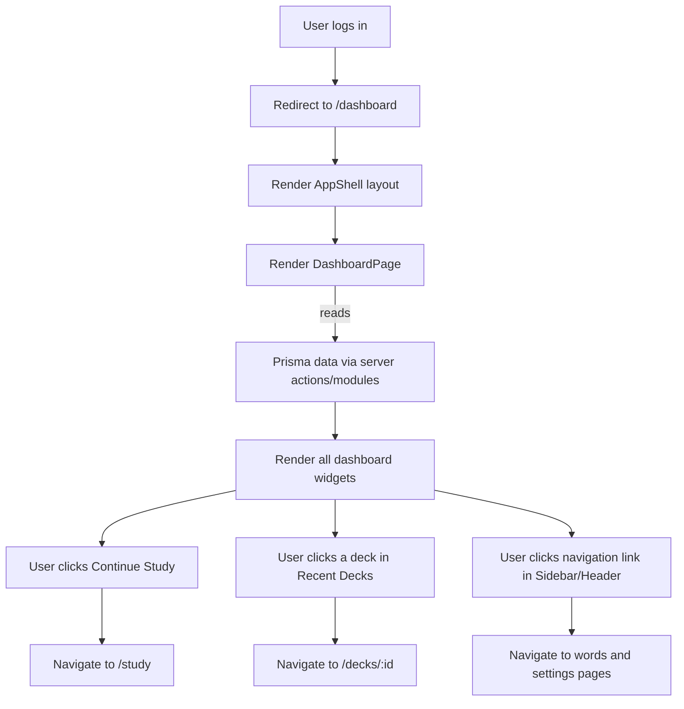

# Dashboard Screen

## 1. Purpose
To provide users with a comprehensive overview of their learning progress, upcoming reviews, and quick access to key application features. It serves as the main hub after logging in.

## 2. URL
- `/dashboard`

## 3. Component Implementation
The dashboard has been implemented with a component-based architecture using Next.js, TypeScript, and shadcn/ui.

### Layout Structure
- **`src/app/(app)/layout.tsx`**: Main app shell provided by `<AppShell>`.
- **`<AppShell>` (`src/components/layout/app-shell.tsx`)**: Composes the `Sidebar`, `Header`, and main content area.
- **`<Sidebar>` (`src/components/layout/sidebar.tsx`)**: Static left navigation panel.
- **`<Header>` (`src/components/layout/header.tsx`)**: Top header bar.

### Dashboard Page
- **`src/app/(app)/dashboard/page.tsx`**: The main page container that arranges all the dashboard widgets in a responsive grid.

### Dashboard Widgets (`src/components/dashboard/`)
- **`WelcomeBanner`**: Greets the user and provides a primary "Continue Study" CTA.
- **`StatsGrid`**: A 4-column responsive grid displaying key metrics.
    - **`MetricCard`**: A reusable card for showing a single statistic (e.g., "Words Learned").
- **`TodayProgressCard`**: A large card showing daily learning activity.
    - **`CircularProgress`**: A custom component using `recharts` to render the "78% done" chart.
- **`StudyGoals`**: A card that tracks progress toward daily, weekly, and deck-mastery goals.
- **`RecentDecks`**: A section that displays a grid of recently used decks.
    - **`DeckCard`**: A reusable card for displaying information about a single deck.
- **`WeeklyActivity`**: A card containing a bar chart to visualize study activity over the week. It uses `recharts` for the chart.

## 4. Dependencies
- **`recharts`**: Added to render the bar chart in `WeeklyActivity` and the circular progress in `TodayProgressCard`.
- **`lucide-react`**: Used for all iconography, managed via `src/components/icons.tsx`.

## 5. State & Data
- Dashboard data is loaded from Prisma-backed server modules, primarily **`src/lib/dashboard-data.ts`** and **`src/lib/data/dashboard.ts`**.

## 6. Screen Flow / Navigation

