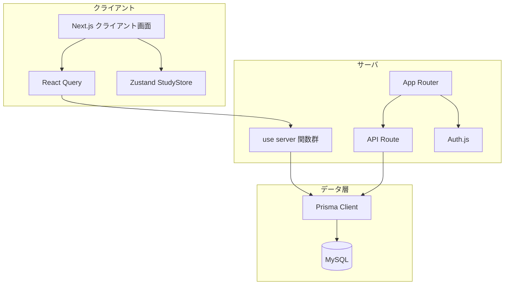
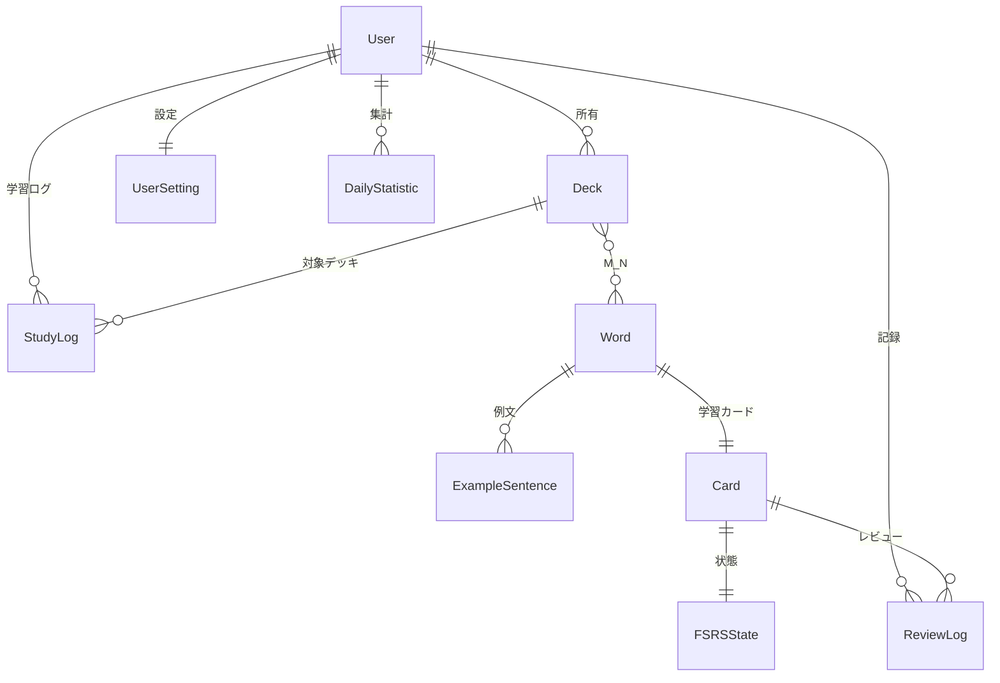
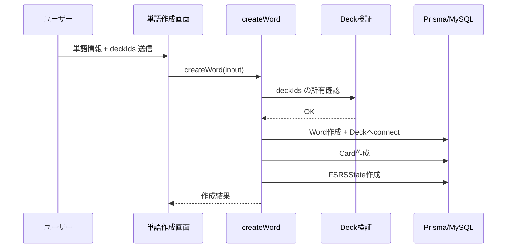
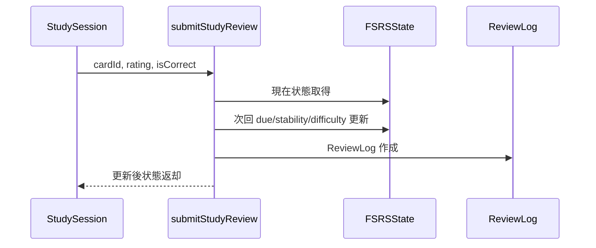
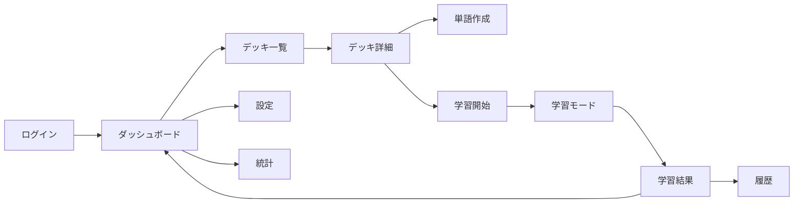

# 1. 設計方針

- Next.js App Router を中心に、画面層とサーバ処理層を分離する。
- 認証は Auth.js（Google + Demo）を採用する。
- DB は Prisma + MySQL を採用する。
- 単語とデッキは M:N 関連で設計する。
- 画面は React Query でサーバ処理を呼び出し、表示更新を行う。

# 2. 全体アーキテクチャ

# 3. ルーティング設計

## 3.1 主要画面ルート

| ルート | 用途 |
| --- | --- |
| / | ログイン |
| /dashboard | ダッシュボード |
| /decks | デッキ一覧 |
| /decks/new | デッキ作成 |
| /decks/:id | デッキ詳細 |
| /decks/:id/edit | デッキ編集 |
| /words | 単語一覧 |
| /words/new | 単語作成 |
| /words/:id | 単語詳細 |
| /words/:id/edit | 単語編集 |
| /study | 学習開始設定 |
| /study/en-ja | 英日学習 |
| /study/ja-en | 日英学習 |
| /study/listening | リスニング学習 |
| /study/pronunciation | 発音学習 |
| /study/result | 学習結果 |
| /history | 学習履歴 |
| /statistics | 統計 |
| /settings | 設定 |
| /public-decks | 公開デッキ一覧 |
| /public-decks/:id | 公開デッキ詳細 |
| /csv-import | CSV取込画面（Mock） |

## 3.2 認証制御

- middleware により、原則として認証必須画面を保護する。
- 未認証時は / へリダイレクトし callbackUrl を付与する。

# 4. データモデル基本設計

## 4.1 ER 図（現行実装準拠）

## 4.2 M:N 関連の実装方針

- Prisma スキーマ上は Deck.words と Word.decks で双方向定義する。
- DB 上は暗黙中間テーブル _DeckToWord により関連を管理する。
- 既存 1:N からの移行は migration 20260730103000_word_deck_many_to_many で実施済み。

## 4.3 論理削除方針

- Deck と Word は deletedAt を用いた論理削除を採用する。
- 一覧系・集計系は deletedAt = null を前提に取得する。

# 5. 処理方式設計

## 5.1 サーバ処理（use server）

- src/lib/data/decks.ts: デッキ一覧/詳細/作成/更新/削除/公開複製
- src/lib/data/words.ts: 単語一覧/詳細/作成/更新/公開参照
- src/lib/data/study.ts: 学習開始デッキ解決、出題取得、レビュー送信
- src/lib/data/history.ts: 学習結果保存、履歴取得
- src/lib/data/dashboard.ts と src/lib/dashboard-data.ts: 集計
- src/lib/data/settings.ts: 設定取得/更新

## 5.2 API ルート

| ルート | メソッド | 目的 |
| --- | --- | --- |
| /api/auth/[...nextauth] | GET, POST | Auth.js 認証ハンドラ |
| /api/health | GET | ヘルスチェック |
| /api/demo/reset | POST | デモデータ再生成 |
| /api/test-harness | GET | カード/FSRS状態補修 |

# 6. 主要データフロー

## 6.1 単語作成フロー（M:N）

## 6.2 学習レビュー送信フロー

# 7. 画面遷移設計

# 8. UI 基本設計

## 8.1 一覧・詳細パターン

- 一覧は検索 + 空状態表示 + ローディングスケルトンを基本とする。
- 詳細は関連情報（単語に対する複数デッキなど）をカード分割で表示する。

## 8.2 入力バリデーション

- フォーム入力は Zod で定義し、react-hook-form から参照する。
- 文字数上限、必須、配列最小件数を画面とサーバ処理で整合させる。

# 9. 現状制約

- デッキ公開可否は DB カラム未整備のため、将来拡張扱い。
- CSV インポートは UI モック段階。
- 一部表示文言は英語/日本語が混在している。

# 10. 改訂履歴

| 版数 | 日付 | 内容 |
| --- | --- | --- |
| 2.0 | 2026-07-30 | 実装準拠へ全面更新。Word-Deck M:N を反映。 |
