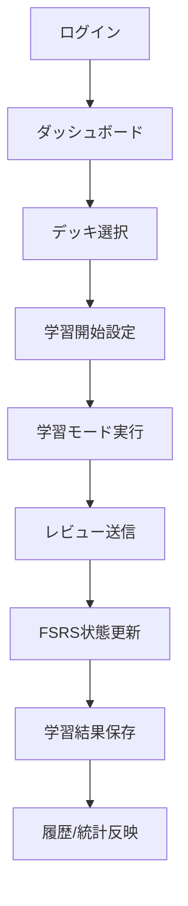
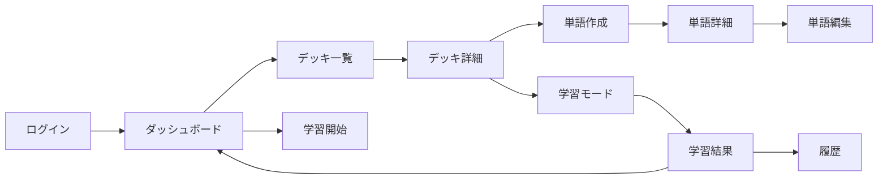

# 1. 文書目的

本書は、現行実装に整合した英単語学習プラットフォームの要件を定義する。
特に、単語とデッキの関連を 1:N ではなく M:N として統一し、機能範囲・利用シナリオ・受入観点を最新化する。

# 2. システム概要

## 2.1 システム名称

English Learning Tool

## 2.2 開発目的

- FSRS に基づく最適な復習タイミング提示
- 英日/日英/リスニング/発音の複数学習モード提供
- 学習履歴と統計の可視化
- 単語帳（デッキ）中心の継続学習導線提供

## 2.3 対象ユーザー

- 主利用者: 学習者（現在は個人利用を中心）
- 認証方式: Google OAuth、およびデモログイン

## 2.4 対応環境

- ブラウザ（PC/スマートフォン）
- Next.js App Router ベースの Web アプリ

# 3. 業務要件

## 3.1 学習業務フロー

## 3.2 管理対象

- ユーザー
- 学習設定
- デッキ
- 単語
- 学習カード/FSRS状態
- レビュー履歴
- 学習セッション履歴
- 日次統計

## 3.3 単語-デッキ関連要件（重要）

- 単語は複数デッキに所属できる。
- デッキは複数単語を保持できる。
- 関連は M:N とし、実装上は Prisma の暗黙中間テーブル（_DeckToWord）で管理する。
- 単語作成・編集時は deckIds 配列で所属デッキを指定する。

# 4. 機能要件

## 4.1 認証機能

- Google ログイン
- デモログイン
- 未認証時の保護画面リダイレクト
- セッションに user.id を保持

## 4.2 デッキ管理機能

- デッキ作成
- デッキ一覧表示・検索
- デッキ詳細表示
- デッキ編集
- デッキ削除（論理削除）
- 公開デッキ一覧/詳細の閲覧
- 公開デッキ複製

## 4.3 単語管理機能

- 単語一覧表示・検索
- 単語作成（複数デッキ所属）
- 単語詳細表示（所属デッキ複数表示）
- 単語編集（deckIds 再設定）

## 4.4 学習機能

- 学習開始設定（モード、入力方式、新規上限、復習上限）
- 英日学習
- 日英学習
- リスニング学習
- 発音学習
- 学習中レビュー送信
- FSRS状態更新
- 学習結果表示

## 4.5 履歴・統計機能

- 学習履歴一覧表示
- 期間別統計（7/30/90日）
- ダッシュボード集計（総デッキ、総単語、Due、新規、週次活動）

## 4.6 設定機能

- 新規上限・復習上限
- 学習順序（ローカル保存）
- テーマ
- Typing 判定上書き許可

## 4.7 補助機能

- ヘルスチェック API
- デモデータ再初期化 API
- 学習データ整合性補修 API（テスト用途）

# 5. ユーザーストーリー

## 5.1 学習者として

- 複数のデッキにまたがって単語を運用したい。
  - 受入条件: 単語作成/編集で 1件以上のデッキを選択でき、詳細画面で複数デッキが確認できる。

- 期限到来カードを優先して学習を開始したい。
  - 受入条件: クイックスタートで due-review を優先したデッキ解決が行われる。

- 学習結果を履歴と統計で確認したい。
  - 受入条件: 学習終了後に履歴へ記録され、統計画面に反映される。

- 公開デッキを取り込みたい。
  - 受入条件: 公開デッキ詳細から複製名を指定して自分のデッキとして作成できる。

# 6. 画面要件

## 6.1 主要画面

- ログイン
- ダッシュボード
- デッキ一覧/詳細/作成/編集
- 単語一覧/詳細/作成/編集
- 学習開始、各学習モード、結果
- 履歴
- 統計
- 設定
- 公開デッキ一覧/詳細
- CSVインポート（現状は Mock UI）

## 6.2 画面遷移（要点）

# 7. 非機能要件

## 7.1 セキュリティ

- 認証必須画面はミドルウェアで保護する。
- サーバ側データ操作はセッション user.id による所有者判定を行う。

## 7.2 可用性

- ヘルスチェック API を提供する。
- デモ環境で再初期化可能にする。

## 7.3 保守性

- Zod による入力検証を統一利用する。
- Prisma による型安全な DB 操作を採用する。

## 7.4 性能

- 一覧系は検索条件と上限件数を受け付ける。
- ダッシュボード集計は並列取得を基本とする。

# 8. API/サーバ処理要件（概要）

## 8.1 APIルート

- GET /api/health
- GET/POST /api/auth/[...nextauth]
- POST /api/demo/reset
- GET /api/test-harness

## 8.2 サーバ側処理（use server）

- src/lib/data/decks.ts
- src/lib/data/words.ts
- src/lib/data/study.ts
- src/lib/data/history.ts
- src/lib/data/dashboard.ts
- src/lib/data/settings.ts

# 9. 現状制約・未実装範囲

- CSVインポートは UI のみで実処理は未実装。
- デッキ公開状態は isPublic フィールド未実装のため、現状は擬似的に扱う箇所がある。
- 単語正答率は一部プレースホルダ値（0）を返す実装がある。
- 学習順序は DB ではなく localStorage を優先して保持する。

# 10. 改訂履歴

| 版数 | 日付 | 内容 |
| --- | --- | --- |
| 2.0 | 2026-07-30 | 現行実装に全面追従。Word-Deck を M:N 前提へ更新。 |
