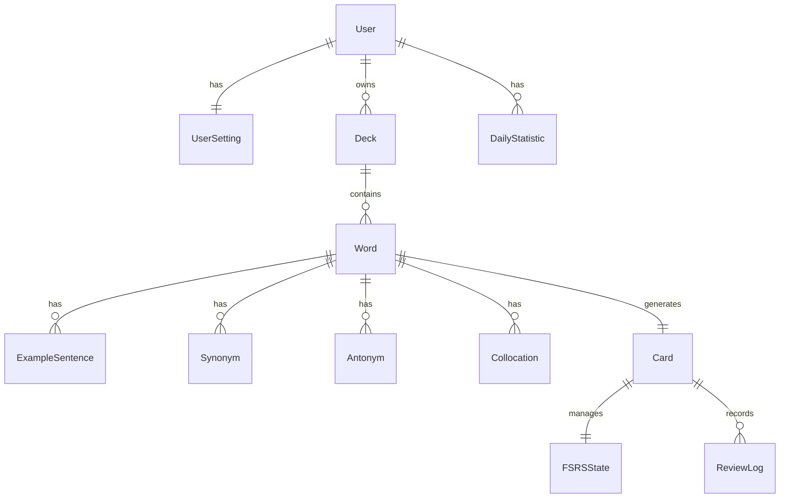

# 1. システム構成

## 1.1 目的

本章では、本システムのソフトウェア構成、実装方針および開発ルールを定義する。

開発者が同一の設計思想に基づいて実装を行えるよう、ディレクトリ構成、レイヤー構成、モジュール構成、命名規則、コーディング規約、依存関係などを明確に定義する。

---

## 1.2 システム全体構成

本システムは、クライアント・サーバ・データベースを分離した三層アーキテクチャを採用する。

```text
┌──────────────────────────┐
│      Browser (PWA)       │
└────────────┬─────────────┘
             │ HTTPS
┌────────────▼─────────────┐
│      Next.js Server      │
└────────────┬─────────────┘
             │ Prisma ORM
┌────────────▼─────────────┐
│          MySQL           │
└──────────────────────────┘
```

各層の責務を以下に示す。

| 層       | 主な責務                                   |
| -------- | ------------------------------------------ |
| Client   | UI描画・状態管理・FSRS計算・オフライン管理 |
| Server   | API・認証・データ整合性管理                |
| Database | 永続化・検索・トランザクション管理         |

---

## 1.3 ソフトウェア構成

システムを以下のモジュールへ分割する。

| モジュール   | 主な責務           |
| ------------ | ------------------ |
| App          | ルーティング       |
| UI           | 画面表示           |
| Components   | 共通UI部品         |
| Features     | 機能単位の画面実装 |
| Services     | 業務ロジック       |
| Repositories | データアクセス     |
| Stores       | 状態管理           |
| Database     | Prisma             |
| Offline      | IndexedDB管理      |
| Sync         | 同期処理           |
| Utils        | 共通処理           |

各モジュールは単一責務を原則とし、責務の重複を避ける。

---

## 1.4 プロジェクトディレクトリ構成

```text
src/
├── app/
├── components/
├── features/
├── hooks/
├── services/
├── repositories/
├── stores/
├── lib/
├── utils/
├── types/
├── constants/
├── schemas/
├── workers/
├── assets/
└── styles/

prisma/
public/
docs/
```

### ディレクトリ責務

| ディレクトリ | 内容           |
| ------------ | -------------- |
| app          | App Router     |
| components   | 共通UI         |
| features     | 機能単位実装   |
| hooks        | カスタムHook   |
| services     | 業務ロジック   |
| repositories | DBアクセス     |
| stores       | Zustand        |
| lib          | 初期化処理     |
| utils        | 汎用関数       |
| types        | 型定義         |
| constants    | 定数           |
| schemas      | Zod            |
| workers      | Service Worker |
| assets       | 静的リソース   |
| styles       | 共通CSS        |

---

## 1.5 レイヤー構成

```text
Presentation Layer
        │
Application Layer
        │
Domain Layer
        │
Infrastructure Layer
```

### Presentation Layer

画面表示および利用者操作を担当する。

対象

- app
- components

### Application Layer

ユースケースを実装する。

対象

- features
- services

### Domain Layer

ビジネスルールおよび型を管理する。

対象

- types
- DTO
- Entity

### Infrastructure Layer

永続化および外部サービス連携を担当する。

対象

- Prisma
- Repository
- IndexedDB
- External API

---

## 1.6 モジュール依存関係

依存方向は以下とする。

```text
UI
 ↓
Feature
 ↓
Service
 ↓
Repository
 ↓
Prisma
 ↓
Database
```

逆方向の依存は禁止する。

また、Presentation LayerからDatabaseへ直接アクセスしてはならない。

---

## 1.7 使用ライブラリ

| ライブラリ   | 用途          |
| ------------ | ------------- |
| Next.js      | Web Framework |
| React        | UI            |
| TypeScript   | 型安全        |
| Prisma       | ORM           |
| Auth.js      | 認証          |
| Zustand      | 状態管理      |
| Dexie.js     | IndexedDB     |
| Zod          | 入力検証      |
| Tailwind CSS | CSS           |
| shadcn/ui    | UI部品        |

ライブラリ追加時は採用理由を明確にする。

---

## 1.8 命名規則

### コンポーネント

PascalCase

例

```text
WordCard
ReviewDialog
DeckList
```

### 関数

camelCase

```text
createDeck()
syncReviews()
calculateFSRS()
```

### 変数

camelCase

```text
reviewCount
nextReviewDate
```

### 型

PascalCase

```text
DeckDto
ReviewRequest
```

### Interface

PascalCase

```text
DeckRepository
ReviewService
```

### Enum

PascalCase

```text
CardState
SyncStatus
```

### 定数

UPPER_SNAKE_CASE

```text
MAX_NEW_CARD
DEFAULT_RETENTION
```

---

## 1.9 コーディング規約

- TypeScript Strict Modeを有効にする。
- ESLintエラーを残さない。
- Prettierで自動整形する。
- any型は禁止する。
- unknownを優先する。
- Optional Chainingを利用する。
- Null安全を考慮する。
- async/awaitを使用する。
- Promiseチェーンは原則使用しない。
- Magic Numberは禁止する。
- 共通処理はUtility化する。

---

## 1.10 設計原則

本システムでは以下を採用する。

### 単一責任原則

一つのクラス・コンポーネントは一つの責務のみを持つ。

### 関心の分離

UI、業務ロジック、データアクセスを分離する。

### 型安全

TypeScriptによる静的型検査を最大限活用する。

### 再利用性

共通処理はコンポーネント・Utility・Hookとして共通化する。

### オフラインファースト

通信環境に依存せず利用可能な設計とする。

### 保守性

将来的な機能追加に対応しやすい構造とする。

---

## 1.11 パスエイリアス

ソースコードでは相対パスを極力使用せず、パスエイリアスを利用する。

| エイリアス     | ディレクトリ |
| -------------- | ------------ |
| @              | src          |
| @/components   | components   |
| @/features     | features     |
| @/services     | services     |
| @/repositories | repositories |
| @/stores       | stores       |
| @/types        | types        |
| @/utils        | utils        |
| @/constants    | constants    |
| @/schemas      | schemas      |

---

## 1.12 Import順序

Import文は以下の順序で記述する。

1. React
2. Next.js
3. 外部ライブラリ
4. エイリアス（@）
5. 相対パス
6. CSS

グループ間には1行空行を設ける。

---

## 1.13 コメント記述方針

以下の場合のみコメントを記述する。

- 複雑なアルゴリズム
- 実装理由
- 注意事項
- 将来対応予定

コードの内容を説明するだけのコメントは記述しない。

公開APIにはJSDocコメントを付与する。

---

## 1.14 例外設計方針

例外は業務例外とシステム例外を区別する。

| 種類                    | 内容           |
| ----------------------- | -------------- |
| BusinessException       | 入力不正等     |
| ValidationException     | バリデーション |
| AuthenticationException | 認証           |
| AuthorizationException  | 権限           |
| NotFoundException       | データ不存在   |
| ConflictException       | 競合           |
| SystemException         | 想定外エラー   |

---

## 1.15 環境変数管理

環境変数は以下のルールで管理する。

| 種類             | 命名          |
| ---------------- | ------------- |
| クライアント利用 | NEXT_PUBLIC_* |
| サーバ専用       | その他        |

`.env.local` はGit管理対象外とする。

---

## 1.16 設定ファイル管理

設定ファイルを以下に示す。

| ファイル             | 用途           |
| -------------------- | -------------- |
| package.json         | パッケージ管理 |
| tsconfig.json        | TypeScript設定 |
| next.config.ts       | Next.js設定    |
| eslint.config.js     | ESLint         |
| prettier.config.js   | Prettier       |
| tailwind.config.ts   | Tailwind CSS   |
| components.json      | shadcn/ui      |
| prisma/schema.prisma | Prisma         |

---

## 1.17 開発ブランチ運用

GitはGitHub Flowを基本とする。

```text
main
 ├── feature/*
 ├── fix/*
 ├── refactor/*
 └── docs/*
```

直接mainブランチへコミットしてはならない。

---

## 1.18 コミットメッセージ規約

Conventional Commitsを採用する。

例

```text
feat: 学習履歴保存APIを追加

fix: FSRS計算バグ修正

docs: 詳細設計書更新

refactor: ReviewService整理
```

---

## 1.19 開発時品質基準

Pull Request前に以下を満たすこと。

- ESLintエラーなし
- TypeScriptエラーなし
- ビルド成功
- テスト成功
- Prettier適用済み
- 不要なconsole.log削除

---

# 2. データベース詳細設計

## 2.1 目的

本章では、本システムで使用するデータベースの詳細設計を定義する。

基本設計書で定義したデータモデルを基に、各テーブルの責務、カラム構成、データ型、制約、リレーションおよび設計方針を詳細化し、実装者がPrisma SchemaおよびMySQLデータベースを構築できることを目的とする。

本章で定義する内容は以下のとおりである。

- テーブル定義
- カラム定義
- データ型
- 主キー・外部キー
- インデックス
- 一意制約
- リレーション
- 共通カラム
- 論理削除
- 排他制御
- Migration運用
- パフォーマンス設計

---

## 2.2 設計方針

本システムのデータベース設計では、以下の方針を採用する。

### 2.2.1 正規化

データベースは原則として第三正規形（3NF）を満たす構造とする。

冗長なデータ保持を避け、更新時の整合性を維持する。

一方、性能上必要な場合は集計テーブルなどの非正規化を認める。

---

### 2.2.2 UUIDによる主キー管理

全テーブルの主キーはUUID Version 7を使用する。

UUIDv7を採用する理由は以下のとおりである。

- 時系列順に並ぶためインデックス効率が高い
- 分散環境でも一意性を保証できる
- URLなどへ公開しても連番が推測されない

---

### 2.2.3 Prisma ORMを前提とした設計

本システムではPrisma ORMを採用する。

そのため、

- 外部キー
- Relation
- Cascade
- Composite Index

などはPrisma Schemaとの整合性を考慮して設計する。

---

### 2.2.4 オフラインファースト

IndexedDBとの同期を前提とするため、

各レコードは同期状態を管理できる設計とする。

必要に応じて以下の情報を保持する。

- 更新日時
- 作成日時
- 同期状態
- 同期対象フラグ

---

### 2.2.5 論理削除

利用者データは原則として物理削除を行わない。

削除時は論理削除とし、

```text
deletedAt
```

へ削除日時を保存する。

物理削除は管理者によるメンテナンス時のみ実施する。

---

### 2.2.6 タイムゾーン

日時はすべてUTCで保存する。

画面表示時のみ利用者のタイムゾーンへ変換する。

---

### 2.2.7 文字コード

データベース全体で以下を使用する。

| 項目          | 値                 |
| ------------- | ------------------ |
| Character Set | utf8mb4            |
| Collation     | utf8mb4_unicode_ci |

---

### 2.2.8 NULL設計

NULLは必要最小限とする。

以下を原則とする。

- 必須項目はNOT NULL
- Optional項目のみNULL許可
- 空文字とNULLを混在させない

---

### 2.2.9 データ整合性

整合性は以下で保証する。

- Primary Key
- Foreign Key
- Unique Constraint
- Check Constraint
- Transaction

アプリケーション側だけでなく、データベース側でも整合性を担保する。

---

## 2.3 データベース概要

### DBMS

MySQL 8.x

---

### ORM

Prisma ORM

---

### データ保存方式

リレーショナルデータベース

---

### 主キー方式

UUID Version 7

---

### 更新方式

CRUD

---

### 排他方式

楽観的排他制御

---

### 削除方式

論理削除

---

### バックアップ

定期バックアップ

---

### Migration

Prisma Migrate

---

### ER構成

本システムは以下の主要エンティティで構成される。

```text
User

│

├── Deck

│      │

│      └── Word

│               │

│               ├── Card

│               │      │

│               │      └── ReviewLog

│               │

│               └── Bookmark

│

├── LearningSession

│

├── DailyStatistic

│

└── UserSettings
```

---

## 2.4 テーブル一覧

本システムで管理するテーブルを以下に示す。

| テーブル名      | 説明                   |
| --------------- | ---------------------- |
| User            | 利用者情報             |
| Deck            | 単語帳                 |
| Word            | 英単語                 |
| Card            | 学習カード（FSRS管理） |
| ReviewLog       | 復習履歴               |
| Bookmark        | お気に入り             |
| LearningSession | 学習セッション         |
| DailyStatistic  | 日別統計               |
| UserSettings    | 利用者設定             |
| SyncQueue       | オフライン同期キュー   |
| Notification    | 通知                   |
| AuditLog        | 操作ログ               |

### テーブル分類

| 分類       | テーブル                          |
| ---------- | --------------------------------- |
| マスタ     | User・UserSettings                |
| 業務データ | Deck・Word・Card                  |
| 履歴       | ReviewLog・LearningSession        |
| 集計       | DailyStatistic                    |
| システム   | SyncQueue・AuditLog・Notification |

---

## 2.5 共通カラム設計

各テーブルで共通して使用するカラムを以下に定義する。

| カラム    | 型       | NULL | 説明            |
| --------- | -------- | ---- | --------------- |
| id        | UUID     | ×    | 主キー          |
| createdAt | DATETIME | ×    | 作成日時（UTC） |
| updatedAt | DATETIME | ×    | 更新日時（UTC） |
| deletedAt | DATETIME | ○    | 論理削除日時    |

必要に応じて以下の共通カラムを追加する。

| カラム     | 型       | 説明                   |
| ---------- | -------- | ---------------------- |
| version    | INTEGER  | 楽観ロック用バージョン |
| syncStatus | ENUM     | 同期状態               |
| syncedAt   | DATETIME | 最終同期日時           |

---

### createdAt

レコード作成日時を保持する。

アプリケーション側で更新してはならない。

---

### updatedAt

レコード更新時に自動更新する。

更新競合検知にも利用する。

---

### deletedAt

NULLの場合は有効データとする。

値が設定されている場合は論理削除済みデータとみなす。

通常の検索では除外する。

---

### version

楽観ロックを行うテーブルのみ保持する。

更新時は

```text
version = version + 1
```

とする。

---

### syncStatus

オフライン同期対象テーブルのみ保持する。

値は以下とする。

| 値        | 説明     |
| --------- | -------- |
| PENDING   | 未同期   |
| SYNCING   | 同期中   |
| COMPLETED | 同期済み |
| FAILED    | 同期失敗 |

---

### 共通インデックス

以下のインデックスを推奨する。

| カラム    | 用途         |
| --------- | ------------ |
| createdAt | 新着順表示   |
| updatedAt | 同期処理     |
| deletedAt | 論理削除検索 |

---

### 共通制約

全テーブルで以下を遵守する。

- Primary KeyはUUIDv7とする。
- 作成日時は更新してはならない。
- 更新日時は更新時に自動更新する。
- deletedAtがNULLでないデータは通常検索対象外とする。
- 外部キー制約を必ず設定する。
- 必要に応じてON DELETE CASCADEまたはRESTRICTを設定する。

---

### 共通設計ルール

- カラム名はcamelCaseを採用する。
- テーブル名はPascalCaseではなく単数形とする（Prismaモデルとの整合性を考慮）。
- BOOLEAN型は真偽値のみ保持する。
- ENUM型はアプリケーションとデータベースで共通定義を使用する。
- VARCHARの長さは必要最小限とする。
- TEXT型は検索対象としない。
- JSON型は拡張情報のみ保存し、業務データの主要項目には使用しない。

---

## 2.6 テーブル詳細設計

### 2.6.1 User

#### 概要

Userテーブルは、本システムを利用するユーザーの認証情報および基本プロフィールを管理する。

すべての業務データはUserを起点として関連付けられるため、本システムのルートエンティティとなる。

---

#### 責務

- ユーザー認証情報の保持
- 基本プロフィールの保持
- 他テーブルとの関連付け
- アカウントの論理削除管理

---

#### カラム一覧

| カラム名     | 型           | NULL | 初期値            | 説明                     |
| ------------ | ------------ | ---- | ----------------- | ------------------------ |
| id           | UUID         | ×    | UUIDv7            | ユーザーID               |
| email        | VARCHAR(255) | ×    | -                 | メールアドレス           |
| passwordHash | VARCHAR(255) | ×    | -                 | ハッシュ化済みパスワード |
| displayName  | VARCHAR(100) | ×    | -                 | 表示名                   |
| avatarUrl    | VARCHAR(500) | ○    | NULL              | アイコン画像URL          |
| createdAt    | DATETIME     | ×    | CURRENT_TIMESTAMP | 作成日時                 |
| updatedAt    | DATETIME     | ×    | CURRENT_TIMESTAMP | 更新日時                 |
| deletedAt    | DATETIME     | ○    | NULL              | 論理削除日時             |

---

#### 業務ルール

- emailはシステム内で一意であること。
- パスワードはハッシュ値のみ保存する。
- deletedAtが設定されたユーザーはログインできない。
- Userは物理削除しない。

---

### 2.6.2 UserSetting

#### 概要

UserSettingテーブルは、利用者ごとの学習設定および表示設定を管理する。

ユーザーごとに1件のみ保持する。

---

#### 責務

- 学習設定
- UI設定
- 音声設定
- テーマ設定

---

#### カラム一覧

| カラム名       | 型          | NULL | 初期値            | 説明              |
| -------------- | ----------- | ---- | ----------------- | ----------------- |
| id             | UUID        | ×    | UUIDv7            | 設定ID            |
| userId         | UUID        | ×    | -                 | ユーザーID        |
| dailyNewCards  | INTEGER     | ×    | 20                | 1日の新規学習枚数 |
| maximumReviews | INTEGER     | ×    | 200               | 復習上限          |
| enableSound    | BOOLEAN     | ×    | TRUE              | 効果音            |
| enableSpeech   | BOOLEAN     | ×    | TRUE              | 音声読み上げ      |
| language       | VARCHAR(10) | ×    | ja                | 表示言語          |
| theme          | VARCHAR(20) | ×    | system            | テーマ            |
| createdAt      | DATETIME    | ×    | CURRENT_TIMESTAMP | 作成日時          |
| updatedAt      | DATETIME    | ×    | CURRENT_TIMESTAMP | 更新日時          |

---

#### 業務ルール

- Userごとに1件のみ保持する。
- 初回ログイン時に自動生成する。
- 設定変更履歴は保持しない。

---

### 2.6.3 Deck

#### 概要

Deckテーブルは、英単語を分類するための単語帳を管理する。

ユーザーは複数の単語帳を作成できる。

---

#### 責務

- 単語帳管理
- 表示順管理
- アーカイブ管理

---

#### カラム一覧

| カラム名    | 型           | NULL | 初期値            | 説明         |
| ----------- | ------------ | ---- | ----------------- | ------------ |
| id          | UUID         | ×    | UUIDv7            | 単語帳ID     |
| userId      | UUID         | ×    | -                 | 所有ユーザー |
| title       | VARCHAR(100) | ×    | -                 | タイトル     |
| description | TEXT         | ○    | NULL              | 説明         |
| color       | VARCHAR(20)  | ○    | blue              | テーマカラー |
| icon        | VARCHAR(50)  | ○    | book              | アイコン     |
| sortOrder   | INTEGER      | ×    | 0                 | 表示順       |
| isArchived  | BOOLEAN      | ×    | FALSE             | アーカイブ   |
| createdAt   | DATETIME     | ×    | CURRENT_TIMESTAMP | 作成日時     |
| updatedAt   | DATETIME     | ×    | CURRENT_TIMESTAMP | 更新日時     |
| deletedAt   | DATETIME     | ○    | NULL              | 論理削除日時 |

---

#### 業務ルール

- タイトルは必須入力とする。
- アーカイブされた単語帳は通常学習対象外とする。
- 表示順はユーザーごとに管理する。
- 論理削除を採用する。

---


### 2.6.4 Word

#### 概要

Wordテーブルは、本システムにおける学習対象の英単語を管理する。

英単語、意味、品詞などの基本情報を保持し、例文・類義語・対義語・コロケーション・学習カードの基点となる。

---

#### 責務

- 英単語情報の管理
- 日本語訳の管理
- 品詞情報の管理
- 学習コンテンツの親エンティティ

---

#### カラム一覧

| カラム名      | 型           | NULL | 初期値            | 説明              |
| ------------- | ------------ | ---- | ----------------- | ----------------- |
| id            | UUID         | ×    | UUIDv7            | 単語ID            |
| deckId        | UUID         | ×    | -                 | 所属単語帳ID      |
| word          | VARCHAR(150) | ×    | -                 | 英単語            |
| pronunciation | VARCHAR(255) | ○    | NULL              | 発音記号（IPA等） |
| partOfSpeech  | VARCHAR(50)  | ○    | NULL              | 品詞              |
| meaning       | TEXT         | ×    | -                 | 日本語訳          |
| memo          | TEXT         | ○    | NULL              | 学習メモ          |
| difficulty    | TINYINT      | ○    | NULL              | 難易度（1〜5）    |
| source        | VARCHAR(100) | ○    | NULL              | 出典・教材名      |
| createdAt     | DATETIME     | ×    | CURRENT_TIMESTAMP | 作成日時          |
| updatedAt     | DATETIME     | ×    | CURRENT_TIMESTAMP | 更新日時          |
| deletedAt     | DATETIME     | ○    | NULL              | 論理削除日時      |

---

#### 業務ルール

- 英単語は前後の空白を除去して保存する。
- 英単語帳内で重複登録してはならない。
- 日本語訳は必須とする。
- 難易度は1〜5の範囲とする。
- 論理削除を採用する。

---

### 2.6.5 ExampleSentence

#### 概要

ExampleSentenceテーブルは、英単語に対応する例文を管理する。

1つの単語に対し複数の例文を登録できる。

---

#### 責務

- 英文例文の管理
- 日本語訳の管理
- 表示順管理

---

#### カラム一覧

| カラム名  | 型       | NULL | 初期値            | 説明         |
| --------- | -------- | ---- | ----------------- | ------------ |
| id        | UUID     | ×    | UUIDv7            | 例文ID       |
| wordId    | UUID     | ×    | -                 | 対象単語ID   |
| english   | TEXT     | ×    | -                 | 英文         |
| japanese  | TEXT     | ○    | NULL              | 日本語訳     |
| sortOrder | INTEGER  | ×    | 0                 | 表示順       |
| createdAt | DATETIME | ×    | CURRENT_TIMESTAMP | 作成日時     |
| updatedAt | DATETIME | ×    | CURRENT_TIMESTAMP | 更新日時     |
| deletedAt | DATETIME | ○    | NULL              | 論理削除日時 |

---

#### 業務ルール

- 英文は必須とする。
- 表示順はsortOrderで管理する。
- 日本語訳は任意入力とする。
- 論理削除を採用する。

---

### 2.6.6 Synonym

#### 概要

Synonymテーブルは、英単語の類義語を管理する。

学習時の語彙理解を支援する目的で利用する。

---

#### 責務

- 類義語管理
- 補足説明管理

---

#### カラム一覧

| カラム名  | 型           | NULL | 初期値            | 説明         |
| --------- | ------------ | ---- | ----------------- | ------------ |
| id        | UUID         | ×    | UUIDv7            | 類義語ID     |
| wordId    | UUID         | ×    | -                 | 対象単語ID   |
| synonym   | VARCHAR(150) | ×    | -                 | 類義語       |
| memo      | VARCHAR(255) | ○    | NULL              | 補足説明     |
| createdAt | DATETIME     | ×    | CURRENT_TIMESTAMP | 作成日時     |
| updatedAt | DATETIME     | ×    | CURRENT_TIMESTAMP | 更新日時     |
| deletedAt | DATETIME     | ○    | NULL              | 論理削除日時 |

---

#### 業務ルール

- 同一単語への重複登録は禁止する。
- 大文字・小文字を区別せず比較する。
- 論理削除を採用する。

---

### 2.6.7 Antonym

#### 概要

Antonymテーブルは、英単語の対義語を管理する。

意味理解や比較学習を支援する。

---

#### 責務

- 対義語管理
- 補足説明管理

---

#### カラム一覧

| カラム名  | 型           | NULL | 初期値            | 説明         |
| --------- | ------------ | ---- | ----------------- | ------------ |
| id        | UUID         | ×    | UUIDv7            | 対義語ID     |
| wordId    | UUID         | ×    | -                 | 対象単語ID   |
| antonym   | VARCHAR(150) | ×    | -                 | 対義語       |
| memo      | VARCHAR(255) | ○    | NULL              | 補足説明     |
| createdAt | DATETIME     | ×    | CURRENT_TIMESTAMP | 作成日時     |
| updatedAt | DATETIME     | ×    | CURRENT_TIMESTAMP | 更新日時     |
| deletedAt | DATETIME     | ○    | NULL              | 論理削除日時 |

---

#### 業務ルール

- 同一単語への重複登録は禁止する。
- 大文字・小文字を区別せず比較する。
- 論理削除を採用する。

---

#### 設計上の注意事項

ExampleSentence、Synonym、Antonymは、それぞれWordに従属する補助情報である。

これらのテーブルは単独では意味を持たず、必ずWordに紐付いて利用される。

将来的にAIによる自動生成機能を実装する場合も、本テーブルへ追加登録することで機能拡張に対応できる設計とする。

---

### 2.6.8 Collocation

#### 概要

Collocationテーブルは、英単語と組み合わせて頻繁に使用される語句（コロケーション）を管理する。

単語単体ではなく自然な表現を学習するための補助情報として利用する。

---

#### 責務

- コロケーション管理
- 日本語訳管理
- 表示順管理

---

#### カラム一覧

| カラム名  | 型           | NULL | 初期値            | 説明             |
| --------- | ------------ | ---- | ----------------- | ---------------- |
| id        | UUID         | ×    | UUIDv7            | コロケーションID |
| wordId    | UUID         | ×    | -                 | 対象単語ID       |
| phrase    | VARCHAR(255) | ×    | -                 | コロケーション   |
| meaning   | VARCHAR(255) | ○    | NULL              | 日本語訳         |
| memo      | VARCHAR(255) | ○    | NULL              | 補足説明         |
| sortOrder | INTEGER      | ×    | 0                 | 表示順           |
| createdAt | DATETIME     | ×    | CURRENT_TIMESTAMP | 作成日時         |
| updatedAt | DATETIME     | ×    | CURRENT_TIMESTAMP | 更新日時         |
| deletedAt | DATETIME     | ○    | NULL              | 論理削除日時     |

---

#### 業務ルール

- コロケーションは1単語に対して複数登録できる。
- 表示順はsortOrderで管理する。
- phraseは必須入力とする。
- 論理削除を採用する。

---

### 2.6.9 Card

#### 概要

Cardテーブルは、学習対象となるカードを管理する。

Wordと1対1で対応し、FSRSアルゴリズムの対象となるエンティティである。

カード自体は学習対象を表し、学習状態はFSRSStateテーブルで管理する。

---

#### 責務

- 学習カード管理
- 学習対象管理
- 学習停止状態管理
- お気に入り管理

---

#### カラム一覧

| カラム名      | 型       | NULL | 初期値            | 説明             |
| ------------- | -------- | ---- | ----------------- | ---------------- |
| id            | UUID     | ×    | UUIDv7            | カードID         |
| wordId        | UUID     | ×    | -                 | 対象単語ID       |
| isSuspended   | BOOLEAN  | ×    | FALSE             | 学習停止フラグ   |
| isStarred     | BOOLEAN  | ×    | FALSE             | お気に入りフラグ |
| lastStudiedAt | DATETIME | ○    | NULL              | 最終学習日時     |
| createdAt     | DATETIME | ×    | CURRENT_TIMESTAMP | 作成日時         |
| updatedAt     | DATETIME | ×    | CURRENT_TIMESTAMP | 更新日時         |
| deletedAt     | DATETIME | ○    | NULL              | 論理削除日時     |

---

#### 業務ルール

- Word作成時に自動生成する。
- Wordと1対1で対応する。
- 学習停止中のカードは出題対象外とする。
- お気に入りは検索条件として利用する。
- Card自体はFSRSアルゴリズムを保持しない。

---

### 2.6.10 FSRSState

#### 概要

FSRSStateテーブルは、FSRS（Free Spaced Repetition Scheduler）の学習状態を管理する。

カードごとに現在の学習状態を保持し、復習タイミングを決定する。

本システムにおけるFSRSアルゴリズムの状態管理エンティティである。

---

#### 責務

- FSRS状態管理
- 復習日時管理
- 学習難易度管理
- 学習履歴要約管理
- 次回復習日時管理

---

#### カラム一覧

| カラム名      | 型          | NULL | 初期値            | 説明                   |
| ------------- | ----------- | ---- | ----------------- | ---------------------- |
| id            | UUID        | ×    | UUIDv7            | 状態ID                 |
| cardId        | UUID        | ×    | -                 | カードID               |
| state         | VARCHAR(20) | ×    | New               | 学習状態               |
| stability     | DOUBLE      | ×    | 0                 | Stability              |
| difficulty    | DOUBLE      | ×    | 0                 | Difficulty             |
| elapsedDays   | INTEGER     | ×    | 0                 | 前回復習からの経過日数 |
| scheduledDays | INTEGER     | ×    | 0                 | 次回復習までの日数     |
| reps          | INTEGER     | ×    | 0                 | 復習回数               |
| lapses        | INTEGER     | ×    | 0                 | Again回数              |
| due           | DATETIME    | ×    | CURRENT_TIMESTAMP | 次回復習日時           |
| lastReviewAt  | DATETIME    | ○    | NULL              | 最終復習日時           |
| version       | INTEGER     | ×    | 1                 | 楽観ロック用バージョン |
| createdAt     | DATETIME    | ×    | CURRENT_TIMESTAMP | 作成日時               |
| updatedAt     | DATETIME    | ×    | CURRENT_TIMESTAMP | 更新日時               |

---

#### 業務ルール

- Card作成時に自動生成する。
- Cardごとに1件のみ保持する。
- 学習実施時のみ更新する。
- ReviewLogとは独立して現在状態のみ保持する。
- versionを利用して楽観的排他制御を実施する。

---

#### 学習状態

| 状態       | 説明   |
| ---------- | ------ |
| New        | 未学習 |
| Learning   | 学習中 |
| Review     | 復習中 |
| Relearning | 再学習 |

---

#### 更新対象

学習評価時には以下を更新する。

- state
- stability
- difficulty
- elapsedDays
- scheduledDays
- reps
- lapses
- due
- lastReviewAt
- updatedAt
- version

---

#### 更新タイミング

以下の処理は同一トランザクション内で実行する。

1. 学習評価受付
2. FSRSアルゴリズム実行
3. FSRSState更新
4. ReviewLog追加
5. DailyStatistic更新

途中で失敗した場合はロールバックする。

---

#### 設計上の注意事項

FSRSStateは「現在の状態」のみを保持する。

過去の状態遷移は保持せず、履歴はReviewLogで管理する。

現在状態と履歴データを分離することで、検索性能および保守性を向上させる。

---

#### 2.6.10.1 FSRSパラメータ対応表


| カラム名      | FSRSパラメータ | 説明                   |
| ------------- | -------------- | ---------------------- |
| state         | State          | 学習状態               |
| stability     | Stability      | 記憶の安定性           |
| difficulty    | Difficulty     | 記憶難易度             |
| elapsedDays   | Elapsed Days   | 前回復習からの経過日数 |
| scheduledDays | Scheduled Days | 次回復習までの日数     |
| reps          | Repetitions    | 総復習回数             |
| lapses        | Lapses         | 忘却回数               |
| due           | Due            | 次回復習日時           |


---

### 2.6.11 ReviewLog

#### 概要

ReviewLogテーブルは、学習カードに対して実施されたすべての復習履歴を管理する。

本テーブルは履歴管理専用テーブルであり、学習分析、統計情報、進捗管理などの基礎データとして利用する。

追加専用（Append Only）テーブルとし、原則として更新・削除は行わない。

---

#### 責務

- 学習履歴の保存
- FSRS更新履歴の保存
- 統計情報の元データ管理
- 学習分析データの提供

---

#### カラム一覧

| カラム名           | 型          | NULL | 初期値            | 説明                   |
| ------------------ | ----------- | ---- | ----------------- | ---------------------- |
| id                 | UUID        | ×    | UUIDv7            | 復習履歴ID             |
| fsrsVersion        | VARCHAR(20) | x    | -                 | 使用したFSRSのバージョン |
| cardId             | UUID        | ×    | -                 | 対象カードID           |
| rating             | TINYINT     | ×    | -                 | 学習評価               |
| previousState      | VARCHAR(20) | ×    | -                 | 更新前状態             |
| newState           | VARCHAR(20) | ×    | -                 | 更新後状態             |
| previousStability  | DOUBLE      | ×    | 0                 | 更新前Stability        |
| newStability       | DOUBLE      | ×    | 0                 | 更新後Stability        |
| previousDifficulty | DOUBLE      | ×    | 0                 | 更新前Difficulty       |
| newDifficulty      | DOUBLE      | ×    | 0                 | 更新後Difficulty       |
| elapsedDays        | INTEGER     | ×    | 0                 | 前回復習からの経過日数 |
| scheduledDays      | INTEGER     | ×    | 0                 | 次回復習までの日数     |
| reviewDuration     | INTEGER     | ○    | NULL              | 回答時間（ms）         |
| reviewedAt         | DATETIME    | ×    | CURRENT_TIMESTAMP | 学習日時               |
| createdAt          | DATETIME    | ×    | CURRENT_TIMESTAMP | 作成日時               |

---

#### 業務ルール

- 学習完了時に1件追加する。
- 更新・削除は行わない。
- FSRSState更新と同一トランザクションで登録する。
- 履歴は永続的に保持する。
- 学習分析・統計処理の元データとして利用する。

---

#### 学習評価一覧

| 値  | 評価  |
| --- | ----- |
| 1   | Again |
| 2   | Hard  |
| 3   | Good  |
| 4   | Easy  |

---

#### 設計上の注意事項

ReviewLogは履歴管理専用テーブルであり、現在の状態は保持しない。

現在状態はFSRSStateを参照する。

---

### 2.6.12 DailyStatistic

#### 概要

DailyStatisticテーブルは、利用者ごとの日次学習統計を管理する。

ReviewLogをもとに集計した結果を保持し、ダッシュボードや統計画面で利用する。

---

#### 責務

- 日次学習統計管理
- 学習時間管理
- 学習進捗管理
- ダッシュボード表示

---

#### カラム一覧

| カラム名     | 型           | NULL | 初期値            | 説明             |
| ------------ | ------------ | ---- | ----------------- | ---------------- |
| id           | UUID         | ×    | UUIDv7            | 統計ID           |
| userId       | UUID         | ×    | -                 | ユーザーID       |
| targetDate   | DATE         | ×    | -                 | 集計日           |
| totalReviews | INTEGER      | ×    | 0                 | 総復習数         |
| againCount   | INTEGER      | ×    | 0                 | Again回数        |
| hardCount    | INTEGER      | ×    | 0                 | Hard回数         |
| goodCount    | INTEGER      | ×    | 0                 | Good回数         |
| easyCount    | INTEGER      | ×    | 0                 | Easy回数         |
| newCards     | INTEGER      | ×    | 0                 | 新規学習カード数 |
| reviewCards  | INTEGER      | ×    | 0                 | 復習カード数     |
| learningTime | INTEGER      | ×    | 0                 | 学習時間（秒）   |
| accuracy     | DECIMAL(5,2) | ×    | 0.00              | 正答率（%）      |
| createdAt    | DATETIME     | ×    | CURRENT_TIMESTAMP | 作成日時         |
| updatedAt    | DATETIME     | ×    | CURRENT_TIMESTAMP | 更新日時         |

---

#### 業務ルール

- ユーザーごとに1日1件保持する。
- ReviewLogをもとに集計する。
- 必要に応じて再集計可能とする。
- 集計処理は冪等性を保証する。

---

#### 正答率算出

```text
accuracy =
(Hard + Good + Easy)
÷
Total Reviews
× 100
```

Againは不正解として扱う。

---

#### 更新タイミング

以下のタイミングで更新する。

- 学習完了時
- 日次再集計
- 管理者による再集計

---

#### 設計上の注意事項

DailyStatisticは集計結果を保持するキャッシュテーブルとして扱う。

元データはReviewLogであり、必要に応じて再生成可能である。

---

### 2.6.13 テーブル設計レビュー

本節で定義した各テーブルについて、実装前に以下の観点でレビューを実施する。

#### レビュー項目

- テーブルの責務が明確であること
- 正規化が適切に行われていること
- カラム名が命名規則に従っていること
- データ型が適切であること
- NULL許可が適切であること
- 初期値が定義されていること
- 業務ルールと整合していること
- 他テーブルとの責務が重複していないこと

---

#### 各テーブルの責務一覧

| テーブル        | 主な責務           |
| --------------- | ------------------ |
| User            | 利用者管理         |
| UserSetting     | ユーザー設定管理   |
| Deck            | 単語帳管理         |
| Word            | 単語管理           |
| ExampleSentence | 例文管理           |
| Synonym         | 類義語管理         |
| Antonym         | 対義語管理         |
| Collocation     | コロケーション管理 |
| Card            | 学習カード管理     |
| FSRSState       | 現在の学習状態管理 |
| ReviewLog       | 学習履歴管理       |
| DailyStatistic  | 日次統計管理       |

---

# 2.7 リレーション設計

本節では、本システムにおける各テーブル間の関連性を定義する。

リレーション設計では、データの整合性、保守性および拡張性を考慮し、適切な関連付けを行う。

---

## 2.7.1 リレーション一覧

本システムで定義するリレーションを以下に示す。

| 親テーブル | 子テーブル      | 関係  | 説明           |
| ---------- | --------------- | ----- | -------------- |
| User       | UserSetting     | 1 : 1 | ユーザー設定   |
| User       | Deck            | 1 : N | 単語帳         |
| User       | DailyStatistic  | 1 : N | 日次統計       |
| Deck       | Word            | 1 : N | 単語           |
| Word       | ExampleSentence | 1 : N | 例文           |
| Word       | Synonym         | 1 : N | 類義語         |
| Word       | Antonym         | 1 : N | 対義語         |
| Word       | Collocation     | 1 : N | コロケーション |
| Word       | Card            | 1 : 1 | 学習カード     |
| Card       | FSRSState       | 1 : 1 | 学習状態       |
| Card       | ReviewLog       | 1 : N | 学習履歴       |

---

## 2.7.2 リレーション設計方針

本システムでは以下の方針でリレーションを設計する。

### 1対1

独立した責務を持つ情報を分離する。

対象

- User ⇔ UserSetting
- Word ⇔ Card
- Card ⇔ FSRSState

### 1対多

親エンティティに対して複数の子エンティティを保持する。

対象

- Deck → Word
- Word → ExampleSentence
- Word → Synonym
- Word → Antonym
- Word → Collocation
- Card → ReviewLog

### 多対多

現時点では採用しない。

必要になった場合は中間テーブルを追加する。

---

## 2.7.3 ER図



ER図は論理設計を示すものであり、実際の物理設計はPrisma SchemaおよびMigrationによって構築する。

---

## 2.7.4 親子関係

### User

Userは本システムのルートエンティティである。

以下を所有する。

- UserSetting
- Deck
- DailyStatistic

---

### Deck

DeckはWordの親エンティティである。

Wordは必ず1つのDeckに属する。

---

### Word

Wordは学習コンテンツの中心となるエンティティである。

Wordを親として以下を保持する。

- ExampleSentence
- Synonym
- Antonym
- Collocation
- Card

---

### Card

CardはFSRS学習管理の親エンティティである。

Cardを親として以下を保持する。

- FSRSState
- ReviewLog

---

## 2.7.5 リレーション設計ルール

### 必須リレーション

以下のリレーションは必須とする。

| 子テーブル | 親が存在しない登録 |
| ---------- | ------------------ |
| Deck       | 不可               |
| Word       | 不可               |
| Card       | 不可               |
| FSRSState  | 不可               |
| ReviewLog  | 不可               |

---

### Optionalリレーション

以下は親エンティティが存在すれば複数登録可能である。

- ExampleSentence
- Synonym
- Antonym
- Collocation

登録件数に上限は設けない。

---

## 2.7.6 リレーション整合性

データ整合性を維持するため、以下を保証する。

- 孤立レコードを作成しない。
- 外部キー制約を設定する。
- アプリケーション層でも整合性を検証する。
- Prisma Schemaと一致させる。

---

## 2.7.7 設計上の考慮事項

### WordとCardを分離した理由

Wordは学習コンテンツであり、Cardは学習状態を管理する。

責務を分離することで、

- 学習アルゴリズム変更
- 学習カード追加
- 将来的な複数学習方式

へ柔軟に対応できる。

---

### CardとFSRSStateを分離した理由

Cardは学習対象であり、FSRSStateは現在の状態である。

履歴を保持するReviewLogとも責務を明確に分離することで、

- 保守性
- 拡張性
- テスト容易性

を向上させる。

---

### ReviewLogを独立エンティティとした理由

ReviewLogは履歴データである。

履歴をAppend Onlyで保持することにより、

- 学習分析
- 統計情報
- 将来的なAI分析

へ利用できる設計とする。

---

## 2.7.8 外部キー設計

本システムでは、データの整合性を保証するため、すべてのリレーションに対して外部キー制約を設定する。

### 外部キー一覧

| 子テーブル      | 外部キー | 親テーブル | 親カラム |
| --------------- | -------- | ---------- | -------- |
| UserSetting     | userId   | User       | id       |
| Deck            | userId   | User       | id       |
| DailyStatistic  | userId   | User       | id       |
| Word            | deckId   | Deck       | id       |
| ExampleSentence | wordId   | Word       | id       |
| Synonym         | wordId   | Word       | id       |
| Antonym         | wordId   | Word       | id       |
| Collocation     | wordId   | Word       | id       |
| Card            | wordId   | Word       | id       |
| FSRSState       | cardId   | Card       | id       |
| ReviewLog       | cardId   | Card       | id       |

---

### 外部キー設計方針

本システムでは以下の方針を採用する。

- 子テーブルは必ず親テーブルを参照する。
- 孤立したレコードは作成しない。
- 外部キー制約はデータベースレベルで保証する。
- Prisma Schemaと一致させる。

---

## 2.7.9 ON DELETE / ON UPDATE 方針

各外部キーに対する削除・更新時の動作を以下に定義する。

| 親テーブル | 子テーブル      | ON DELETE | ON UPDATE |
| ---------- | --------------- | --------- | --------- |
| User       | UserSetting     | CASCADE   | CASCADE   |
| User       | Deck            | CASCADE   | CASCADE   |
| User       | DailyStatistic  | CASCADE   | CASCADE   |
| Deck       | Word            | CASCADE   | CASCADE   |
| Word       | ExampleSentence | CASCADE   | CASCADE   |
| Word       | Synonym         | CASCADE   | CASCADE   |
| Word       | Antonym         | CASCADE   | CASCADE   |
| Word       | Collocation     | CASCADE   | CASCADE   |
| Word       | Card            | CASCADE   | CASCADE   |
| Card       | FSRSState       | CASCADE   | CASCADE   |
| Card       | ReviewLog       | RESTRICT  | CASCADE   |

---

### CASCADE採用理由

以下のテーブルは親データが存在しなければ意味を持たない。

- UserSetting
- Deck
- Word
- ExampleSentence
- Synonym
- Antonym
- Collocation
- Card
- FSRSState

物理削除時には関連データも同時に削除する。

---

### RESTRICT採用理由

ReviewLogは履歴データであり、誤削除を防止するためRESTRICTを採用する。

通常運用では論理削除を採用するため、本制約は保守作業および物理削除時の安全装置として利用する。

---

## 2.7.10 トランザクション設計

複数テーブルを更新する処理では、データ整合性を保証するためトランザクションを利用する。

### トランザクション対象

| 処理         | 更新対象                             |
| ------------ | ------------------------------------ |
| ユーザー登録 | User・UserSetting                    |
| 単語帳作成   | Deck                                 |
| 単語登録     | Word・Card・FSRSState                |
| 単語更新     | Word                                 |
| 単語削除     | Word・関連子テーブル                 |
| 学習実施     | FSRSState・ReviewLog・DailyStatistic |
| 単語帳削除   | Deck配下すべて                       |
| ユーザー削除 | User配下すべて                       |

---

### 学習処理

学習処理は以下の順序で実施する。

1. Card取得
2. FSRSState取得
3. FSRSアルゴリズム実行
4. FSRSState更新
5. ReviewLog登録
6. DailyStatistic更新
7. Commit

途中で失敗した場合はRollbackする。

---

### 単語登録処理

単語登録時は以下を同時に生成する。

1. Word
2. Card
3. FSRSState

いずれかの登録に失敗した場合はRollbackする。

---

### エラー時の動作

トランザクション内で例外が発生した場合は以下を実施する。

- Rollback
- エラーログ出力
- 利用者へエラー通知
- 再試行可能な場合は再実行を許可する。

---

### 排他制御

FSRSStateは楽観的排他制御を採用する。

versionカラムを利用し、更新時には以下の条件で更新を行う。

```sql
UPDATE FSRSState
SET
    version = version + 1
WHERE
    id = ?
AND
    version = ?
```

更新件数が0件の場合は競合が発生したものと判断する。

---

## 2.7.11 リレーション設計レビュー

実装前に以下を確認する。

### リレーション

- 親子関係が適切であること
- 循環参照が存在しないこと
- 多対多が不要であること

### 外部キー

- 全リレーションに外部キーが存在すること
- 孤立データが発生しないこと
- Prisma Schemaと一致すること

### トランザクション

- 複数テーブル更新時に利用すること
- Rollbackが保証されること
- 排他制御が適切であること

### 保守性

- 将来的な機能追加に対応できる構造であること
- リレーションが責務に基づいて分離されていること
- 履歴データと現在状態が明確に分離されていること

---

# 2.8 データ整合性設計

本節では、データベース内のデータ整合性を維持するための制約および設計方針を定義する。

アプリケーション層だけでなく、データベース層でも整合性を保証することを目的とする。

---

## 2.8.1 ENUM定義

本システムで使用する列挙値を以下に定義する。

### ReviewRating

学習時の評価を表す。

| 値  | 名称  | 説明       |
| --- | ----- | ---------- |
| 1   | Again | 忘れた     |
| 2   | Hard  | 難しかった |
| 3   | Good  | 普通       |
| 4   | Easy  | 簡単だった |

---

### FSRSState

カードの学習状態を表す。

| 値         | 説明   |
| ---------- | ------ |
| New        | 未学習 |
| Learning   | 学習中 |
| Review     | 復習中 |
| Relearning | 再学習 |

---

### Theme

画面テーマを表す。

| 値     |
| ------ |
| light  |
| dark   |
| system |

---

### Language

表示言語を表す。

| 値  |
| --- |
| ja  |
| en  |

---

## 2.8.2 CHECK制約

データベースレベルで入力値を保証する。

| テーブル       | カラム         | 条件    |
| -------------- | -------------- | ------- |
| Word           | difficulty     | 1～5    |
| ReviewLog      | rating         | 1～4    |
| UserSetting    | dailyNewCards  | 0～500  |
| UserSetting    | maximumReviews | 0～1000 |
| Deck           | sortOrder      | 0以上   |
| DailyStatistic | accuracy       | 0～100  |

---

### 設計方針

CHECK制約はアプリケーション側バリデーションとは独立して設定する。

不正なSQLが実行された場合でもデータベース側で拒否する。

---

## 2.8.3 UNIQUE制約

重複データ登録を防止するため、以下のUNIQUE制約を設定する。

| テーブル       | カラム             |
| -------------- | ------------------ |
| User           | email              |
| UserSetting    | userId             |
| Card           | wordId             |
| FSRSState      | cardId             |
| DailyStatistic | userId, targetDate |

---

### 業務ルール

- メールアドレスはシステム全体で一意とする。
- UserSettingはユーザーごとに1件のみ保持する。
- CardはWordごとに1件のみ保持する。
- FSRSStateはCardごとに1件のみ保持する。
- DailyStatisticはユーザー・日付ごとに1件のみ保持する。

---

## 2.8.4 インデックス設計

検索性能を向上させるため、以下のインデックスを設定する。

### User

| カラム | 用途     |
| ------ | -------- |
| email  | ログイン |

---

### Deck

| カラム    | 用途     |
| --------- | -------- |
| userId    | 一覧取得 |
| sortOrder | 表示順   |

---

### Word

| カラム | 用途     |
| ------ | -------- |
| deckId | 単語一覧 |
| word   | 検索     |

---

### Card

| カラム        | 用途     |
| ------------- | -------- |
| lastStudiedAt | 学習履歴 |

---

### FSRSState

| カラム | 用途         |
| ------ | ------------ |
| due    | 復習対象取得 |
| state  | 状態検索     |

---

### ReviewLog

| カラム     | 用途       |
| ---------- | ---------- |
| cardId     | 履歴取得   |
| reviewedAt | 時系列検索 |

---

### DailyStatistic

| カラム     | 用途     |
| ---------- | -------- |
| userId     | 統計取得 |
| targetDate | 日付検索 |

---

## 2.8.5 データ整合性ルール

本システムでは以下の整合性を保証する。

### エンティティ整合性

- すべてのテーブルに主キーを設定する。
- 主キーはNULLを許可しない。
- 主キーは変更しない。

---

### 参照整合性

- 外部キー制約を設定する。
- 親データが存在しない子データを作成しない。
- 孤立データを発生させない。

---

### ドメイン整合性

各カラムは定義されたデータ型および値域のみ許可する。

例

- difficulty：1～5
- rating：1～4
- accuracy：0～100

---

### 論理整合性

アプリケーション側で以下を保証する。

- 同一メールアドレス登録禁止
- 同一WordへのCard重複生成禁止
- FSRSState重複生成禁止

---

## 2.8.6 論理削除ポリシー

本システムでは履歴保持を考慮し、論理削除を採用する。

### 論理削除対象

| テーブル        |
| --------------- |
| User            |
| Deck            |
| Word            |
| ExampleSentence |
| Synonym         |
| Antonym         |
| Collocation     |
| Card            |

deletedAtに日時を設定することで削除済みと判定する。

---

### 論理削除対象外

| テーブル       | 理由                                     |
| -------------- | ---------------------------------------- |
| ReviewLog      | 履歴保持専用                             |
| DailyStatistic | 再集計可能                               |
| FSRSState      | Cardと同時に管理されるため単独削除しない |

---

## 2.8.7 データ整合性レビュー項目

実装前に以下を確認する。

### 制約

- 主キーが設定されていること
- UNIQUE制約が適切であること
- CHECK制約が設定されていること
- 外部キー制約が設定されていること

### インデックス

- 検索条件にインデックスが存在すること
- 不要なインデックスが存在しないこと
- 更新性能とのバランスが取れていること

### データ品質

- 重複データが発生しないこと
- 孤立データが存在しないこと
- NULL値が適切に管理されていること
- 業務ルールと矛盾しないこと

---

# 2.9 Prisma設計方針

本節では、Prisma ORMを利用したデータアクセスモデルの設計方針を定義する。

データベース設計との整合性を維持し、型安全性および保守性の高い実装を実現することを目的とする。

---

## 2.9.1 Prisma採用方針

本システムではORM（Object Relational Mapping）としてPrismaを採用する。

採用理由を以下に示す。

- 型安全なデータアクセス
- TypeScriptとの高い親和性
- Prisma Clientによるコード補完
- Migration管理の容易さ
- スキーマファーストな設計

Prisma Schemaをデータベース定義の唯一の管理対象（Single Source of Truth）とする。

---

## 2.9.2 データ型対応

MySQL、PrismaおよびTypeScriptの型対応を以下に示す。

| MySQL    | Prisma   | TypeScript       | 用途       |
| -------- | -------- | ---------------- | ---------- |
| CHAR(36) | String   | string           | UUID       |
| VARCHAR  | String   | string           | 短い文字列 |
| TEXT     | String   | string           | 長文       |
| TINYINT  | Int      | number           | 小さい整数 |
| INT      | Int      | number           | 整数       |
| DOUBLE   | Float    | number           | 浮動小数点 |
| DECIMAL  | Decimal  | Prisma.Decimal   | 小数       |
| BOOLEAN  | Boolean  | boolean          | 真偽値     |
| DATE     | DateTime | Date             | 日付       |
| DATETIME | DateTime | Date             | 日時       |
| JSON     | Json     | Prisma.JsonValue | JSON       |

---

## 2.9.3 UUID設計

すべての主キーはUUID Version 7を採用する。

### 設計方針

- UUIDはアプリケーション側で生成する。
- UUIDは主キー以外には利用しない。
- 外部キーは親テーブルのUUIDを参照する。

例

```prisma
id String
    @id
    @db.Char(36)
```

---

## 2.9.4 日時設計

日時はすべてUTCで保存する。

表示時のみ利用者のタイムゾーンへ変換する。

### 作成日時

```prisma
createdAt DateTime
    @default(now())
```

### 更新日時

```prisma
updatedAt DateTime
    @updatedAt
```

### 論理削除

```prisma
deletedAt DateTime?
```

NULLの場合は有効データとする。

---

## 2.9.5 リレーション設計

Prismaのrelationを利用してエンティティ間の関連を定義する。

例

```prisma
model User {
    id      String
    decks   Deck[]
}
```

---

### リレーション命名規則

| 関係  | 名前   |
| ----- | ------ |
| 1対1  | 単数形 |
| 1対多 | 複数形 |

例

```text
setting

card

decks

words

reviewLogs
```

---

## 2.9.6 Enum設計

Prisma Enumを利用して列挙型を管理する。

例

```prisma
enum ReviewRating {
    AGAIN
    HARD
    GOOD
    EASY
}
```

Enumはデータベース・Prisma・TypeScriptで意味を統一する。

---

## 2.9.7 Prisma Client利用方針

Prisma ClientはRepository層のみで利用する。

Service層およびController層から直接アクセスしてはならない。

依存性注入（Dependency Injection）によりRepositoryへ提供する。

---

## 2.9.8 Migration管理

データベース変更はPrisma Migrationで管理する。

運用ルールを以下に示す。

- 手動DDLは禁止する。
- MigrationファイルをGit管理する。
- 本番環境ではMigrationのみ適用する。

---

### Migration命名例

```text
20260725090000_init

20260726143000_add_review_log

20260727110000_add_daily_statistics
```

---

## 2.9.9 Prisma実装ルール

実装時は以下を遵守する。

### select

必要なカラムのみ取得する。

### include

必要な関連のみ取得する。

### transaction

複数テーブル更新時は必ず利用する。

### orderBy

一覧取得時は必ずソートを指定する。

### where

検索条件はRepositoryで構築する。

---

## 2.9.10 Prisma設計レビュー

実装前に以下を確認する。

### Schema

- テーブル設計と一致していること
- カラム型が一致していること
- NULL許可が一致していること

### Relation

- 外部キーと一致していること
- relation名が統一されていること

### Migration

- 差分のみ生成されること
- 不要な変更が含まれないこと

### 型安全性

- anyを使用しないこと
- Prisma生成型を利用すること
- 型定義を重複作成しないこと

---

## 2.9.11 Prismaモデル一覧

| Prisma Model    | 対応テーブル    |
| --------------- | --------------- |
| User            | User            |
| UserSetting     | UserSetting     |
| Deck            | Deck            |
| Word            | Word            |
| ExampleSentence | ExampleSentence |
| Synonym         | Synonym         |
| Antonym         | Antonym         |
| Collocation     | Collocation     |
| Card            | Card            |
| FSRSState       | FSRSState       |
| ReviewLog       | ReviewLog       |
| DailyStatistic  | DailyStatistic  |

---

# 2.10 データアクセス設計

本節では、データベースへのアクセス方法およびRepository層の設計方針を定義する。

データアクセスをRepository層へ集約し、保守性・再利用性・テスト容易性を向上させることを目的とする。

---

## 2.10.1 Repository設計方針

本システムではRepositoryパターンを採用する。

Repositoryはデータアクセスのみを担当し、業務ロジックを実装してはならない。

### 責務

- CRUD操作
- 検索処理
- トランザクション実行
- Prisma Client操作

### 責務外

- 業務ロジック
- バリデーション
- 認証・認可
- APIレスポンス生成

---

## 2.10.2 Repository一覧

| Repository            | 対象エンティティ |
| --------------------- | ---------------- |
| UserRepository        | User             |
| UserSettingRepository | UserSetting      |
| DeckRepository        | Deck             |
| WordRepository        | Word             |
| CardRepository        | Card             |
| ReviewRepository      | ReviewLog        |
| StatisticRepository   | DailyStatistic   |

Repositoryは原則としてエンティティ単位で作成する。

---

## 2.10.3 CRUD設計

各Repositoryは以下の基本操作を提供する。

| メソッド | 内容             |
| -------- | ---------------- |
| create   | 登録             |
| findById | ID検索           |
| findAll  | 一覧取得         |
| update   | 更新             |
| delete   | 削除（論理削除） |

必要に応じて検索専用メソッドを追加する。

---

## 2.10.4 データ取得方針

取得するデータは必要最小限とする。

### select

不要なカラムは取得しない。

例

- パスワードハッシュ
- deletedAt
- 更新履歴

---

### include

必要なリレーションのみ取得する。

不要なネスト取得は禁止する。

---

### ページネーション

一覧取得ではページネーションを利用する。

Prismaでは以下を利用する。

- skip
- take

デフォルト取得件数は20件とする。

---

## 2.10.5 トランザクション利用方針

以下の処理ではトランザクションを利用する。

| 処理         |
| ------------ |
| ユーザー登録 |
| 単語登録     |
| 学習結果登録 |
| 単語帳削除   |

Prismaの `$transaction()` を利用する。

---

## 2.10.6 楽観的排他制御

FSRSStateでは楽観的排他制御を採用する。

versionカラムを比較して更新する。

競合した場合は更新を中止する。

---

## 2.10.7 キャッシュ方針

Repository層ではキャッシュを保持しない。

キャッシュを利用する場合はService層で管理する。

---

## 2.10.8 ソフトデリート方針

論理削除対象テーブルでは、通常検索時に削除済みデータを取得しない。

検索条件には以下を付与する。

deletedAt IS NULL

管理画面などで必要な場合のみ削除済みデータを取得する。

---

## 2.10.9 パフォーマンス設計

大量データ取得時は以下を遵守する。

- N+1問題を発生させない。
- 必要最小限のカラムのみ取得する。
- インデックスを利用する検索条件を使用する。
- 不要なJOINを避ける。
- 大量データ取得時はページネーションを利用する。

---

## 2.10.10 エラーハンドリング

Repositoryでは以下の例外を適切に処理する。

| エラー           | 対応                         |
| ---------------- | ---------------------------- |
| レコード未存在   | NotFoundException            |
| UNIQUE制約違反   | ConflictException            |
| 外部キー制約違反 | BadRequestException          |
| 接続エラー       | InternalServerErrorException |

データベース固有の例外はRepository内でアプリケーション例外へ変換する。

---

## 2.10.11 ログ出力方針

Repositoryでは以下の場合のみログを出力する。

- SQL実行エラー
- トランザクション失敗
- 接続エラー

正常なCRUD操作についてはログ出力しない。

---

## 2.10.12 データアクセス設計レビュー

実装前に以下を確認する。

### Repository

- Repository以外からPrismaを直接利用していないこと
- Repositoryが単一責務であること

### パフォーマンス

- N+1問題が発生しないこと
- 必要最小限のデータ取得であること
- インデックスを利用していること

### トランザクション

- 必要箇所のみ利用していること
- Rollbackが保証されていること

### 保守性

- Repositoryの責務が明確であること
- Prisma依存がRepository層へ閉じ込められていること
- テスト容易性が確保されていること

---

### レポジトリインターフェース設計

| Repository     | Interface         |
| -------------- | ----------------- |
| UserRepository | `IUserRepository` |
| DeckRepository | `IDeckRepository` |
| WordRepository | `IWordRepository` |
| CardRepository | `ICardRepository` |


---

# 第3章 Prismaモデル設計

## 3.1 目的

本章では、第2章「データベース詳細設計」で定義したテーブル構造を、Prisma ORMを用いて実装するためのモデル設計を定義する。

本設計はPrisma Schema（schema.prisma）の作成指針となる。

---

## 3.2 設計方針

Prismaモデルは以下の方針で設計する。

### 型安全性

- Prisma Clientによる型安全なデータアクセスを実現する。
- すべてのモデルはTypeScriptの型生成対象とする。

---

### 命名規則

#### Model

PascalCaseを使用する。

例

- User
- Deck
- Word
- Card

---

#### Field

camelCaseを使用する。

例

- createdAt
- updatedAt
- deletedAt

---

#### Relation

リレーション名は以下とする。

| 関係  | 命名   |
| ----- | ------ |
| 1対1  | 単数形 |
| 1対多 | 複数形 |

例

- setting
- card
- decks
- words
- reviewLogs

---

### Prisma機能利用方針

以下のPrisma機能を利用する。

- @id
- @default
- @updatedAt
- @relation
- @@index
- @@unique
- @@map
- @map

---

### データベースとの対応

Prisma Modelとデータベーステーブルは1対1で対応する。

| Prisma Model    | DBテーブル      |
| --------------- | --------------- |
| User            | User            |
| UserSetting     | UserSetting     |
| Deck            | Deck            |
| Word            | Word            |
| ExampleSentence | ExampleSentence |
| Synonym         | Synonym         |
| Antonym         | Antonym         |
| Collocation     | Collocation     |
| Card            | Card            |
| FSRSState       | FSRSState       |
| ReviewLog       | ReviewLog       |
| DailyStatistic  | DailyStatistic  |

---

### NULL設計

NULLを許可するカラムはOptional型とする。

例

avatarUrl String?

deletedAt DateTime?

memo String?

---

### 作成日時・更新日時

すべての永続エンティティで共通とする。

createdAt

更新不可

updatedAt

Prismaの@updatedAtを利用する。

---

### 論理削除

論理削除対象テーブルでは

deletedAt DateTime?

を保持する。

NULLなら有効データと判定する。

---

### Prisma Client

Prisma ClientはRepository層のみ利用する。

Service層・Controller層から直接利用してはならない。

---

### モデル追加時のルール

新しいモデルを追加する場合は以下を定義する。

- 主キー
- リレーション
- Index
- Unique
- Map
- 作成日時
- 更新日時
- 必要に応じてdeletedAt

---

## 3.3 User

### 3.3.1 概要

Userモデルは、本システムの利用者を管理するPrismaモデルである。

認証情報およびプロフィール情報を保持し、すべての業務データの起点となるルートエンティティである。

本モデルはUserSetting、Deck、DailyStatisticとのリレーションを保持する。

---

### 3.3.2 Prisma Model

```prisma
model User {
    id             String            @id @default(uuid()) @db.Char(36)

    email          String            @unique @db.VarChar(255)
    passwordHash   String            @db.VarChar(255)

    displayName    String            @db.VarChar(100)
    avatarUrl      String?           @db.VarChar(500)

    createdAt      DateTime          @default(now())
    updatedAt      DateTime          @updatedAt
    deletedAt      DateTime?

    setting        UserSetting?
    decks          Deck[]
    statistics     DailyStatistic[]

    @@map("User")
}
```

---

### 3.3.3 フィールド一覧

| フィールド   | 型        | 必須 | DB型         | 説明                     |
| ------------ | --------- | ---- | ------------ | ------------------------ |
| id           | String    | ○    | CHAR(36)     | ユーザーID（UUID）       |
| email        | String    | ○    | VARCHAR(255) | ログイン用メールアドレス |
| passwordHash | String    | ○    | VARCHAR(255) | ハッシュ化済みパスワード |
| displayName  | String    | ○    | VARCHAR(100) | 表示名                   |
| avatarUrl    | String?   | ×    | VARCHAR(500) | アイコン画像URL          |
| createdAt    | DateTime  | ○    | DATETIME     | 作成日時                 |
| updatedAt    | DateTime  | ○    | DATETIME     | 更新日時                 |
| deletedAt    | DateTime? | ×    | DATETIME     | 論理削除日時             |

---

### 3.3.4 Relation

| リレーション | 相手モデル     | 多重度 | 説明           |
| ------------ | -------------- | ------ | -------------- |
| setting      | UserSetting    | 1 : 1  | ユーザー設定   |
| decks        | Deck           | 1 : N  | 所有する単語帳 |
| statistics   | DailyStatistic | 1 : N  | 日次学習統計   |

---

### 3.3.5 Index

| 対象  | 種類         | 用途               |
| ----- | ------------ | ------------------ |
| email | UNIQUE INDEX | ログイン・重複防止 |

---

### 3.3.6 Unique

| フィールド |
| ---------- |
| email      |

---

### 3.3.7 備考

- 本システムのルートエンティティとする。
- メールアドレスはシステム全体で一意とする。
- パスワードはハッシュ値のみ保存する。
- 認証処理はAuthServiceが担当し、本モデルは認証情報の保持のみを行う。
- 論理削除を採用する。

---

## 3.4 UserSetting

### 3.4.1 概要

UserSettingモデルは、ユーザーごとの学習設定およびアプリケーション設定を管理するPrismaモデルである。

本モデルはUserと1対1で対応し、学習枚数、表示言語、テーマなどの個人設定を保持する。

---

### 3.4.2 Prisma Model

```prisma
model UserSetting {
    id               String    @id @db.Char(36)

    userId           String    @unique @db.Char(36)

    dailyNewCards    Int       @default(20)
    maximumReviews   Int       @default(200)

    enableSound      Boolean   @default(true)
    enableSpeech     Boolean   @default(true)

    language         Language  @default(ja)
    theme            Theme     @default(system)

    createdAt        DateTime  @default(now())
    updatedAt        DateTime  @updatedAt

    user             User      @relation(fields: [userId], references: [id], onDelete: Cascade)

    @@index([userId])
    @@map("UserSetting")
}
```

---

### 3.4.3 フィールド一覧

| フィールド     | 型       | 必須 | DB型     | 説明              |
| -------------- | -------- | ---- | -------- | ----------------- |
| id             | String   | ○    | CHAR(36) | 設定ID            |
| userId         | String   | ○    | CHAR(36) | ユーザーID        |
| dailyNewCards  | Int      | ○    | INT      | 1日の新規学習枚数 |
| maximumReviews | Int      | ○    | INT      | 1日の復習上限     |
| enableSound    | Boolean  | ○    | BOOLEAN  | 効果音有効        |
| enableSpeech   | Boolean  | ○    | BOOLEAN  | 音声読み上げ有効  |
| language       | Language | ○    | ENUM     | 表示言語          |
| theme          | Theme    | ○    | ENUM     | テーマ設定        |
| createdAt      | DateTime | ○    | DATETIME | 作成日時          |
| updatedAt      | DateTime | ○    | DATETIME | 更新日時          |

---

### 3.4.4 Relation

| リレーション | 相手モデル | 多重度 | 説明             |
| ------------ | ---------- | ------ | ---------------- |
| user         | User       | 1 : 1  | 設定対象ユーザー |

---

### 3.4.5 Index

| インデックス | 種類  | 用途               |
| ------------ | ----- | ------------------ |
| userId       | INDEX | UserとのJOIN高速化 |

---

### 3.4.6 Unique

| フィールド |
| ---------- |
| userId     |

---

### 3.4.7 備考

- Userと1対1で対応する。
- ユーザー登録時に自動生成する。
- 設定履歴は保持しない。
- システム設定ではなく、ユーザー個別設定のみ保持する。
- User削除時は同時に削除される。

---

## 3.5 Deck

### 3.5.1 概要

Deckモデルは、英単語を分類・管理するための単語帳を表すPrismaモデルである。

ユーザーは複数の単語帳を作成でき、各単語帳には複数のWordを登録できる。

DeckはWordの親エンティティとして機能し、学習データの分類単位となる。

---

### 3.5.2 Prisma Model

```prisma
model Deck {
    id            String      @id @db.Char(36)

    userId        String      @db.Char(36)

    title         String      @db.VarChar(100)
    description   String?     @db.Text

    color         String?     @db.VarChar(20)
    icon          String?     @db.VarChar(50)

    sortOrder     Int         @default(0)
    isArchived    Boolean     @default(false)

    createdAt     DateTime    @default(now())
    updatedAt     DateTime    @updatedAt
    deletedAt     DateTime?

    user          User        @relation(fields: [userId], references: [id], onDelete: Cascade)

    words         Word[]

    @@index([userId])
    @@index([userId, sortOrder])

    @@map("Deck")
}
```

---

### 3.5.3 フィールド一覧

| フィールド  | 型        | 必須 | DB型         | 説明           |
| ----------- | --------- | ---- | ------------ | -------------- |
| id          | String    | ○    | CHAR(36)     | 単語帳ID       |
| userId      | String    | ○    | CHAR(36)     | 所有ユーザー   |
| title       | String    | ○    | VARCHAR(100) | 単語帳名       |
| description | String?   | ×    | TEXT         | 説明           |
| color       | String?   | ×    | VARCHAR(20)  | テーマカラー   |
| icon        | String?   | ×    | VARCHAR(50)  | アイコン       |
| sortOrder   | Int       | ○    | INT          | 表示順         |
| isArchived  | Boolean   | ○    | BOOLEAN      | アーカイブ状態 |
| createdAt   | DateTime  | ○    | DATETIME     | 作成日時       |
| updatedAt   | DateTime  | ○    | DATETIME     | 更新日時       |
| deletedAt   | DateTime? | ×    | DATETIME     | 論理削除日時   |

---

### 3.5.4 Relation

| リレーション | 相手モデル | 多重度 | 説明         |
| ------------ | ---------- | ------ | ------------ |
| user         | User       | N : 1  | 所有ユーザー |
| words        | Word       | 1 : N  | 登録単語     |

---

### 3.5.5 Index

| インデックス      | 種類      | 用途               |
| ----------------- | --------- | ------------------ |
| userId            | INDEX     | ユーザー単位の検索 |
| userId, sortOrder | 複合INDEX | 並び順付き一覧取得 |

---

### 3.5.6 Unique

本モデルではUNIQUE制約は設定しない。

---

### 3.5.7 備考

- User配下に所属する。
- Wordの親エンティティである。
- 表示順はユーザーごとに管理する。
- アーカイブされたDeckは通常の学習対象から除外する。
- 論理削除を採用する。

---

## 3.6 Word

### 3.6.1 概要

Wordモデルは、本システムにおける学習対象の英単語を管理するPrismaモデルである。

英単語、意味、品詞などの基本情報を保持し、例文・類義語・対義語・コロケーション・学習カードの親エンティティとして機能する。

---

### 3.6.2 Prisma Model

```prisma
model Word {
    id               String              @id @db.Char(36)

    deckId           String              @db.Char(36)

    word             String              @db.VarChar(150)
    pronunciation    String?             @db.VarChar(255)
    partOfSpeech     String?             @db.VarChar(50)

    meaning          String              @db.Text
    memo             String?             @db.Text

    difficulty       Int?

    source           String?             @db.VarChar(100)

    createdAt        DateTime            @default(now())
    updatedAt        DateTime            @updatedAt
    deletedAt        DateTime?

    deck             Deck                @relation(fields: [deckId], references: [id], onDelete: Cascade)

    exampleSentences ExampleSentence[]
    synonyms         Synonym[]
    antonyms         Antonym[]
    collocations     Collocation[]

    card             Card?

    @@index([deckId])
    @@index([word])
    @@index([partOfSpeech])

    @@unique([deckId, word])

    @@map("Word")
}
```

---

### 3.6.3 フィールド一覧

| フィールド    | 型        | 必須 | DB型         | 説明           |
| ------------- | --------- | ---- | ------------ | -------------- |
| id            | String    | ○    | CHAR(36)     | 単語ID         |
| deckId        | String    | ○    | CHAR(36)     | 所属単語帳     |
| word          | String    | ○    | VARCHAR(150) | 英単語         |
| pronunciation | String?   | ×    | VARCHAR(255) | 発音記号       |
| partOfSpeech  | String?   | ×    | VARCHAR(50)  | 品詞           |
| meaning       | String    | ○    | TEXT         | 日本語訳       |
| memo          | String?   | ×    | TEXT         | 学習メモ       |
| difficulty    | Int?      | ×    | INT          | 難易度（1〜5） |
| source        | String?   | ×    | VARCHAR(100) | 出典・教材名   |
| createdAt     | DateTime  | ○    | DATETIME     | 作成日時       |
| updatedAt     | DateTime  | ○    | DATETIME     | 更新日時       |
| deletedAt     | DateTime? | ×    | DATETIME     | 論理削除日時   |

---

### 3.6.4 Relation

| リレーション     | 相手モデル      | 多重度 | 説明           |
| ---------------- | --------------- | ------ | -------------- |
| deck             | Deck            | N : 1  | 所属単語帳     |
| exampleSentences | ExampleSentence | 1 : N  | 例文           |
| synonyms         | Synonym         | 1 : N  | 類義語         |
| antonyms         | Antonym         | 1 : N  | 対義語         |
| collocations     | Collocation     | 1 : N  | コロケーション |
| card             | Card            | 1 : 1  | 学習カード     |

---

### 3.6.5 Index

| インデックス | 種類             | 用途                     |
| ------------ | ---------------- | ------------------------ |
| deckId       | INDEX            | 単語一覧取得             |
| word         | INDEX            | 単語検索                 |
| partOfSpeech | INDEX            | 品詞検索                 |
| deckId, word | 複合UNIQUE INDEX | 同一単語帳内での重複防止 |

---

### 3.6.6 Unique

| フィールド   | 説明                                 |
| ------------ | ------------------------------------ |
| deckId, word | 同一単語帳内で同一単語を登録できない |

---

### 3.6.7 備考

- Deckに所属する。
- 学習コンテンツの中心エンティティである。
- CardはWord作成時に自動生成する。
- Word削除時は子エンティティも削除される。
- 論理削除を採用する。
- 品詞をEnum化する。

---

## 3.7 ExampleSentence

### 3.7.1 概要

ExampleSentenceモデルは、Wordモデルに対応する例文を管理するPrismaモデルである。

1つの単語に対して複数の例文を登録でき、学習者が単語の実際の用法や文脈を理解するための補助情報として利用する。

---

### 3.7.2 Prisma Model

```prisma
model ExampleSentence {
    id          String      @id @db.Char(36)

    wordId      String      @db.Char(36)

    english     String      @db.Text
    japanese    String?     @db.Text

    sortOrder   Int         @default(0)

    createdAt   DateTime    @default(now())
    updatedAt   DateTime    @updatedAt
    deletedAt   DateTime?

    word        Word        @relation(fields: [wordId], references: [id], onDelete: Cascade)

    @@index([wordId])
    @@index([wordId, sortOrder])

    @@map("ExampleSentence")
}
```

---

### 3.7.3 フィールド一覧

| フィールド | 型        | 必須 | DB型     | 説明         |
| ---------- | --------- | ---- | -------- | ------------ |
| id         | String    | ○    | CHAR(36) | 例文ID       |
| wordId     | String    | ○    | CHAR(36) | 対象単語ID   |
| english    | String    | ○    | TEXT     | 英文         |
| japanese   | String?   | ×    | TEXT     | 日本語訳     |
| sortOrder  | Int       | ○    | INT      | 表示順       |
| createdAt  | DateTime  | ○    | DATETIME | 作成日時     |
| updatedAt  | DateTime  | ○    | DATETIME | 更新日時     |
| deletedAt  | DateTime? | ×    | DATETIME | 論理削除日時 |

---

### 3.7.4 Relation

| リレーション | 相手モデル | 多重度 | 説明         |
| ------------ | ---------- | ------ | ------------ |
| word         | Word       | N : 1  | 親となる単語 |

---

### 3.7.5 Index

| インデックス      | 種類      | 用途               |
| ----------------- | --------- | ------------------ |
| wordId            | INDEX     | 単語ごとの例文取得 |
| wordId, sortOrder | 複合INDEX | 表示順付き一覧取得 |

---

### 3.7.6 Unique

本モデルではUNIQUE制約は設定しない。

---

### 3.7.7 備考

- Wordに従属する子エンティティである。
- 1つのWordに対して複数登録できる。
- sortOrder昇順で表示する。
- Wordが削除された場合は同時に削除される。
- 論理削除を採用する。

---

## 3.8 Synonym

### 3.8.1 概要

Synonymモデルは、Wordモデルに関連する類義語を管理するPrismaモデルである。

1つの単語に対して複数の類義語を登録でき、意味の近い単語を比較学習するために利用する。

本モデルでは、類義語自体を独立したWordモデルとして参照せず、現在は補助情報として文字列管理する。

---

### 3.8.2 Prisma Model

```prisma
model Synonym {
    id          String      @id @db.Char(36)

    wordId      String      @db.Char(36)

    value       String      @db.VarChar(150)
    explanation String?     @db.Text

    sortOrder   Int         @default(0)

    createdAt   DateTime    @default(now())
    updatedAt   DateTime    @updatedAt
    deletedAt   DateTime?

    word        Word        @relation(fields: [wordId], references: [id], onDelete: Cascade)

    @@index([wordId])
    @@index([wordId, sortOrder])

    @@map("Synonym")
}
```

---

### 3.8.3 フィールド一覧

| フィールド  | 型        | 必須 | DB型         | 説明         |
| ----------- | --------- | ---- | ------------ | ------------ |
| id          | String    | ○    | CHAR(36)     | 類義語ID     |
| wordId      | String    | ○    | CHAR(36)     | 対象単語ID   |
| value       | String    | ○    | VARCHAR(150) | 類義語       |
| explanation | String?   | ×    | TEXT         | 補足説明     |
| sortOrder   | Int       | ○    | INT          | 表示順       |
| createdAt   | DateTime  | ○    | DATETIME     | 作成日時     |
| updatedAt   | DateTime  | ○    | DATETIME     | 更新日時     |
| deletedAt   | DateTime? | ×    | DATETIME     | 論理削除日時 |

---

### 3.8.4 Relation

| リレーション | 相手モデル | 多重度 | 説明     |
| ------------ | ---------- | ------ | -------- |
| word         | Word       | N : 1  | 対象単語 |

---

### 3.8.5 Index

| インデックス      | 種類      | 用途                 |
| ----------------- | --------- | -------------------- |
| wordId            | INDEX     | 単語ごとの類義語取得 |
| wordId, sortOrder | 複合INDEX | 表示順取得           |

---

### 3.8.6 Unique

本モデルではUNIQUE制約は設定しない。

---

### 3.8.7 備考

- Wordに従属する補助情報である。
- 1つのWordに複数登録可能。
- 表示順はsortOrderで管理する。
- Word削除時には関連データも削除する。
- 現時点では別Wordとして学習対象にはしない。

---

## 3.9 Antonym

### 3.9.1 概要

Antonymモデルは、Wordモデルに関連する対義語を管理するPrismaモデルである。

反対概念を持つ単語を保持することで、意味の比較学習を支援する。

---

### 3.9.2 Prisma Model

```prisma
model Antonym {
    id          String      @id @db.Char(36)

    wordId      String      @db.Char(36)

    value       String      @db.VarChar(150)
    explanation String?     @db.Text

    sortOrder   Int         @default(0)

    createdAt   DateTime    @default(now())
    updatedAt   DateTime    @updatedAt
    deletedAt   DateTime?

    word        Word        @relation(fields: [wordId], references: [id], onDelete: Cascade)

    @@index([wordId])
    @@index([wordId, sortOrder])

    @@map("Antonym")
}
```

---

### 3.9.3 フィールド一覧

| フィールド  | 型        | 必須 | DB型         | 説明         |
| ----------- | --------- | ---- | ------------ | ------------ |
| id          | String    | ○    | CHAR(36)     | 対義語ID     |
| wordId      | String    | ○    | CHAR(36)     | 対象単語ID   |
| value       | String    | ○    | VARCHAR(150) | 対義語       |
| explanation | String?   | ×    | TEXT         | 補足説明     |
| sortOrder   | Int       | ○    | INT          | 表示順       |
| createdAt   | DateTime  | ○    | DATETIME     | 作成日時     |
| updatedAt   | DateTime  | ○    | DATETIME     | 更新日時     |
| deletedAt   | DateTime? | ×    | DATETIME     | 論理削除日時 |

---

### 3.9.4 Relation

| リレーション | 相手モデル | 多重度 | 説明     |
| ------------ | ---------- | ------ | -------- |
| word         | Word       | N : 1  | 対象単語 |

---

### 3.9.5 Index

| インデックス      | 種類      | 用途                 |
| ----------------- | --------- | -------------------- |
| wordId            | INDEX     | 単語ごとの対義語取得 |
| wordId, sortOrder | 複合INDEX | 表示順取得           |

---

### 3.9.6 Unique

本モデルではUNIQUE制約は設定しない。

---

### 3.9.7 備考

- Wordに従属する補助情報である。
- 1つのWordに複数登録可能。
- 類義語とは別管理する。
- Word削除時には関連データも削除する。
- 将来的に対義語側からの逆参照を追加する可能性がある。

---

## 3.10 Collocation

### 3.10.1 概要

Collocationモデルは、Wordモデルに関連するコロケーション（語の組み合わせ）を管理するPrismaモデルである。

英単語が実際の文章中でどのような語と共に使用されるかを保持し、自然な英語表現の習得を支援する。

1つのWordに対して複数のCollocationを登録できる。

---

### 3.10.2 Prisma Model

```prisma
model Collocation {
    id          String      @id @db.Char(36)

    wordId      String      @db.Char(36)

    phrase      String      @db.VarChar(255)
    meaning     String?     @db.Text
    example     String?     @db.Text

    sortOrder   Int         @default(0)

    createdAt   DateTime    @default(now())
    updatedAt   DateTime    @updatedAt
    deletedAt   DateTime?

    word        Word        @relation(fields: [wordId], references: [id], onDelete: Cascade)

    @@index([wordId])
    @@index([wordId, sortOrder])

    @@map("Collocation")
}
```

---

### 3.10.3 フィールド一覧

| フィールド | 型        | 必須 | DB型         | 説明             |
| ---------- | --------- | ---- | ------------ | ---------------- |
| id         | String    | ○    | CHAR(36)     | コロケーションID |
| wordId     | String    | ○    | CHAR(36)     | 対象単語ID       |
| phrase     | String    | ○    | VARCHAR(255) | 語句             |
| meaning    | String?   | ×    | TEXT         | 日本語訳         |
| example    | String?   | ×    | TEXT         | 使用例           |
| sortOrder  | Int       | ○    | INT          | 表示順           |
| createdAt  | DateTime  | ○    | DATETIME     | 作成日時         |
| updatedAt  | DateTime  | ○    | DATETIME     | 更新日時         |
| deletedAt  | DateTime? | ×    | DATETIME     | 論理削除日時     |

---

### 3.10.4 Relation

| リレーション | 相手モデル | 多重度 | 説明     |
| ------------ | ---------- | ------ | -------- |
| word         | Word       | N : 1  | 対象単語 |

---

### 3.10.5 Index

| インデックス      | 種類      | 用途           |
| ----------------- | --------- | -------------- |
| wordId            | INDEX     | 単語ごとの取得 |
| wordId, sortOrder | 複合INDEX | 表示順付き取得 |

---

### 3.10.6 Unique

本モデルではUNIQUE制約は設定しない。

---

### 3.10.7 備考

- Wordに従属する補助情報である。
- 1つのWordに複数登録可能。
- ExampleSentenceとは役割を分離する。
  - ExampleSentence：文章単位の利用例
  - Collocation：頻出する語の組み合わせ
- Word削除時には関連データも削除する。
- 論理削除を採用する。

---

## 3.12 FSRSState

### 3.12.1 概要

FSRSStateモデルは、FSRS（Free Spaced Repetition Scheduler）アルゴリズムに必要な学習状態を管理するPrismaモデルである。

Cardごとに1件保持し、次回復習日時、安定度、難易度などを保存する。

---

### 3.12.2 Prisma Model

```prisma
model FSRSState {
    id              String      @id @db.Char(36)

    cardId          String      @unique @db.Char(36)

    state           FSRSStateType @default(NEW)

    stability       Float       @default(0)
    difficulty      Float       @default(0)

    due             DateTime
    lastReview      DateTime?

    reps            Int         @default(0)
    lapses          Int         @default(0)

    createdAt       DateTime    @default(now())
    updatedAt       DateTime    @updatedAt

    card            Card        @relation(fields: [cardId], references: [id], onDelete: Cascade)

    @@index([due])
    @@index([state])
    @@map("FSRSState")
}
```

---

### 3.12.3 フィールド一覧

| フィールド | 型            | 必須 | DB型     | 説明         |
| ---------- | ------------- | ---- | -------- | ------------ |
| id         | String        | ○    | CHAR(36) | 状態ID       |
| cardId     | String        | ○    | CHAR(36) | カードID     |
| state      | FSRSStateType | ○    | ENUM     | 学習状態     |
| stability  | Float         | ○    | DOUBLE   | 安定度       |
| difficulty | Float         | ○    | DOUBLE   | 難易度       |
| due        | DateTime      | ○    | DATETIME | 次回復習日時 |
| lastReview | DateTime?     | ×    | DATETIME | 最終復習日時 |
| reps       | Int           | ○    | INT      | 復習回数     |
| lapses     | Int           | ○    | INT      | 忘却回数     |
| createdAt  | DateTime      | ○    | DATETIME | 作成日時     |
| updatedAt  | DateTime      | ○    | DATETIME | 更新日時     |

---

### 3.12.4 Relation

| リレーション | 相手モデル | 多重度 | 説明       |
| ------------ | ---------- | ------ | ---------- |
| card         | Card       | 1 : 1  | 対象カード |

---

### 3.12.5 Index

| インデックス | 種類  | 用途         |
| ------------ | ----- | ------------ |
| due          | INDEX | 復習対象取得 |
| state        | INDEX | 状態別検索   |

---

### 3.12.6 Unique

| フィールド | 説明                       |
| ---------- | -------------------------- |
| cardId     | 1カードにつき1状態のみ保持 |

---

### 3.12.7 備考

- Card作成時に初期状態を生成する。
- FSRS計算結果を保存する。
- 学習履歴はReviewLogで管理し、本モデルには保持しない。
- due日時を基準に復習対象を取得する。

---

## 3.13 ReviewLog

### 3.13.1 概要

ReviewLogモデルは、利用者による学習結果および復習履歴を管理するPrismaモデルである。

カード単位で実施された学習結果を時系列で保存し、FSRSによるスケジュール計算、学習統計生成、同期処理に利用する。

ReviewLogは履歴データであるため、原則として更新を行わず追加記録方式とする。

---

### 3.13.2 Prisma Model

```prisma
model ReviewLog {
    id              String          @id @db.Char(36)

    userId          String          @db.Char(36)
    cardId          String          @db.Char(36)

    rating          ReviewRating

    reviewMode      ReviewMode

    responseTime    Int?

    reviewedAt      DateTime

    syncStatus      SyncStatus      @default(PENDING)
    version         Int             @default(1)

    createdAt       DateTime        @default(now())
    updatedAt       DateTime        @updatedAt

    user            User            @relation(fields: [userId], references: [id], onDelete: Cascade)

    card            Card            @relation(fields: [cardId], references: [id], onDelete: Cascade)

    @@index([userId, reviewedAt])
    @@index([cardId, reviewedAt])
    @@index([syncStatus])

    @@map("ReviewLog")
}
```

---

### 3.13.3 フィールド一覧

| フィールド   | 型           | 必須 | DB型     | 説明           |
| ------------ | ------------ | ---- | -------- | -------------- |
| id           | String       | ○    | CHAR(36) | 履歴ID         |
| userId       | String       | ○    | CHAR(36) | 利用者ID       |
| cardId       | String       | ○    | CHAR(36) | 学習カードID   |
| rating       | ReviewRating | ○    | ENUM     | FSRS評価値     |
| reviewMode   | ReviewMode   | ○    | ENUM     | 学習方式       |
| responseTime | Int?         | ×    | INT      | 回答時間(ms)   |
| reviewedAt   | DateTime     | ○    | DATETIME | 学習実施日時   |
| syncStatus   | SyncStatus   | ○    | ENUM     | 同期状態       |
| version      | Int          | ○    | INT      | 同期競合管理用 |
| createdAt    | DateTime     | ○    | DATETIME | 作成日時       |
| updatedAt    | DateTime     | ○    | DATETIME | 更新日時       |

---

### 3.13.4 Relation

| リレーション | 相手モデル | 多重度 | 説明       |
| ------------ | ---------- | ------ | ---------- |
| user         | User       | N : 1  | 利用者     |
| card         | Card       | N : 1  | 学習カード |

---

### 3.13.5 Index

| インデックス       | 種類      | 用途                 |
| ------------------ | --------- | -------------------- |
| userId, reviewedAt | 複合INDEX | ユーザー学習履歴取得 |
| cardId, reviewedAt | 複合INDEX | カード履歴取得       |
| syncStatus         | INDEX     | 同期対象検索         |

---

### 3.13.6 Unique

本モデルではUNIQUE制約は設定しない。

---

### 3.13.7 備考

- 学習履歴は追加専用データとして扱う。
- 更新処理は原則禁止とする。
- オフライン環境で生成された履歴はsyncStatusで管理する。
- versionは同期競合検知に利用する。
- FSRS状態更新時の入力データとして利用する。

---

## 3.14 DailyStatistic

### 3.14.1 概要

DailyStatisticモデルは、利用者の日単位の学習統計情報を管理するPrismaモデルである。

学習回数、学習時間、正答率などを集計し、ダッシュボード表示および学習分析に利用する。

---

### 3.14.2 Prisma Model

```prisma
model DailyStatistic {
    id              String      @id @db.Char(36)

    userId          String      @db.Char(36)

    date            DateTime

    reviewCount     Int         @default(0)
    studyTime       Int         @default(0)

    correctCount    Int         @default(0)
    incorrectCount  Int         @default(0)

    accuracyRate    Float       @default(0)

    syncStatus      SyncStatus  @default(PENDING)
    version         Int         @default(1)

    createdAt       DateTime    @default(now())
    updatedAt       DateTime    @updatedAt

    user            User        @relation(fields: [userId], references: [id], onDelete: Cascade)

    @@unique([userId, date])

    @@index([userId, date])

    @@map("DailyStatistic")
}
```

---

### 3.14.3 フィールド一覧

| フィールド     | 型         | 必須 | DB型     | 説明         |
| -------------- | ---------- | ---- | -------- | ------------ |
| id             | String     | ○    | CHAR(36) | 統計ID       |
| userId         | String     | ○    | CHAR(36) | 利用者ID     |
| date           | DateTime   | ○    | DATE     | 対象日       |
| reviewCount    | Int        | ○    | INT      | 学習回数     |
| studyTime      | Int        | ○    | INT      | 学習時間(秒) |
| correctCount   | Int        | ○    | INT      | 正答数       |
| incorrectCount | Int        | ○    | INT      | 誤答数       |
| accuracyRate   | Float      | ○    | DOUBLE   | 正答率       |
| syncStatus     | SyncStatus | ○    | ENUM     | 同期状態     |
| version        | Int        | ○    | INT      | 同期管理用   |
| createdAt      | DateTime   | ○    | DATETIME | 作成日時     |
| updatedAt      | DateTime   | ○    | DATETIME | 更新日時     |

---

### 3.14.4 Relation

| リレーション | 相手モデル | 多重度 | 説明   |
| ------------ | ---------- | ------ | ------ |
| user         | User       | N : 1  | 利用者 |

---

### 3.14.5 Index

| インデックス | 種類      | 用途         |
| ------------ | --------- | ------------ |
| userId, date | 複合INDEX | 日次統計取得 |

---

### 3.14.6 Unique

| フィールド   | 説明            |
| ------------ | --------------- |
| userId, date | 1ユーザー1日1件 |

---

### 3.14.7 備考

- ReviewLogを集計して生成する。
- 日付単位で1レコード保持する。
- ダッシュボード表示用の集計データとして利用する。
- オフライン同期対象として管理する。

---

## 3.15 Enum定義

### 3.15.1 概要

本節では、システム内で利用する列挙型（Enum）を定義する。

Enumを利用することで、状態値や分類値の表記揺れを防止し、データ整合性を確保する。

---

## 3.15.2 ReviewRating

### 用途

FSRSにおける復習評価値を管理する。

ユーザーが学習後に入力する評価結果として利用する。

---

### Prisma Enum

```prisma
enum ReviewRating {
    AGAIN
    HARD
    GOOD
    EASY
}
```

---

### 値一覧

| 値    | 説明               |
| ----- | ------------------ |
| AGAIN | 忘却・再学習が必要 |
| HARD  | 難しい             |
| GOOD  | 正常に回答         |
| EASY  | 簡単               |

---

## 3.15.3 FSRSStateType

### 用途

FSRSにおけるカード状態を管理する。

---

### Prisma Enum

```prisma
enum FSRSStateType {
    NEW
    LEARNING
    REVIEW
    RELEARNING
}
```

---

### 値一覧

| 値         | 説明     |
| ---------- | -------- |
| NEW        | 未学習   |
| LEARNING   | 学習中   |
| REVIEW     | 復習対象 |
| RELEARNING | 再学習中 |

---

## 3.15.4 ReviewMode

### 用途

学習方法を管理する。

---

### Prisma Enum

```prisma
enum ReviewMode {
    NORMAL
    RANDOM
    CUSTOM
}
```

---

### 値一覧

| 値     | 説明             |
| ------ | ---------------- |
| NORMAL | 通常復習         |
| RANDOM | ランダム学習     |
| CUSTOM | ユーザー指定学習 |

---

## 3.15.5 SyncStatus

### 用途

オフライン環境で作成されたデータの同期状態を管理する。

---

### Prisma Enum

```prisma
enum SyncStatus {
    PENDING
    SYNCED
    CONFLICT
}
```

---

### 値一覧

| 値       | 説明         |
| -------- | ------------ |
| PENDING  | 未同期       |
| SYNCED   | 同期済み     |
| CONFLICT | 同期競合発生 |

---

## 3.15.6 Language

### 用途

ユーザー表示言語を管理する。

---

### Prisma Enum

```prisma
enum Language {
    JA
    EN
}
```

---

### 値一覧

| 値  | 説明   |
| --- | ------ |
| JA  | 日本語 |
| EN  | 英語   |

---

## 3.15.7 Theme

### 用途

アプリケーションテーマ設定を管理する。

---

### Prisma Enum

```prisma
enum Theme {
    LIGHT
    DARK
    SYSTEM
}
```

---

### 値一覧

| 値     | 説明         |
| ------ | ------------ |
| LIGHT  | ライトテーマ |
| DARK   | ダークテーマ |
| SYSTEM | OS設定へ追従 |

---

## 3.15.8 Enum設計ルール

Enum追加時は以下を遵守する。

- データベース上の意味を明確化する。
- 状態遷移が存在する場合は状態図を定義する。
- 削除ではなく追加で拡張する。
- 既存値の意味変更は禁止する。

---

## 3.15.9 Enum利用方針

Enumは以下の用途で利用する。

| 項目                               | Enum利用 |
| ---------------------------------- | -------- |
| 状態管理                           | ○        |
| 種別管理                           | ○        |
| 表示設定                           | ○        |
| 自由入力データ                     | ×        |
| 将来的に頻繁な追加が予想される分類 | △        |

---

## 3.16 Index・Unique定義

### 3.16.1 概要

本節では、Prismaモデルに設定するIndexおよびUnique制約を定義する。

Indexは検索性能向上を目的として設定し、Unique制約はデータ整合性を保証する目的で設定する。

---

## 3.16.2 Index一覧

| モデル          | Index対象          | 種類         | 用途                 |
| --------------- | ------------------ | ------------ | -------------------- |
| User            | email              | UNIQUE INDEX | ログインユーザー検索 |
| UserSetting     | userId             | INDEX        | ユーザー設定取得     |
| Deck            | userId             | INDEX        | ユーザー単語帳取得   |
| Deck            | userId, sortOrder  | 複合INDEX    | 並び順付き取得       |
| Word            | deckId             | INDEX        | 単語帳内検索         |
| Word            | word               | INDEX        | 単語検索             |
| Word            | partOfSpeech       | INDEX        | 品詞検索             |
| ExampleSentence | wordId             | INDEX        | 例文取得             |
| ExampleSentence | wordId, sortOrder  | 複合INDEX    | 表示順取得           |
| Synonym         | wordId             | INDEX        | 類義語取得           |
| Synonym         | wordId, sortOrder  | 複合INDEX    | 表示順取得           |
| Antonym         | wordId             | INDEX        | 対義語取得           |
| Antonym         | wordId, sortOrder  | 複合INDEX    | 表示順取得           |
| Collocation     | wordId             | INDEX        | 連語取得             |
| Collocation     | wordId, sortOrder  | 複合INDEX    | 表示順取得           |
| Card            | wordId             | INDEX        | カード取得           |
| FSRSState       | due                | INDEX        | 復習対象検索         |
| FSRSState       | state              | INDEX        | 状態別検索           |
| ReviewLog       | userId, reviewedAt | 複合INDEX    | 学習履歴取得         |
| ReviewLog       | cardId, reviewedAt | 複合INDEX    | カード履歴取得       |
| ReviewLog       | syncStatus         | INDEX        | 同期対象検索         |
| DailyStatistic  | userId, date       | INDEX        | 日次統計取得         |

---

## 3.16.3 Unique一覧

| モデル         | Unique対象    | 用途                             |
| -------------- | ------------- | -------------------------------- |
| User           | email         | メールアドレス重複防止           |
| UserSetting    | userId        | 1ユーザー1設定                   |
| Deck           | userId, title | 同一ユーザー内の単語帳名重複防止 |
| Word           | deckId, word  | 同一単語帳内の単語重複防止       |
| Card           | wordId        | 1単語1カード                     |
| FSRSState      | cardId        | 1カード1FSRS状態                 |
| DailyStatistic | userId, date  | 1日1統計                         |

---

## 3.16.4 Index設計方針

Index設定時は以下を考慮する。

- WHERE条件で頻繁に利用される項目へ設定する。
- JOIN対象となる外部キーへ設定する。
- ORDER BYで利用される項目は複合Indexを検討する。
- 過剰なIndex追加は禁止する。

---

## 3.16.5 Unique設計方針

Unique制約は以下を目的として設定する。

- 重複データ防止
- 業務ルール保証
- データ整合性維持

アプリケーション側だけではなく、データベース層でも保証する。

---

## 3.17 Prisma Schemaレビュー

### 3.17.1 目的

本節では、作成したPrisma Schemaが設計方針および要件を満たしているか確認する。

---

## 3.17.2 モデル構成確認

| 分類           | Model           |
| -------------- | --------------- |
| ユーザー管理   | User            |
| ユーザー設定   | UserSetting     |
| 単語帳管理     | Deck            |
| 学習コンテンツ | Word            |
| 補助情報       | ExampleSentence |
| 補助情報       | Synonym         |
| 補助情報       | Antonym         |
| 補助情報       | Collocation     |
| 学習管理       | Card            |
| FSRS管理       | FSRSState       |
| 学習履歴       | ReviewLog       |
| 統計管理       | DailyStatistic  |

---

## 3.17.3 リレーション確認

| 親モデル | 子モデル        | 関係  |
| -------- | --------------- | ----- |
| User     | UserSetting     | 1対1  |
| User     | Deck            | 1対多 |
| User     | DailyStatistic  | 1対多 |
| Deck     | Word            | 1対多 |
| Word     | ExampleSentence | 1対多 |
| Word     | Synonym         | 1対多 |
| Word     | Antonym         | 1対多 |
| Word     | Collocation     | 1対多 |
| Word     | Card            | 1対1  |
| Card     | FSRSState       | 1対1  |
| Card     | ReviewLog       | 1対多 |

---

## 3.17.4 データ整合性確認

確認項目：

| 項目         | 結果 |
| ------------ | ---- |
| 主キー設定   | OK   |
| 外部キー設定 | OK   |
| Unique設定   | OK   |
| Index設定    | OK   |
| 論理削除対応 | OK   |
| 作成日時管理 | OK   |
| 更新日時管理 | OK   |

---

## 3.17.5 FSRS対応確認

確認項目：

| 項目          | 結果 |
| ------------- | ---- |
| Card管理      | OK   |
| FSRSState管理 | OK   |
| ReviewLog保存 | OK   |
| 復習日時管理  | OK   |
| 評価値保存    | OK   |

---

## 3.17.6 オフライン同期対応確認

確認項目：

| 項目             | 結果 |
| ---------------- | ---- |
| syncStatus保持   | OK   |
| version保持      | OK   |
| 同期対象検索可能 | OK   |
| 競合管理可能     | OK   |

---

## 3.17.7 Prisma実装時確認事項

実装時には以下を確認する。

- schema.prismaと本設計書の一致
- Migration実行前のレビュー
- 外部キー制約確認
- Index生成確認
- Prisma Client生成確認

---

## 3.17.8 第3章完了条件

以下を満たした場合、第3章完了とする。

- 全モデル定義完了
- Enum定義完了
- Index定義完了
- Unique定義完了
- Relation定義完了
- Prisma Schema生成可能

---

## 3.18 第3章まとめ

本章では、本システムのデータモデルをPrisma ORM上で実装するための詳細設計を定義した。

以下のモデルを設計対象とした。

- User
- UserSetting
- Deck
- Word
- ExampleSentence
- Synonym
- Antonym
- Collocation
- Card
- FSRSState
- ReviewLog
- DailyStatistic

また、以下について定義した。

- Prisma Model構造
- フィールド仕様
- Relation
- Index
- Unique制約
- Enum
- 同期管理項目

本設計に基づき、Prisma Schemaを作成することで、データベース構築およびRepository層実装へ移行可能な状態とする。

---

# 10. 更新履歴

## 実装開始時の補足

2026-07-23 に第1章〜第3章の確定仕様をもとに、以下を実装した。

- `prisma/schema.prisma` に第3章の11モデルとEnumを定義した。
- `prisma/migrations/20260723230000_init/migration.sql` に初回Migrationを追加した。
- `src/lib/prisma.ts` にPrisma Clientのシングルトン設定を追加した。
- `src/domain` にEntity型とRepositoryインターフェースを追加した。
- `src/infrastructure/repositories` にPrisma Repository実装を追加した。

実装上の整合性補足：

- 第3章のモデル記述に `Card` が含まれていなかったため、第2章 2.6.9 の確定カラム定義（`wordId`、停止・お気に入り状態、最終学習日時、監査日時）を反映した。
- `UserSetting.language` と `theme` の初期値は、第3章のEnum定義に合わせて `JA` / `SYSTEM` とした（PrismaではEnum値を大文字で指定する必要がある）。
- UUIDv7のクライアント採番方針に従い、主キーにはDB側の自動採番を設定していない。UUIDv7生成はクライアント／上位層の責務とする。
- `UserSetting` は第3章の定義どおり `deletedAt` を持たないため、Repositoryの削除は物理削除とした。それ以外の論理削除対象モデルは `deletedAt` を設定する。
- Backendの疎通確認用として `GET /api/health` を追加した。認証・DB接続確認・業務処理は行わない。

| 版数 | 日付    | 内容     | 担当     |
| ---- | ------- | -------- | -------- |
| 2.1 | 2026-07-23 | 設計書の加筆 | 堀内悠斗 |
| 2.0  | 2026-07-04 | 本設計書大幅改訂 | 堀内悠斗 |
| 1.0  | 2026-06-22 | 初版作成 | 堀内悠斗 |
