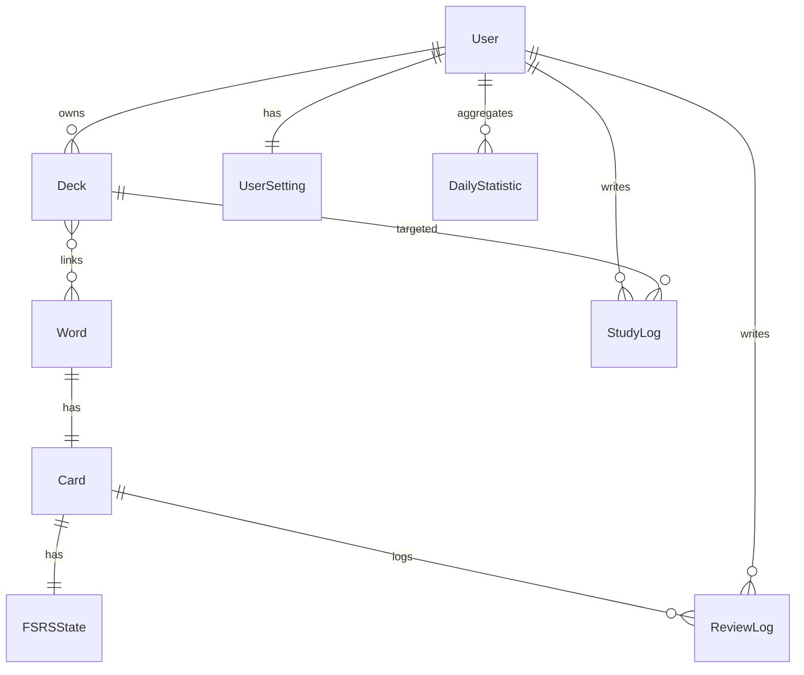
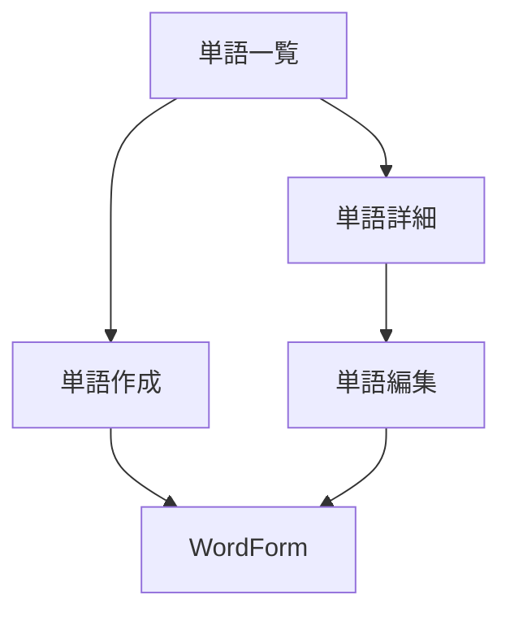
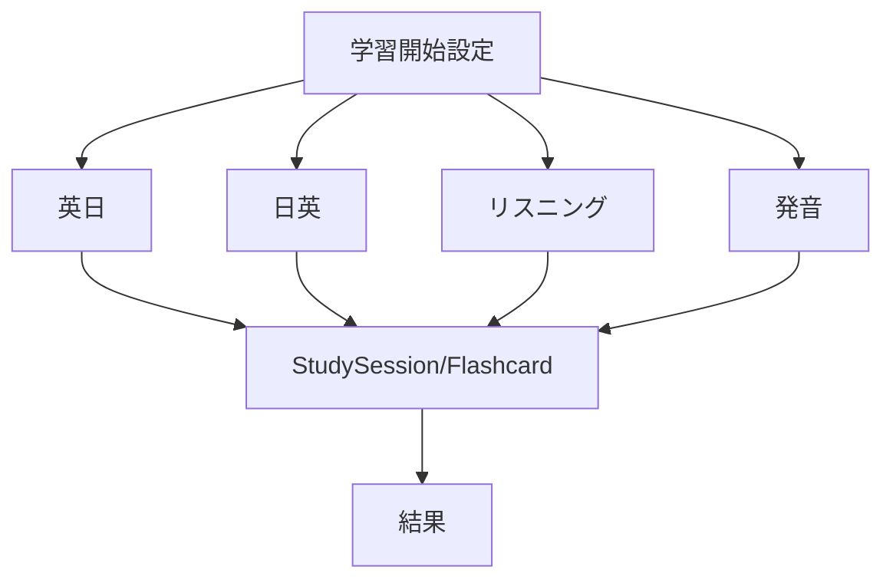

# 1. 目的

本書は現行コードに基づき、実装単位の構造・型・バリデーション・処理契約を定義する。

# 2. 実装構成

## 2.1 ディレクトリ（実装ベース）

```text
src/
  app/                 # App Router 画面・APIルート
  components/          # UIコンポーネント
  lib/                 # サーバ処理・共通ロジック
    data/              # use server 関数群
  stores/              # Zustand 状態管理
  types/               # 型拡張
prisma/
  schema.prisma
  migrations/
```

## 2.2 レイヤ責務

- app: 画面とルーティング、Route Handler
- components: 入力/表示部品、画面部品
- lib/data: 認証済みデータ取得・更新
- stores: 学習セッションのクライアント状態
- prisma: 永続化モデル

# 3. データベース詳細設計

## 3.1 主要モデル

| モデル | 主要項目 | 補足 |
| --- | --- | --- |
| User | id, email, providerAccountId | Google/Demo 認証主体 |
| UserSetting | dailyNewCards, maximumReviews, allowTypingCorrectnessOverride, theme | 設定保存 |
| Deck | userId, title, description, isArchived, deletedAt | 論理削除対応 |
| Word | word, meaning, partOfSpeech, memo, deletedAt | 単語本体 |
| Card | wordId(unique), lastStudiedAt | 単語ごと 1件 |
| FSRSState | cardId(unique), state, due, stability, difficulty | 復習状態 |
| ReviewLog | userId, cardId, isCorrect, rating, reviewedAt | 回答ログ |
| StudyLog | deckId, mode, solved, correct, accuracy, minutes | セッションログ |
| DailyStatistic | userId+date(unique), reviewCount, studyTime | 日次集計 |

## 3.2 Word-Deck 関連（M:N）

- Prisma 定義
  - Deck.words: Word[]
  - Word.decks: Deck[]
- DB 管理
  - 暗黙中間テーブル _DeckToWord
- 移行
  - 20260730103000_word_deck_many_to_many で旧 deckId を廃止し M:N に移行

## 3.3 ER 詳細



# 4. バリデーション設計

## 4.1 単語フォーム（components/words/word-form.tsx）

```ts
word: z.string().trim().min(1).max(100)
translation: z.string().trim().min(1).max(500)
partOfSpeech: z.string().min(1)
deckIds: z.array(z.string().min(1)).min(1)
definition: z.string().trim().max(2000)
example: z.string().trim().max(2000)
```

要点:
- deckIds は必須配列（最小1件）
- UI はチェックボックスで複数デッキ選択

## 4.2 デッキフォーム（components/decks/deck-form.tsx）

```ts
name: z.string().trim().min(1).max(100)
description: z.string().max(500).optional()
isPublic: z.boolean().default(false)
```

注記:
- isPublic はフォーム上存在するが DB には未保存（将来拡張）

## 4.3 サーバ側 Zod（主要）

- words.ts
  - CreateWordSchema.deckIds: z.array(z.string().min(1)).min(1)
  - UpdateWordSchema.deckIds: z.array(z.string().min(1)).min(1)
- study.ts
  - GetStudySessionWordsSchema: deckId/newLimit/reviewLimit/order
  - SubmitStudyReviewSchema: cardId/rating/isCorrect/binaryCorrectMapping
- settings.ts
  - updateSettingsSchema: newLimit/reviewLimit/theme/order/allowTypingCorrectnessOverride
- history.ts
  - SaveStudySessionSchema: deckId/mode/totalReviewed/correctCount/incorrectCount/accuracyRate/fsrsBreakdown/minutes

# 5. サーバ処理インタフェース設計

## 5.1 単語系（src/lib/data/words.ts）

| 関数 | 入力 | 出力概要 |
| --- | --- | --- |
| listWords | deckId?, query?, limit? | 単語配列（deckIds と decks を含む） |
| listPublicWords | deckId, limit? | 公開単語配列 |
| createWord | word, translation, partOfSpeech, deckIds, definition?, example? | 作成 Word |
| getWordById | id | 単語詳細（deckIds, decks, fsrs情報） |
| updateWord | id, word, translation, partOfSpeech, deckIds, definition, example | { id } |

実装ポイント:
- createWord/updateWord は deckIds 重複を除去
- deckIds の所有者検証を行い、不正ID混入を拒否
- updateWord は decks.set で所属を完全置換

## 5.2 デッキ系（src/lib/data/decks.ts）

| 関数 | 入力 | 出力概要 |
| --- | --- | --- |
| listDecks | query? | デッキ配列（wordCount, dueCount, newCount, progress） |
| createDeck | name, description?, isPublic? | 作成 Deck |
| getDeckById | id | デッキ基本情報 |
| getDeckDetails | id | 詳細統計付きデッキ |
| updateDeck | id, name, description?, isPublic? | 更新 Deck |
| deleteDeck | id | { id }（論理削除） |
| listPublicDecks | query?, limit? | 公開デッキ配列 |
| getPublicDeckById | id | 公開デッキ詳細 |
| clonePublicDeck | sourceDeckId, name | { id } |

## 5.3 学習系（src/lib/data/study.ts）

| 関数 | 入力 | 出力概要 |
| --- | --- | --- |
| resolveDashboardStudyStart | なし | deckId と reason |
| getStudySessionWords | deckId, newLimit, reviewLimit, order | 学習カード配列 |
| submitStudyReview | cardId, rating, isCorrect?, binaryCorrectMapping? | 更新後FSRS情報 |

実装ポイント:
- getStudySessionWords は自己修復処理で Card/FSRSState 欠損を補完
- 出題順は DUE_ASC/RANDOM/CREATED_DESC を切替
- submitStudyReview は 4段階評価へ正規化し、FSRSパラメータを更新
- ReviewLog.isCorrect の後方互換フォールバックあり

## 5.4 履歴・統計・設定

- history.ts
  - saveStudySession: StudyLog 作成 + DailyStatistic upsert 相当更新
  - getStudyHistory: 履歴一覧返却
- dashboard.ts / dashboard-data.ts
  - 期間集計、ストリーク、ダッシュボード表示データ
- settings.ts
  - getUserSettings/updateUserSettings
  - theme は DB 保存、order は現状ローカル保持前提

# 6. API ルート詳細

| パス | メソッド | 仕様 |
| --- | --- | --- |
| /api/auth/[...nextauth] | GET, POST | Auth.js handlers を公開 |
| /api/health | GET | success/failure 共通レスポンス |
| /api/demo/reset | POST | デモユーザーのみ再初期化可能 |
| /api/test-harness | GET | Card/FSRSState 欠損補修 |

# 7. 型定義設計

## 7.1 NextAuth 拡張

src/types/next-auth.d.ts により以下を付与:

- Session.user.id: string
- JWT.userId?: string

これにより、サーバ処理で session.user.id を共通利用する。

# 8. 状態管理設計（Zustand）

対象: src/stores/study-store.ts

## 8.1 状態項目

- deckId, mode, inputMethod
- assessmentMode, binaryCorrectMapping
- newLimit, reviewLimit, order
- solved, correct, ratingCounts, startTime

## 8.2 操作

- start: セッション進捗を初期化
- answer: solved/correct/ratingCounts 更新
- setMode/setInputMethod: モードに応じ入力方式を補正
- resetProgress/reset: 結果画面離脱時の初期化

## 8.3 入力方式制約

- en-ja は SELF_EVALUATION 固定
- ja-en は TYPING または SELF_EVALUATION
- listening/pronunciation は SELF_EVALUATION 扱い

# 9. UI コンポーネント構造

## 9.1 単語編集系



## 9.2 学習系



# 10. 例外・エラー設計

- 未認証: 各 use server 関数で例外を送出
- 所有権不一致: not found 相当エラー
- 入力不正: Zod 例外
- DB後方互換: 一部カラム未反映環境向けフォールバック処理あり

# 11. 実装差分メモ（既知制約）

- CSVインポートは Mock 表示のみ
- デッキ公開可否は DB 未実装
- 単語一覧の accuracy はプレースホルダ
- 一部画面文言は英日混在

# 12. 改訂履歴

| 版数 | 日付 | 内容 |
| --- | --- | --- |
| 3.0 | 2026-07-30 | 実装準拠へ全面更新。M:N・Server処理契約・Zod定義を反映。 |
