# 1. システムアーキテクチャ

## 1.1 設計方針

本システムは以下の方針に基づいて設計する。

- クライアントとサーバを明確に分離する。
- PWAとして実装し、PC・スマートフォンの双方で利用可能とする。
- オフライン環境でも学習を継続できるようにする。
- 学習データはローカルへ一時保存し、オンライン復帰時に同期する。
- 外部サービスとの結合度を低く保ち、将来的な差し替えを容易にする。
- 単語数・利用者数の増加に対応できる拡張性を確保する。

---

## 1.2 全体構成

```text
┌──────────────────────────┐
│       Client (PWA)       │
│──────────────────────────│
│ Next.js                  │
│ TypeScript               │
│ Tailwind CSS             │
│ shadcn/ui                │
│ Service Worker           │
│ IndexedDB                │
└────────────┬─────────────┘
             │ HTTPS
┌────────────▼─────────────┐
│         Server           │
│──────────────────────────│
│ Next.js Route Handler    │
│ Auth.js                  │
│ Prisma ORM               │
└────────────┬─────────────┘
             │
┌────────────▼─────────────┐
│         Database         │
│──────────────────────────│
│ MySQL                    │
└──────────────────────────┘
```

## 1.3 クライアントアーキテクチャ
### 画面描画
Next.jsのApp Routerを採用し、クライアントコンポーネント（CSR）を主体として構成する。オフライン動作を担保するため、主要な学習画面はブラウザ側で完結する動的描画を行う。
### 状態管理
アプリケーションのグローバル状態、およびオフライン同期の状態管理には状態管理ライブラリ（Zustand等）を採用する。
### 永続化（ローカルストレージ）
オフライン時の学習履歴、カード情報、未同期キューの保持には IndexedDB を使用する。ラッパーライブラリとして Dexie.js を採用し、型安全なデータアクセスを実現する。
### アルゴリズム実行
FSRS（Free Spaced Repetition Scheduler）のスケジュール・パラメータ計算責務はクライアント側（Zustandストレージ/Dexie.js処理内）に持たせ、オフライン下でもミリ秒単位の高速なUIレスポンスを実現する。

## 1.4 サーバアーキテクチャ
### API提供
Next.jsの Route Handlers を使用し、RESTful APIとして構築する。クライアントからのデータ同期、単語情報の取得、認証処理などを受け付ける。
### データアクセス
Prisma ORM を採用し、型安全なデータベース操作を行う。
### 外部連携
Dictionary API や音声取得処理は、サーバ側で中継（プロキシ）してクライアントに提供するか、バッチ/非同期で処理を行うことで、クライアント側が外部APIの仕様変更やレートリミットに直接影響を受けない設計とする。

## 1.5 ネットワークトポロジー
クライアント（PWA）からインターネット経由でVercel等のホスティング環境に配置されたNext.jsサーバへHTTPS通信を行う。サーバから同一プライベートネットワーク内、または認証されたセキュアな経路を通じてマネージドMySQLデータベースへ接続する。

## 1.6 外部サービス連携
### Dictionary API
単語登録時に英英定義、品詞、発音記号、および公式の音声URLを取得するために連携する。
### 音声再生・認識
ブラウザ標準機能である `Browser SpeechSynthesis` および `Web Speech API (SpeechRecognition)` を第一候補として利用し、オフライン環境下でも基本動作を可能とする。外部APIから取得した音声ファイル（mp3等）が利用可能な場合は、Service Workerを介してローカルキャッシュ（Cache Storage）に保存し、オフライン時でも再生できるように制御する。

---

# 2. 共通設計方針

## 2.1 認証・認可
### 認証方式
Auth.js（旧 NextAuth.js）を利用したセッション認証、またはJWT認証を採用する。初期フェーズでは、シンプルなID/パスワード認証または主要なOAuth（Google等）連携をサポートする。
### 認可制御
すべてのAPIエンドポイント（パブリックなものを除く）は、リクエストに含まれるセッション情報を検証し、ログイン済みユーザー本人のリソースへのアクセスのみを許可する。

## 2.2 エラーハンドリング・共通レスポンス
### APIレスポンスフォーマット
正常時・異常時ともに、統一されたJSONフォーマットでレスポンスを返却する。
#### 正常時
```json
{
  "success": true,
  "data": { ... }
}
```
#### 異常時
```json
{
  "success": false,
  "error": {
    "code": "BAD_REQUEST",
    "message": "入力エラーが発生しました。",
    "details": [ ... ]
  }
}
```
### クライアント側エラーハンドリング
APIからのエラーレスポンス、およびネットワーク切断時の通信エラーは、共通のエラーインターセプターでキャッチし、適切にトースト（Toast）やダイアログでユーザーに通知する。

## 2.3 ログ出力
### クライアント側
開発環境ではコンソールログを出力するが、本番環境では不要なログを抑制する。致命的なエラーについては、エラー監視サービス（Sentry等）へ送信できるように考慮する。
### サーバ側
アクセスログ、および例外発生時のスタックトレースを標準出力（またはログ管理システム）に構造化ログ（JSON）として出力する。

---

# 3. データモデル概要

## 3.1 設計方針
本システムでは、学習データを以下の単位で管理する。
- ユーザー
- デッキ
- 単語
- 学習カード
- 学習履歴
- 統計情報

各データは責務を明確に分離し、将来的な機能追加に対応できる拡張性を確保する。

### 監査カラム共通方針

本システムでは、Prismaスキーマへ落とし込みやすいよう、主要エンティティに共通の監査カラムを付与する。

共通監査カラムは以下の通りとする。

- id
- createdAt
- updatedAt
- deletedAt
- syncStatus
- version

### エンティティ関連図（ER概要）

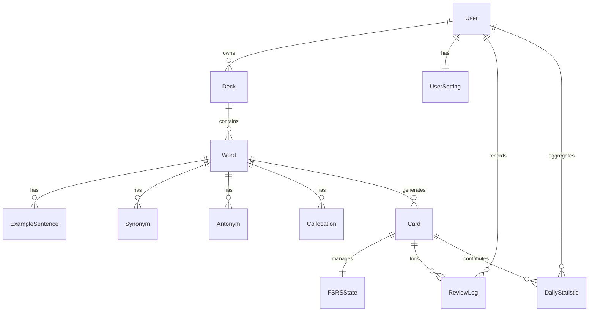

### Prismaスキーマへの反映方針

- 各エンティティは `id` を主キーとする。
- `createdAt` と `updatedAt` は自動更新可能な列として定義する。
- `deletedAt` は論理削除の判定に使用する。
- `syncStatus` はオフライン同期管理に使用する。
- `version` は同期競合検知および将来的な楽観ロックに使用する。
- Prismaの `@default(uuid())`、`@updatedAt` 等を用いて実装しやすい構造とする。

### version

- 楽観的排他制御および同期競合解決に利用する。
- 更新時にインクリメントする。
- 将来的な差分同期機能への拡張を考慮する。

## 3.2 エンティティ一覧

| エンティティ    | 説明           |
| :-------------- | :------------- |
| User            | 利用者情報     |
| UserSetting     | 学習設定       |
| Deck            | 単語帳         |
| Word            | 英単語情報     |
| ExampleSentence | 例文           |
| Synonym         | 類義語         |
| Antonym         | 対義語         |
| Collocation     | コロケーション |
| Card            | 学習カード     |
| FSRSState       | FSRS状態       |
| ReviewLog       | 学習履歴       |
| DailyStatistic  | 日次統計       |

## 3.3 エンティティ識別子（ID）設計
### 設計方針
本システムでは、オフライン環境におけるデータ作成および同期処理を考慮し、すべてのエンティティの主キーとして **UUIDv7** を採用する。

### 対象エンティティ
- User
- UserSetting
- Deck
- Word
- ExampleSentence
- Synonym
- Antonym
- Collocation
- Card
- FSRSState
- ReviewLog
- DailyStatistic

### 採番方式
- UUIDはクライアント側で生成する。
- オンライン・オフラインを問わず一意性を保証する。
- サーバ側ではクライアントから送信されたUUIDをそのまま採用する。
- UUIDの再採番は行わない。

### 採用理由
- オフライン環境下でもデータ作成が可能となる。
- UUIDv7は時系列ソート性を持ち、検索・集計時のインデックス効率に優れる。
- UUIDv7は時系列順に並びやすく、インデックス性能および同期処理効率の向上が期待できる。
- IndexedDBとMySQL間の同期時にID衝突を防止できる。
- 将来的な分散環境への拡張に対応しやすい。
- クライアント生成でも分散環境と親和性が高く、サーバ側で再採番する必要がない。

## 3.4 列挙型（Enum）定義

### 品詞（PartOfSpeech）

| 値           | 説明   |
| :----------- | :----- |
| NOUN         | 名詞   |
| VERB         | 動詞   |
| ADJECTIVE    | 形容詞 |
| ADVERB       | 副詞   |
| PRONOUN      | 代名詞 |
| PREPOSITION  | 前置詞 |
| CONJUNCTION  | 接続詞 |
| INTERJECTION | 間投詞 |
| PHRASAL_VERB | 句動詞 |
| OTHER        | その他 |

### 単語状態（WordState）

| 値       | 説明             |
| :------- | :--------------- |
| ACTIVE   | 学習対象         |
| EXCLUDED | 学習対象から除外 |
| DELETED  | 論理削除         |

### 学習カード状態（CardState）

| 値         | 説明       |
| :--------- | :--------- |
| NEW        | 新規カード |
| LEARNING   | 学習中     |
| REVIEW     | 復習中     |
| RELEARNING | 再学習中   |
| SUSPENDED  | 一時停止   |
| DELETED    | 論理削除   |

### 学習順序（StudyOrder）

| 値              | 説明         |
| :-------------- | :----------- |
| RANDOM          | ランダム     |
| CREATED_ASC     | 作成日時昇順 |
| CREATED_DESC    | 作成日時降順 |
| DUE_ASC         | 復習期限昇順 |
| DIFFICULT_FIRST | 難易度優先   |

### 同期状態（SyncStatus）

| 値      | 説明     |
| :------ | :------- |
| PENDING | 同期待ち |
| SYNCING | 同期中   |
| SYNCED  | 同期済み |
| FAILED  | 同期失敗 |
| FAILED_PERMANENT | 永続失敗 |

### メタデータ状態（MetadataStatus）

| 値                | 説明       |
| :---------------- | :--------- |
| PENDING_METADATA  | 補完待ち   |
| METADATA_SYNCING  | 補完中     |
| METADATA_READY    | 補完完了   |
| METADATA_FAILED   | 補完失敗   |

### 発音判定結果（PronunciationResult）

| 値        | 説明     |
| :-------- | :------- |
| CORRECT   | 正解     |
| PARTIAL   | 一部一致 |
| INCORRECT | 不正解   |

## 3.5 CSVデータフォーマット
### 設計方針
単語データの一括登録およびバックアップ用途としてCSV形式のインポート・エクスポート機能を提供する。

### 文字コード
- UTF-8
- BOM有無の双方へ対応する。

### ヘッダー定義

| カラム名      | 必須  | 説明     |
| :------------ | :---: | :------- |
| word          |   ○   | 英単語   |
| translation   |   ○   | 日本語訳 |
| partOfSpeech  |   -   | 品詞     |
| definition    |   -   | 英英定義 |
| pronunciation |   -   | 発音記号 |
| etymology     |   -   | 語源     |
| example       |   -   | 例文     |
| audioUrl      |   -   | 音声URL  |

### 列順

1. word
2. translation
3. partOfSpeech
4. definition
5. pronunciation
6. etymology
7. example
8. audioUrl

### サンプル
```csv
word,translation,partOfSpeech,definition,pronunciation,etymology,example,audioUrl
apple,りんご,NOUN,a fruit,/ˈæpəl/,Old English æppel,An apple a day keeps the doctor away.,https://example.com/audio/apple.mp3
book,本,NOUN,a written work,/bʊk/,Old English bōc,This book is interesting.,https://example.com/audio/book.mp3
```

### バリデーション
#### 必須チェック
- word
- translation

#### 文字数制限
- word：1～100文字
- translation：1～500文字
- definition：0～2,000文字
- pronunciation：0～100文字
- etymology：0～2,000文字
- example：0～2,000文字

#### Enumチェック

- partOfSpeechはPartOfSpeechの値のみ許可する。

### エラーハンドリング

- 1行単位でバリデーションし、エラー行は行番号付きで返却する。
- Enum不正、必須項目不足、桁数超過、文字コード不正を検出する。
- UTF-8 BOM有無の差異は吸収し、同一フォーマットとして処理する。

### ロールバック方針

- インポート処理全体はトランザクションとして扱う。
- 途中で致命的エラーが発生した場合は、登録済みデータをすべて破棄して元の状態へ戻す。
- 行単位の軽微なエラーはロールバックせず、エラー一覧として利用者へ提示する。

#### Enumチェック
partOfSpeechは以下のみ受け付ける。
- NOUN, VERB, ADJECTIVE, ADVERB, PRONOUN, PREPOSITION, CONJUNCTION, INTERJECTION, PHRASAL_VERB, OTHER

### エラーハンドリング
- 不正行はスキップしない。
- エラー内容および行番号を利用者へ通知する。
- エラーが存在する場合はインポート処理全体をロールバックする。

## 3.6 ユーザー
### 保持情報
- 認証情報
- 学習設定
- 統計情報
### 関係
- 複数のデッキを所有できる。
- 1つの学習設定を保持する。
- 複数の日次統計を保持する。

## 3.7 デッキ
### 保持情報
- デッキ名
- 説明
- 公開設定
- 作成日時
- 更新日時
### 関係
- 複数の単語を保持できる。
- 公開デッキとして共有できる。
- 他ユーザーのデッキを複製できる。

## 3.8 単語
### 保持情報
- 英単語
- 日本語訳
- 英英定義
- 品詞
- 発音記号
- 音声情報
- 語源
- データ取得元
- 状態
### 関係
- 複数の例文を保持できる。
- 複数の類義語を保持できる。
- 複数の対義語を保持できる。
- 複数のコロケーションを保持できる。
- 複数の学習カードを生成する。

## 3.9 学習カード
### 保持情報
- 学習方式
- 学習状態
- FSRS状態
### 関係
- 単語ごとに複数生成される。
- 学習履歴を保持する。

## 3.10 学習履歴
### 保持情報
- 学習日時
- 自己評価
- 回答時間
- 同期状態
### 利用目的
- 復習スケジュール計算
- 統計生成
- オフライン同期

## 3.11 日次統計
### 保持情報
- 学習回数
- 学習時間
- 正答率
- 学習品質スコア
### 利用目的
- ダッシュボード表示
- 学習分析
- 学習継続状況の可視化

---

# 4. 学習方式設計

## 4.1 設計方針

本システムでは、英単語を複数の観点から学習することで、記憶の定着と運用能力の向上を図る。

また、FSRSを利用して、利用者ごとの記憶状態に応じた復習タイミングを提示する。

---

## 4.2 学習モード

### 英→日学習

英単語を提示し、日本語の意味を想起する。

### 日→英学習

日本語を提示し、英単語を想起する。

### リスニング学習

音声を提示し、英単語を想起する。

### 発音学習

単語を発音し、発音能力の向上を図る。

---

## 4.3 FSRS状態管理

### 設計方針

本システムでは、FSRS（Free Spaced Repetition Scheduler）の状態を学習カードごとに独立して保持する。

各カードは、それぞれ異なる学習履歴および記憶状態を持つものとして管理する。

### 保持項目

| 項目名       | 型       | 説明                 |
| ------------ | -------- | -------------------- |
| stability    | number   | 記憶の安定性         |
| difficulty   | number   | カードの主観的難易度 |
| reviewCount  | integer  | 復習回数             |
| lapseCount   | integer  | 忘却による再学習回数 |
| lastReviewAt | datetime | 最終学習日時         |
| nextReviewAt | datetime | 次回復習予定日時     |

### 管理方針

- FSRS状態はCardと1対1で関連付ける。
- 学習完了時に状態を更新する。
- 復習日時の判定にはnextReviewAtを使用する。
- 学習履歴の削除によってFSRS状態は削除しない。
- カードの論理削除時のみFSRS状態を削除対象とする。

---

## 4.4 FSRSパラメータ管理

### 設計方針

FSRSアルゴリズムで利用する重みパラメータおよび学習設定は、アプリケーション設定として管理する。

### 管理項目

| 項目名           | 説明                     |
| ---------------- | ------------------------ |
| desiredRetention | 目標保持率               |
| maximumInterval  | 最大復習間隔             |
| enableFuzz       | 復習間隔のランダム化有無 |
| weights          | FSRS重みパラメータ       |

### 管理方針

- desiredRetentionの初期値は0.90とする。
- maximumIntervalの初期値は36500日とする。
- enableFuzzの初期値は有効とする。
- weightsはアプリケーション共通設定として保持する。

### 拡張性

将来的には以下を考慮する。

- ユーザーごとの目標保持率変更
- ユーザーごとの重みパラメータ最適化
- 学習履歴を用いた個別パラメータ推定

---

## 4.5 FSRS計算責務

### 設計方針

オフライン環境でも学習を継続できるよう、FSRSの計算処理はクライアント側で実行する。

サーバは同期時の整合性確認およびデータ保存を担当する。

### クライアントの責務

- 学習結果の入力
- FSRS状態の更新
- 次回復習日時の算出
- IndexedDBへの保存

### サーバの責務

- 学習データの永続化
- FSRS状態の保存
- 同期データの整合性検証
- 統計データ生成のための履歴保持

### 同期方針

同期時は以下を送信する。

- 学習日時
- 評価結果
- 更新後のFSRS状態
- 次回復習日時

### 整合性方針

- クライアントをFSRS計算の正とする。
- サーバは受信データの妥当性のみを検証する。
- 同期失敗時は再送キューへ格納する。

---

## 4.6 学習カード構造

```text
Word
├─ EN_TO_JA
├─ JA_TO_EN
├─ LISTENING
└─ PRONUNCIATION
```

各カードは独立した学習状態を保持する。

---

## 4.7 FSRS方式

### 方針

- カードごとに独立したFSRS状態を保持する。
- レビュー結果から次回復習日時を算出する。
- 長期記憶形成を目的とする。

### 利用する評価

- Again
- Hard
- Good
- Easy

### FSRSレビュー評価値

FSRSのレビュー評価値は以下の通り定義する。

| 評価 | 値 | 説明 |
| :--- | :--- | :--- |
| Again | 1 | 全く思い出せなかった場合に使用する。 |
| Hard | 2 | 難しいが思い出せた場合に使用する。 |
| Good | 3 | 適切に思い出せた場合に使用する。 |
| Easy | 4 | 容易に思い出せた場合に使用する。 |

### 復習対象抽出条件

復習対象は以下の条件をすべて満たすカードとする。

- nextReviewAt <= now
- status = REVIEW

抽出結果はAPI・SQL・詳細設計と整合するよう、カード単位で返却可能な形とする。

---

## 4.8 学習設定

利用者は以下を設定できる。

- 新規カード上限
- レビュー上限
- 学習順序
- 学習モード配分比率

---

# 5. 状態遷移設計

## 5.1 単語状態

```text
ACTIVE
├─ 除外 → EXCLUDED
└─ 削除 → DELETED
```

### ACTIVE

通常の学習対象。

### EXCLUDED

学習対象から一時的に除外する。

### DELETED

論理削除された状態。

---

## 5.2 学習カード状態

```text
ACTIVE
├─ 停止 → SUSPENDED
└─ 削除 → DELETED
```

### ACTIVE

通常の学習状態。

### SUSPENDED

一時停止状態。

### DELETED

論理削除状態。

---

## 5.3 学習カード状態定義

### 設計方針

本システムでは、FSRSに基づく学習状態をカード単位で管理する。

カードは以下のいずれかの状態を持つ。

### 状態一覧

| 状態       | 説明                                 |
| ---------- | ------------------------------------ |
| NEW        | 未学習の新規カード                   |
| LEARNING   | 初回学習中のカード                   |
| REVIEW     | 復習段階へ移行したカード             |
| RELEARNING | 忘却により再学習中のカード           |
| SUSPENDED  | 一時的に学習対象から除外されたカード |
| DELETED    | 論理削除されたカード                 |

### 状態管理方針

- CardStateはCardごとに保持する。
- 状態変更時にはFSRSStateを更新する。
- DELETED状態のカードは学習対象としない。
- SUSPENDED状態のカードはCard単位で管理する。
- Wordの除外は配下CardをSUSPENDEDへ変更することで実現する。
- SUSPENDED状態のカードは学習履歴を保持する。

### 状態遷移禁止事項

DELETED状態は終端状態とし、以下の遷移は禁止する。

- DELETED → REVIEW
- DELETED → LEARNING
- DELETED → RELEARNING
- DELETED → NEW

---

## 5.4 学習状態遷移

### 状態遷移図

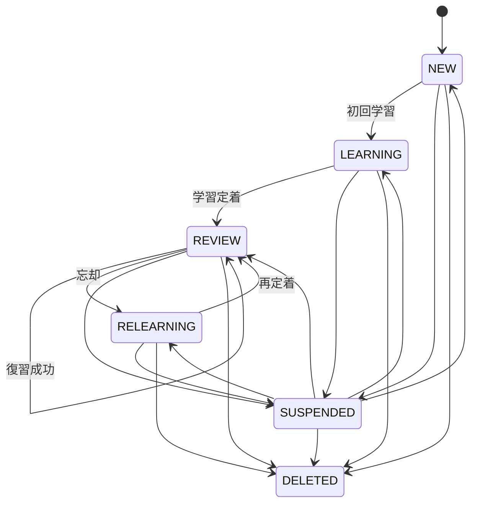

### 遷移ルール

#### NEW → LEARNING

- 初回学習を開始した場合

#### LEARNING → REVIEW

- 初回学習が一定基準へ到達した場合
- FSRSによる次回復習日時が算出された場合

#### REVIEW → REVIEW

- 復習評価が成功と判定された場合

#### REVIEW → RELEARNING

- 忘却と判定された場合

#### RELEARNING → REVIEW

- 再学習が成功した場合

#### 任意状態 → SUSPENDED

- 利用者が学習対象から除外した場合

#### SUSPENDED → 元の状態

- 利用者が除外を解除した場合

#### 任意状態 → DELETED

- 利用者が論理削除した場合

---

## 5.5 FSRSレビュー評価遷移

### 設計方針

学習結果はFSRSの評価値へ変換し、次回復習日時およびカード状態を更新する。

### 評価値

| 評価  | 説明             |
| ----- | ---------------- |
| Again | 思い出せなかった |
| Hard  | 難しかった       |
| Good  | 思い出せた       |
| Easy  | 容易に思い出せた |

### 更新内容

レビュー完了時には以下を更新する。

- stability
- difficulty
- reviewCount
- lapseCount
- lastReviewAt
- nextReviewAt
- CardState

### 状態更新ルール

#### Again

- lapseCountを増加する。
- REVIEW状態の場合はRELEARNINGへ遷移する。

#### Hard

- REVIEW状態を維持する。
- 次回復習間隔を短縮する。

#### Good

- REVIEW状態を維持する。
- 次回復習間隔を通常計算する。

#### Easy

- REVIEW状態を維持する。
- 次回復習間隔を延長する。

---

## 5.6 学習対象除外状態管理

### 設計方針

利用者は単語またはカードを削除することなく、一時的に学習対象から除外できるものとする。

### 管理方針

- 除外状態はSUSPENDEDとして管理する。
- FSRSStateは保持する。
- ReviewLogは保持する。
- DailyStatisticは保持する。
- 学習対象一覧には表示しない。
- 検索機能では表示可能とする。

### 復元

利用者は除外状態を解除できる。

解除時は除外前のCardStateへ復元する。

---

# 6. データ削除設計

## 6.1 設計方針

利用者の学習履歴を保護するため、論理削除を基本とする。

必要に応じて物理削除を行う。

---

## 6.2 デッキ削除

デッキ削除時は以下を削除対象とする。

- 単語
- 例文
- 類義語
- 対義語
- コロケーション
- 学習カード
- FSRS状態
- 学習履歴

---

## 6.3 データ削除方針

### 設計方針

本システムでは、誤操作による学習データの消失を防止するため、論理削除を採用する。

物理削除は原則として行わない。

### 削除方式

| 方式                      | 説明                         |
| ------------------------- | ---------------------------- |
| 論理削除（DELETED）       | 利用者から見えない状態とする |
| 学習対象除外（SUSPENDED） | 学習対象からのみ除外する     |

### 基本方針

- 削除時は状態をDELETEDへ変更する。
- 物理削除は行わない。
- 削除日時を保持する。
- 削除済みデータは通常の検索結果へ表示しない。
- 管理機能から復元できるものとする。

---

## 6.4 エンティティ別削除ポリシー

### Deck

#### 論理削除

- 状態をDELETEDへ変更する。
- 配下のCardは論理削除する。
- ReviewLogおよびDailyStatisticは保持する。

#### 復元

- 復元可能とする。
- 配下のCardも同時に復元する。

---

### Word

#### 論理削除

- 状態をDELETEDへ変更する。
- 関連するCardは論理削除する。
- ExampleSentenceを保持する。
- Synonymを保持する。
- Antonymを保持する。
- Collocationを保持する。

#### 復元

- 復元可能とする。
- 関連Cardも同時に復元する。

---

### Card

#### 論理削除

- 状態をDELETEDへ変更する。
- FSRSStateを保持する。
- ReviewLogを保持する。

#### 復元

- 復元可能とする。
- 削除前のCardStateへ復元する。

---

## 6.5 学習対象除外（SUSPENDED）

### 設計方針

利用者は単語またはカードを削除せず、一時的に学習対象から除外できるものとする。

### 管理方針

除外時は以下を実施する。

- CardStateをSUSPENDEDへ変更する。
- 学習対象一覧から除外する。
- 復習対象一覧から除外する。
- FSRSStateを保持する。
- ReviewLogを保持する。
- DailyStatisticを保持する。

### 復元

利用者は除外状態を解除できる。

解除時は除外前の状態へ復元する。

### 利用例

- 学習済みのため一時的に出題したくない単語
- 誤登録したが削除したくない単語
- 後で再利用する可能性がある単語

---

## 6.6 削除データの同期方針

### 設計方針

論理削除および除外状態は、オフライン環境下でも適切に同期できるものとする。

### 同期内容

以下の情報を同期対象とする。

- エンティティID
- 状態（ACTIVE、SUSPENDED、DELETED）
- 更新日時
- 削除日時

### 同期ルール

#### ACTIVE → DELETED

- 削除情報を同期する。
- サーバ側もDELETEDへ変更する。

#### ACTIVE → SUSPENDED

- 除外情報を同期する。
- サーバ側もSUSPENDEDへ変更する。

#### SUSPENDED → ACTIVE

- 除外解除情報を同期する。

#### DELETED → ACTIVE

- 復元情報を同期する。

### 競合解決

同一エンティティが複数端末から更新された場合は、updatedAtを基準として最新更新を採用する。

---

## 6.7 削除データの保持期間

### 設計方針

利用者の誤操作からの復旧を可能とするため、論理削除データは一定期間保持する。

### 保持期間

- 論理削除データ：無期限保持
- 学習対象除外データ：無期限保持
- ReviewLog：無期限保持
- DailyStatistic：無期限保持

### 将来的な拡張

将来的には以下の機能追加を考慮する。

- ごみ箱機能
- 自動完全削除機能
- 保持期間の利用者設定

---

## 6.8 単語削除

単語削除時は以下を削除対象とする。

- 例文
- 類義語
- 対義語
- コロケーション
- 学習カード
- FSRS状態
- 学習履歴

---

## 6.9 論理削除

削除データは一定期間保持し、復元可能とする。

---

# 7. オフライン同期設計

## 7.1 設計方針

通信環境に依存せず学習を継続できるよう、オフライン学習を可能とする。

学習データはローカルへ一時保存し、オンライン復帰時に同期する。

---

## 7.2 ローカル保存

保存対象

- 学習履歴
- 学習状態
- 未同期データ
- 学習設定

保存先

```text
IndexedDB
```

---

## 7.3 オフラインデータ管理方針

### 設計方針

本システムはPWAとして動作し、ネットワーク接続がない環境でも学習機能を利用できるものとする。

利用者が作成または更新したデータは、まずクライアント側へ保存し、オンライン復帰時にサーバへ同期する。

### ローカル保存対象

以下のデータをIndexedDBへ保存する。

- UserSetting
- Deck
- Word
- ExampleSentence
- Synonym
- Antonym
- Collocation
- Card
- FSRSState
- ReviewLog
- DailyStatistic
- 同期キュー情報

### 基本方針

- オフライン時でも学習を継続できる。
- オフライン時でも単語登録・編集・削除を行える。
- すべての更新処理はローカルへ即時反映する。
- サーバ接続の有無によって画面操作を制限しない。

---

## 7.4 オフライン作成データ同期

### 設計方針

オフライン環境下で作成されたデータは、オンライン復帰時に自動同期する。

### ID管理

すべてのエンティティはUUIDv7を採用する。

UUIDはクライアント側で生成する。

### 同期対象

- 作成
- 更新
- 論理削除
- 除外状態変更
- 学習履歴追加
- FSRS状態更新

### 同期順序

以下の順序で同期する。

1. UserSetting
2. Deck
3. Word
4. Card
5. FSRSState
6. ReviewLog
7. DailyStatistic

### 同期方針

- 作成順を維持する。
- 親エンティティを先に同期する。
- 同期完了後に同期キューから削除する。

---

## 7.5 同期状態管理

### 設計方針

各エンティティは同期状態を保持する。

### 同期状態

| 状態    | 説明     |
| ------- | -------- |
| PENDING | 同期待ち |
| SYNCING | 同期中   |
| SYNCED  | 同期済み |
| FAILED  | 同期失敗 |
| FAILED_PERMANENT | 永続失敗 |

### 状態遷移

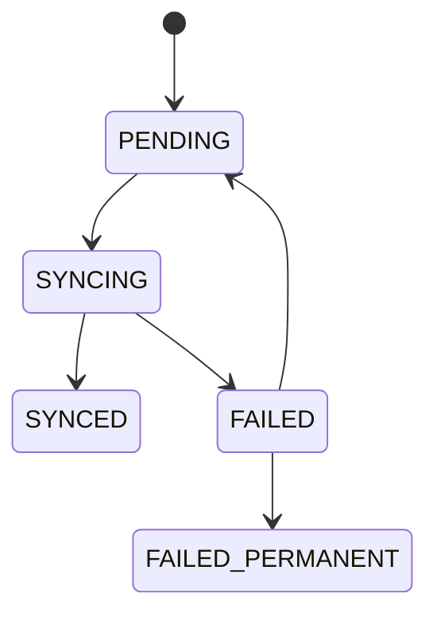

### 更新ルール

#### 作成・更新時

- 状態をPENDINGへ変更する。

#### 同期開始時

- 状態をSYNCINGへ変更する。

#### 同期成功時

- 状態をSYNCEDへ変更する。

#### 同期失敗時

- 状態をFAILEDへ変更する。

#### 再試行上限到達時

- 状態をFAILED_PERMANENTへ変更する。
- 自動再試行の対象外とする。

---

## 7.6 同期キュー設計

### 設計方針

サーバとの通信に失敗した場合でも、データ消失を防止するため同期キューを使用する。

### 管理項目

| 項目       | 説明             |
| ---------- | ---------------- |
| queueId    | キュー識別子     |
| entityType | エンティティ種別 |
| entityId   | エンティティID   |
| operation  | 操作種別         |
| payload    | 同期データ       |
| retryCount | 再試行回数       |
| createdAt  | 作成日時         |
| updatedAt  | 更新日時         |

### 操作種別

- CREATE
- UPDATE
- DELETE
- SUSPEND
- RESTORE

### リトライ方針

- ネットワーク復帰時に自動再試行する。
- アプリ起動時に自動再試行する。
- 一定時間ごとに再試行する。
- 同期成功時はキューを削除する。
- retryCountは再試行のたびに加算する。
- 最大再試行回数に到達した場合はFAILED_PERMANENTとして扱う。

## 7.7 競合解決方針

### 設計方針

複数端末から同一データが更新された場合は、updatedAtを用いた Last Write Wins を採用する。

ReviewLogはクライアントを正とし、FSRSStateもクライアントを正とする。

学習履歴を失わないことを最優先とする。

### 判定項目

- updatedAt
- deletedAt
- status

### 競合解決ルール

#### 更新と更新が競合した場合

updatedAtが新しいデータを採用する。

#### 更新と削除が競合した場合

deletedAtが存在する場合は削除を優先する。

#### 除外状態と更新が競合した場合

updatedAtが新しい状態を採用する。

#### ReviewLogと同期が競合した場合

クライアント側のReviewLogを優先する。

#### FSRSStateと同期が競合した場合

クライアント側のFSRSStateを優先する。

### 将来的な拡張

以下の方式へ拡張可能とする。

- 利用者による競合解決
- フィールド単位マージ
- バージョン番号管理

---

## 7.8 外部辞書データ補完同期

### 設計方針

オフライン環境下では、外部Dictionary APIへアクセスできないため、単語データを一時保存し、オンライン復帰後に不足情報を補完する。

### 補完対象

- 英英定義
- 品詞
- 発音記号
- 音声URL
- 例文

### 管理状態

| 状態             | 説明     |
| ---------------- | -------- |
| PENDING_METADATA | 補完待ち |
| METADATA_SYNCING | 補完中   |
| METADATA_READY   | 補完完了 |
| METADATA_FAILED  | 補完失敗 |

### 処理フロー

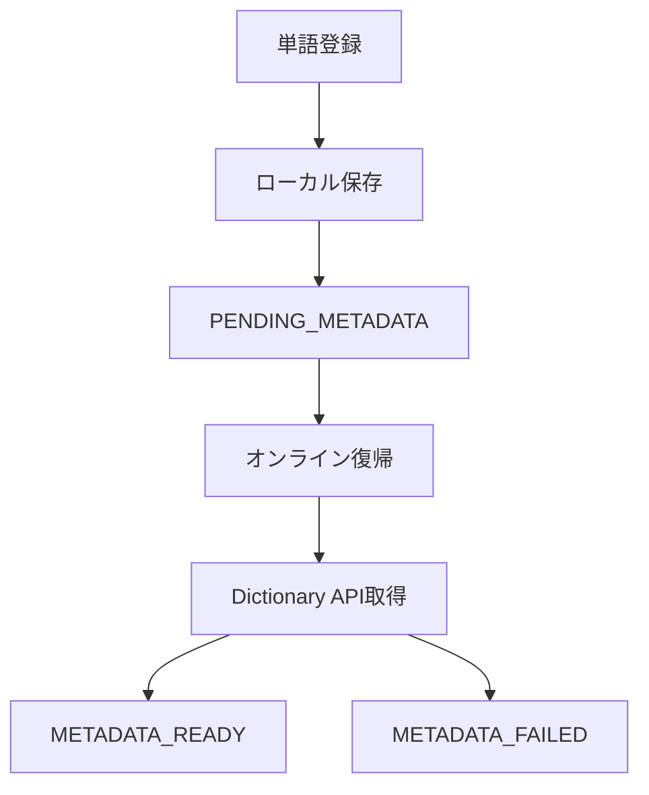

### 補完失敗時

- 学習機能は継続可能とする。
- 利用者へ補完失敗を通知する。
- 後続の同期処理で再試行する。

---

## 7.9 同期フロー

```text
学習
↓
IndexedDB保存
↓
オンライン復帰
↓
未同期データ取得
↓
サーバ同期
↓
同期状態更新
```

---

## 7.10 重複防止

- 学習履歴に一意識別子を付与する。
- 同一履歴の重複登録を防止する。

---

## 7.11 同期失敗時

```text
同期失敗
↓
再送キュー登録
↓
オンライン復帰
↓
自動再送
```

---

## 7.12 同期競合

同一データに競合が発生した場合は、サーバ側の最新データを優先する。

---

## 7.13 障害時

- オフライン学習を継続可能とする。
- 未同期データを保持する。
- 同期可能になり次第、自動的に再同期を行う。

---

## 7.14 同期トリガー

同期は以下のタイミングで実行する。

- アプリ起動時
- オンライン復帰時
- 一定間隔
- 手動同期

## 7.15 再試行方針

再試行制御は以下の項目で管理する。

- retryCount
- 最大再試行回数
- FAILED_PERMANENT 状態

再試行回数が上限に達した場合はFAILED_PERMANENTへ遷移し、自動再試行の対象外とする。

## 7.16 UI方針

同期状態は利用者へ明示的に表示する。

- 同期中表示
- 同期失敗表示
- 手動再同期

同期中は対象データの編集中であることを分かりやすく示し、失敗時は再同期操作へ誘導する。

---

# 8. 画面設計

## 8.1 設計方針

本システムでは、学習を中断させないシンプルなUIを基本方針とする。

また、PC・スマートフォン・タブレットの全てで利用可能なレスポンシブデザインを採用する。

### 設計原則

- 学習開始まで3クリック以内とする。
- 学習中の不要な画面遷移を避ける。
- キーボード操作へ対応する。
- ダークモードへ対応する。
- 主要機能へ容易にアクセスできる導線を提供する。
- モバイル環境でも快適に利用できるUIを提供する。

---

## 8.2 画面一覧

| ID      | 画面名         | パス                   | 主な責務           |
| ------- | -------------- | ---------------------- | ------------------ |
| SCR-001 | ログイン       | `/`                    | Google認証         |
| SCR-002 | ダッシュボード | `/dashboard`           | 学習状況表示       |
| SCR-003 | 学習開始       | `/study`               | 学習セッション開始 |
| SCR-004 | 英→日学習      | `/study/en-ja`         | 英→日学習          |
| SCR-005 | 日→英学習      | `/study/ja-en`         | 日→英学習          |
| SCR-006 | リスニング学習 | `/study/listening`     | リスニング学習     |
| SCR-007 | 発音学習       | `/study/pronunciation` | 発音学習           |
| SCR-008 | 学習結果       | `/study/result`        | 学習結果表示       |
| SCR-009 | 単語一覧       | `/words`               | 単語検索・管理     |
| SCR-010 | 単語編集       | `/words/[id]`          | 単語編集           |
| SCR-011 | デッキ一覧     | `/decks`               | デッキ管理         |
| SCR-012 | デッキ作成     | `/decks/new`           | デッキ作成         |
| SCR-013 | デッキ詳細     | `/decks/[id]`          | デッキ閲覧・編集   |
| SCR-014 | CSVインポート  | `/decks/import`        | CSV登録            |
| SCR-015 | 統計           | `/statistics`          | 学習分析           |
| SCR-016 | 学習履歴       | `/history`             | 学習履歴閲覧       |
| SCR-017 | 設定           | `/settings`            | 学習設定変更       |
| SCR-018 | 公開デッキ一覧 | `/public-decks`        | 公開デッキ検索     |
| SCR-019 | 公開デッキ詳細 | `/public-decks/[id]`   | 公開デッキ閲覧     |
| SCR-020 | エラー         | `/error`               | エラー表示         |

---

## 8.3 音声再生方式

### 設計方針

本システムでは、英単語の発音学習を支援するため、外部Dictionary APIから取得した音声データを優先的に利用する。

外部音声が利用できない場合は、ブラウザ標準のSpeechSynthesisへフォールバックする。

### 音声取得優先順位

1. ローカルキャッシュ済み音声
2. Dictionary APIの音声データ
3. Browser SpeechSynthesis

### 音声再生要件

- 利用者は任意のタイミングで音声を再生できる。
- 音声再生回数に制限は設けない。
- 音声取得失敗時でも学習を継続可能とする。
- 音声再生失敗時は利用者へ通知する。

### フォールバック方針

#### Dictionary API利用可能

- 外部音声データを利用する。
- 取得した音声をローカルへキャッシュする。

#### Dictionary API利用不可

- SpeechSynthesisによる読み上げを行う。

#### 両方利用不可

- 発音記号のみを表示する。
- 学習機能自体は継続可能とする。

---

## 8.4 音声データオフライン対応

### 設計方針

一度取得した音声データはオフライン環境下でも利用できるよう、クライアントへ保存する。

### 保存方式

音声データはCache Storageへ保存する。

### 保存対象

- mp3
- wav
- ogg

### キャッシュ方針

- 初回取得時にキャッシュへ保存する。
- キャッシュ済みデータを優先利用する。
- 同一URLへの重複取得を防止する。

### キャッシュ削除

以下の場合はキャッシュ削除対象とする。

- 利用者によるデータ削除
- キャッシュ容量超過
- 音声URL変更
- アプリケーション初期化

### オフライン時

- キャッシュ済み音声を再生する。
- 未取得音声はSpeechSynthesisへフォールバックする。
- 音声再生不可の場合でも学習を継続可能とする。

---

## 8.5 発音認識方式

### 設計方針

利用者の発音結果をSpeechRecognitionによって取得し、認識文字列を基に評価する。

### 利用技術

- Web Speech API
- SpeechRecognition

### 処理フロー

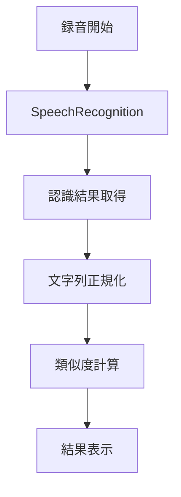

### 正規化処理

比較前に以下を実施する。

- 大文字小文字を統一する。
- 前後空白を除去する。
- 連続空白を単一空白へ変換する。
- 記号を除去する。

### 対象言語

- 英語（en-US）
- 英語（en-GB）

### 音声認識失敗時

- 再試行を可能とする。
- 学習継続を妨げない。
- 手動で正答確認を行えるものとする。

---

## 8.6 発音評価方式

### 設計方針

発音の正誤は、認識文字列と正解単語の類似度によって判定する。

### 判定手順

1. 正解単語を取得する。
2. SpeechRecognition結果を取得する。
3. 文字列を正規化する。
4. 類似度を算出する。
5. 判定結果を表示する。

### 類似度判定

- 完全一致は正解とする。
- 類似度80%以上を正解とする。
- 類似度80%未満を不正解とする。

### 評価結果

| 状態      | 説明     |
| --------- | -------- |
| CORRECT   | 正解     |
| PARTIAL   | 一部一致 |
| INCORRECT | 不正解   |

### 表示内容

- 認識結果
- 正解単語
- 判定結果

### 注意事項

発音評価は補助機能であり、SpeechRecognitionの認識結果が必ずしも利用者の実際の発音品質を完全に表すものではない。

---

## 8.7 ブラウザ互換性対応

### 設計方針

ブラウザ実装差異により音声機能が利用できない場合でも、学習体験を維持する。

### 対応ブラウザ

- Google Chrome
- Microsoft Edge
- Safari
- Firefox

### 制約事項

#### iOS Safari

- 音声再生は利用者操作を起点とする。
- SpeechRecognitionが利用できない場合がある。
- PWA環境で動作差異が発生する場合がある。

#### Firefox

- SpeechRecognitionが利用できない場合がある。

### 非対応時の動作

#### SpeechRecognition非対応

- 発音学習機能を無効化する。
- 発音記号を表示する。
- 発音ボタンを無効化する。
- 非対応メッセージを表示する。
- 再試行ボタンを表示する。
- 音声再生機能のみ提供する。

#### SpeechSynthesis非対応

- Dictionary API音声のみ提供する。

#### 音声機能全体が利用不可

- 発音記号を表示する。
- 発音ボタンを無効化する。
- 非対応メッセージを表示する。
- 単語学習機能は継続可能とする。

### 利用者通知

機能が利用できない場合は、理由および利用可能な代替手段を画面上へ表示する。

### 非対応時のUI

- 権限拒否時は、許可が必要である旨と再許可手順を表示する。
- オフライン時は、利用可能な音声方式を案内する。
- 発音記号は、音声再生不可時の代替情報として常時表示できるようにする。

## 8.8 音声キャッシュ容量方針

### 設計方針

音声キャッシュは利用者のストレージを圧迫しないよう、容量上限を設けて管理する。

### 容量上限

- キャッシュ容量には上限を設定する。
- 上限超過時はLRU方式で古い音声データから削除する。

### 運用方針

- 単語学習に必要な音声を優先的に保持する。
- 再生頻度の低い音声は自動的に削除対象とする。

## 8.9 SpeechRecognitionタイムアウト

### 設計方針

SpeechRecognitionは一定時間内に結果が得られない場合、タイムアウトとして扱う。

### タイムアウト時の挙動

- 認識処理を終了する。
- 利用者へ再試行を促す。
- 学習セッション自体は継続可能とする。

## 8.10 録音中断時の挙動

### 設計方針

録音中断が発生した場合でも、学習体験を妨げないことを優先する。

### 中断時の挙動

- 中断理由を利用者へ通知する。
- 発音評価を未判定として扱う。
- 必要に応じて再録音を促す。

---

## 8.3 画面遷移図

```text
/
└─ ログイン
     ↓
/dashboard
├─ /study
│   ├─ /study/en-ja
│   ├─ /study/ja-en
│   ├─ /study/listening
│   ├─ /study/pronunciation
│   └─ /study/result
│
├─ /decks
│   ├─ /decks/new
│   ├─ /decks/[id]
│   └─ /decks/import
│
├─ /words
│   └─ /words/[id]
│
├─ /statistics
│
├─ /history
│
├─ /settings
│
└─ /public-decks
    └─ /public-decks/[id]
```

---

## 8.4 ナビゲーション構成

### 共通ヘッダー

- ダッシュボード
- 学習
- デッキ
- 単語
- 統計
- 学習履歴
- 設定
- ログアウト

---

### モバイルナビゲーション

- ダッシュボード
- 学習
- デッキ
- 統計
- その他

---

## 8.5 学習画面遷移

```text
学習開始
    ↓
問題表示
    ↓
回答
    ↓
自己評価
    ↓
次の問題
    ↓
・・・
    ↓
学習終了
    ↓
結果表示
```

---

## 8.6 デッキ管理画面遷移

```text
デッキ一覧
    ├─ 新規作成
    ├─ 編集
    ├─ 削除
    ├─ 公開設定
    └─ CSVインポート
```

---

## 8.7 単語管理画面遷移

```text
単語一覧
    ├─ 検索
    ├─ 編集
    ├─ 削除
    ├─ 除外
    ├─ 除外解除
    ├─ 新規登録
    └─ CSV操作
```

---

# 9. 認可設計

## 9.1 設計方針

本システムでは、認証状態およびリソース所有者によってアクセス権限を制御する。

公開デッキを除き、利用者は自分自身のデータのみへアクセスできる。

---

## 9.2 権限区分

### 未ログイン利用者

```text
利用可能
├─ ログイン
├─ 公開デッキ一覧
└─ 公開デッキ詳細
```

---

### ログイン利用者

```text
利用可能
├─ ダッシュボード
├─ 学習
├─ デッキ管理
├─ 単語管理
├─ 統計
├─ 学習履歴
└─ 設定
```

---

### リソース所有者

```text
編集可能
├─ デッキ編集
├─ 単語編集
├─ CSV操作
├─ 削除
├─ 公開設定変更
└─ 設定変更
```

---

## 9.3 日次統計集計方式

### 設計方針

学習統計は学習完了時にリアルタイムで更新する。

夜間バッチ処理は採用せず、利用者が学習結果を即座に確認できるようにする。

### 集計対象

- 学習回数
- 学習カード数
- 正解数
- 不正解数
- 学習時間
- 新規学習数
- 復習数
- 再学習数

### 更新タイミング

以下のタイミングで統計を更新する。

- カード回答完了時
- 学習セッション終了時
- 同期済み学習履歴の反映時

### 更新方式

- インクリメント更新を採用する。
- 集計結果をDailyStatisticへ保存する。
- ReviewLogを集計元データとする。

### 再集計

以下の場合はReviewLogから再集計を実施する。

- データ不整合検出時
- 同期競合発生時
- 統計データ破損時

---

## 9.4 タイムゾーン設計

### 設計方針

システム内部ではUTCを基準として日時を管理し、利用者への表示および日次統計の集計は利用者のローカルタイムゾーンで行う。

### 保存方針

| 項目         | 管理方式 |
| ------------ | -------- |
| createdAt    | UTC      |
| updatedAt    | UTC      |
| deletedAt    | UTC      |
| lastReviewAt | UTC      |
| nextReviewAt | UTC      |
| reviewAt     | UTC      |

### 集計方針

日次統計は利用者のローカル日付を基準として管理する。

### 保存方針

- statisticDateは利用者のローカル日付として保存する。
- createdAt、updatedAt、deletedAtはUTCで保存する。

### 日付境界

例：

- タイムゾーン：Asia/Tokyo
- 集計日：2026-06-23
- 集計期間：2026-06-23 00:00:00 ～ 2026-06-23 23:59:59

### タイムゾーン変更

利用者のタイムゾーンが変更された場合は、表示時に変換を行う。

保存済みUTCデータの再保存は行わない。

---

## 9.5 DailyStatistic管理

### 設計方針

利用者ごと、日付ごとに学習統計を保持する。

statisticDateは利用者のローカル日付を採用する。

### 保持項目

| 項目名              | 説明         |
| ------------------- | ------------ |
| statisticDate       | 集計日       |
| studiedCardCount    | 学習カード数 |
| correctCount        | 正解数       |
| incorrectCount      | 不正解数     |
| learningTime        | 学習時間     |
| newCardCount        | 新規学習数   |
| reviewCardCount     | 復習数       |
| relearningCardCount | 再学習数     |
| createdAt           | 作成日時     |
| updatedAt           | 更新日時     |

### 一意性

以下の組み合わせを一意とする。

- userId
- statisticDate

### 更新方針

- 当日のレコードが存在しない場合は新規作成する。
- 存在する場合は各値を加算更新する。
- ReviewLog削除時は再集計によって整合性を維持する。

---

## 9.6 学習継続日数（ストリーク）管理

### 設計方針

利用者の学習習慣形成を支援するため、継続学習日数（ストリーク）を管理する。

### 算出ルール

以下の条件を満たす場合、その日を学習実施日とする。

- 学習カード数が1件以上

### 管理項目

| 項目             | 説明               |
| ---------------- | ------------------ |
| currentStreak    | 現在の連続学習日数 |
| longestStreak    | 最長連続学習日数   |
| lastLearningDate | 最終学習日         |

### 更新ルール

#### 前日にも学習実績がある場合

currentStreakを加算する。

#### 学習が途切れた場合

currentStreakを1へリセットする。

#### 最長記録更新時

longestStreakを更新する。

---

## 9.7 分析データ生成

### 設計方針

学習状況を可視化するため、統計データから分析用データを生成する。

### 提供データ

- 日別学習回数
- 日別学習時間
- 正答率推移
- 学習継続日数
- デッキ別学習量
- 品詞別学習量
- 新規学習数推移
- 復習数推移

### 集計期間

- 当日
- 過去7日間
- 過去30日間
- 過去90日間
- 全期間

### 利用用途

- ダッシュボード表示
- 学習履歴画面
- グラフ表示
- 学習傾向分析

---

## 9.8 統計データのオフライン対応

### 設計方針

オフライン環境下でも統計情報を利用できるよう、DailyStatisticをIndexedDBへ保存する。

### 更新方針

- 学習完了時にローカル統計を更新する。
- オンライン復帰時にサーバへ同期する。
- 同期競合時はReviewLogを基準として再集計する。

### 整合性方針

統計データはキャッシュデータとして扱う。

ReviewLogを正とし、必要に応じて再生成可能なものとする。

## 9.9 正答率算出式

### 設計方針

正答率は学習結果を分かりやすく示すため、正解数を母数で割って算出する。

### 算出式

```text
正答率 = 正解数 / 回答数 × 100
```

### 補足

- 回答数が0件の場合は0%とする。
- 集計単位は日次、期間指定の双方に対応する。

## 9.10 学習時間算出式

### 設計方針

学習時間は学習開始から終了までの経過時間を基準として算出する。

### 算出式

```text
学習時間 = 学習終了時刻 - 学習開始時刻
```

### 補足

- 一時停止時間を除外する場合は、停止区間を差し引いて算出する。
- 学習セッション単位で保存し、日次集計へ加算する。

## 9.11 再集計条件

### 設計方針

統計データの整合性を保つため、必要時のみ再集計を実施する。

### 再集計条件

- ReviewLogの不整合検出時
- 同期競合解決時
- 統計データの破損検出時
- 集計ロジック変更時

### 再集計方針

- ReviewLogを正として再計算する。
- DailyStatisticを上書き更新する。
- 再集計中は利用者に処理中表示を行う。

---

## 9.3 アクセス制御一覧

| 機能           | 未ログイン | ログイン | 所有者 |
| -------------- | ---------- | -------- | ------ |
| ログイン       | ○          | ○        | ○      |
| 公開デッキ閲覧 | ○          | ○        | ○      |
| 学習           | ×          | ○        | ○      |
| デッキ作成     | ×          | ○        | ○      |
| デッキ編集     | ×          | ×        | ○      |
| 単語登録       | ×          | ○        | ○      |
| 単語編集       | ×          | ×        | ○      |
| CSV操作        | ×          | ×        | ○      |
| 統計閲覧       | ×          | ○        | ○      |
| 設定変更       | ×          | ×        | ○      |

---

## 9.4 認可フロー

```text
リクエスト
      ↓
ログイン確認
      ↓
未ログイン
      └─ 公開画面のみ許可

ログイン済み
      ↓
所有者確認
      ↓
所有者
      └─ 許可

非所有者
      └─ アクセス拒否
```

---

## 9.5 エラー時の動作

### 未認証

- ログイン画面へ遷移する。

### 権限不足

- アクセス拒否画面を表示する。

### 存在しないリソース

- Not Found画面を表示する。

---

# 10. URL設計

## 10.1 目的

本章では、画面およびリソースへアクセスするためのURL設計方針を定義する。

URLは利用者にとって理解しやすく、開発者にとって保守しやすい構造とする。

---

## 10.2 設計方針

### 基本原則

- 小文字のみ使用する。
- 英数字とハイフン（-）のみ使用する。
- REST APIを採用する。
- リソース指向の命名とする。
- URLに動詞を含めない。
- 階層構造を明確に表現する。
- URLのみから画面の役割を推測できる構造とする。
- 将来的な機能追加に対応できる拡張性を確保する。

## 10.10 Dictionary API採用候補

### 設計方針

外部サービスは将来的な差し替えを考慮し、採用候補を複数持てるように整理する。

### 採用候補

- DictionaryAPI.dev
- Free Dictionary API
- Merriam-Webster Dictionary API

### 選定観点

- 英英定義の取得可否
- 発音記号の取得可否
- 音声URLの取得可否
- 利用制限およびレートリミット
- 商用利用条件

## 10.11 APIタイムアウト

### 設計方針

外部API呼び出しは応答遅延による画面停止を防ぐため、タイムアウトを設定する。

### 方針

- 通常の取得処理に対してタイムアウトを設定する。
- タイムアウト発生時は即時フォールバックへ切り替える。
- 再試行は必要最小限とする。

### 目安値

| 対象 | タイムアウト |
| :--- | :--- |
| Dictionary API | 5秒 |
| SpeechRecognition | 30秒 |
| 同期API | 10秒 |

## 10.12 Circuit Breaker方針

### 設計方針

外部サービス障害の連鎖を防ぐため、Circuit Breakerを導入する。

### 動作方針

- 一定回数失敗した場合は遮断状態へ遷移する。
- 遮断状態では外部API呼び出しを停止する。
- 回復判定後に段階的に再開する。

### 停止条件

- 5回連続失敗

### 復帰条件

- 30分経過
- 利用者による再試行

## 10.13 キャッシュ有効期限

### 設計方針

取得済みの辞書データは一定期間キャッシュし、不要な外部アクセスを抑制する。

### 方針

- 定義データは期限付きで保持する。
- 音声データは利用頻度に応じて保持する。
- 期限切れデータは再取得対象とする。

## 10.14 障害時のフォールバック手順

### 設計方針

外部サービス障害時でも学習継続を優先し、段階的に代替手段へ切り替える。

### フォールバック手順

1. キャッシュ済みデータを利用する。
2. ローカルに保持された最終取得データを利用する。
3. 音声についてはSpeechSynthesisへ切り替える。
4. 辞書情報が取得できない場合は、既知の基本情報のみで表示する。

### 利用者通知

- 一時的な障害である旨を表示する。
- 再試行可能であることを案内する。
- 学習継続は可能であることを明示する。

---

## 10.3 命名規則

### ケバブケースを使用する

#### 例

```text
/public-decks
/study-result
/forgot-password
```

#### 禁止例

```text
/PublicDecks
/public_decks
/publicDecks
```

---

### 複数形を使用する

#### 例

```text
/decks
/words
/statistics
```

#### 禁止例

```text
/deck
/word
/statistic
```

---

### 動詞を使用しない

#### 例

```text
/decks/new
/decks/123
```

#### 禁止例

```text
/createDeck
/getDeck
/deleteDeck
```

### UUIDv7を識別子として使用する

#### 例

```text
/words/018f3f7f-3c1b-7d2a-9f2a-6f7d9c4a1234
```

### snake_caseを使用しない

#### 禁止例

```text
/words/word_id
/api/sync_status
```

### 状態変更操作はサブリソースとして表現する

#### 例

```text
/words/{wordId}/metadata/refresh
/api/sync/retry
```

---

## 10.4 URL一覧

### 認証

| URL | 説明 |
|-----|------|
| / | ログイン画面 |

---

### ダッシュボード

| URL | 説明 |
|-----|------|
| /dashboard | ダッシュボード |

---

### 学習

| URL | 説明 |
|-----|------|
| /study | 学習開始 |
| /study/en-ja | 英→日学習 |
| /study/ja-en | 日→英学習 |
| /study/listening | リスニング学習 |
| /study/pronunciation | 発音学習 |
| /study/result | 学習結果 |

---

### デッキ

| URL | 説明 |
|-----|------|
| /decks | デッキ一覧 |
| /decks/new | デッキ作成 |
| /decks/[id] | デッキ詳細 |
| /decks/import | CSVインポート |

---

### 単語

| URL | 説明 |
|-----|------|
| /words | 単語一覧 |
| /words/[id] | 単語編集 |

---

### 統計

| URL | 説明 |
|-----|------|
| /statistics | 統計 |

---

## 10.5 API設計

### 同期API

| URI | メソッド | 説明 |
|-----|----------|------|
| /api/sync | POST | 同期実行 |
| /api/sync/status | GET | 同期状態取得 |
| /api/sync/retry | POST | 同期再試行 |

### メタデータ補完API

| URI | メソッド | 説明 |
|-----|----------|------|
| /api/words/{wordId}/metadata | GET | メタデータ取得 |
| /api/words/{wordId}/metadata/refresh | POST | メタデータ再取得 |

### 音声API

| URI | メソッド | 説明 |
|-----|----------|------|
| /api/words/{wordId}/audio | GET | 音声取得 |

### 統計API

| URI | メソッド | 説明 |
|-----|----------|------|
| /api/statistics/daily | GET | 日次統計取得 |
| /api/statistics/streak | GET | 継続日数統計取得 |
| /api/statistics/dashboard | GET | ダッシュボード統計取得 |

---

### 学習履歴

| URL | 説明 |
|-----|------|
| /history | 学習履歴 |

---

### 設定

| URL | 説明 |
|-----|------|
| /settings | 設定 |

---

### 公開デッキ

| URL | 説明 |
|-----|------|
| /public-decks | 公開デッキ一覧 |
| /public-decks/[id] | 公開デッキ詳細 |

---

## 10.6 URL階層

```text
/
├─ dashboard
├─ study
│   ├─ en-ja
│   ├─ ja-en
│   ├─ listening
│   ├─ pronunciation
│   └─ result
├─ decks
│   ├─ new
│   ├─ import
│   └─ [id]
├─ words
│   └─ [id]
├─ statistics
├─ history
├─ settings
└─ public-decks
    └─ [id]
```

---

## 10.7 URLパラメータ方針

### 動的セグメント

以下の画面では一意識別子を使用する。

```text
/decks/[id]
/words/[id]
/public-decks/[id]
```

---

### クエリパラメータ

検索条件や表示設定にはクエリパラメータを使用する。

#### デッキ検索

```text
/decks?page=2
/decks?keyword=toeic
```

#### 単語検索

```text
/words?keyword=apple
/words?status=excluded
```

#### 統計画面

```text
/statistics?period=month
/statistics?deck=123
```

---

## 10.8 URL設計上の制約

### URLへ機密情報を含めない

禁止例

```text
/decks?token=xxxxx
/users?email=example@example.com
```

---

### URLへ学習状態を保持しない

禁止例

```text
/study?score=10
/study?currentCard=20
```

学習状態はクライアント状態管理または永続ストレージで管理する。

---

## 10.9 将来的な拡張

将来的な機能追加を考慮し、以下のURLを予約領域とする。

```text
/idioms
/grammar
/reading
/ai
/ranking
/social
```

---

# 11. Breadcrumb（パンくずリスト）設計

## 11.1 目的

利用者が現在位置を容易に把握できるようにする。

また、上位画面へ迅速に移動できる導線を提供する。

---

## 11.2 設計方針

### 基本原則

- 現在位置を階層構造で表示する。
- 各階層へクリックまたはタップで移動可能とする。
- 現在表示中のページはリンク化しない。
- URL階層と整合する構造とする。
- モバイルでは必要に応じて省略表示を行う。

---

## 11.3 表示位置

### PC

```text
Header
↓
Breadcrumb
↓
Page Content
```

---

### スマートフォン

```text
Header
↓
Breadcrumb（省略表示）
↓
Page Content
```

---

## 11.4 共通形式

```text
Dashboard
 > Parent
 > Child
 > Current Page
```

### 例

```text
Dashboard
 > Decks
 > TOEIC 600
```

---

## 11.5 画面別定義

### ダッシュボード

```text
Dashboard
```

---

### 学習開始

```text
Dashboard
 > Study
```

---

### 英→日学習

```text
Dashboard
 > Study
 > English → Japanese
```

---

### 日→英学習

```text
Dashboard
 > Study
 > Japanese → English
```

---

### リスニング学習

```text
Dashboard
 > Study
 > Listening
```

---

### 発音学習

```text
Dashboard
 > Study
 > Pronunciation
```

---

### 学習結果

```text
Dashboard
 > Study
 > Result
```

---

### デッキ一覧

```text
Dashboard
 > Decks
```

---

### デッキ作成

```text
Dashboard
 > Decks
 > New Deck
```

---

### デッキ詳細

```text
Dashboard
 > Decks
 > {Deck Name}
```

例

```text
Dashboard
 > Decks
 > TOEIC 600
```

---

### CSVインポート

```text
Dashboard
 > Decks
 > Import
```

---

### 単語一覧

```text
Dashboard
 > Words
```

---

### 単語編集

```text
Dashboard
 > Words
 > {Word}
```

例

```text
Dashboard
 > Words
 > apple
```

---

### 統計

```text
Dashboard
 > Statistics
```

---

### 学習履歴

```text
Dashboard
 > History
```

---

### 設定

```text
Dashboard
 > Settings
```

---

### 公開デッキ一覧

```text
Public Decks
```

---

### 公開デッキ詳細

```text
Public Decks
 > {Deck Name}
```

---

## 11.6 モバイル表示方針

### 2階層以下

通常表示する。

例

```text
Dashboard > Decks
```

---

### 3階層以上

省略表示する。

例

```text
... > Decks > TOEIC 600
```

---

## 11.7 非表示画面

以下の画面ではパンくずリストを表示しない。

### ログイン画面

理由

- 階層構造を持たないため。

---

### 学習中画面

理由

- 学習への集中を優先するため。
- 誤操作による離脱を防止するため。

対象

```text
/study/en-ja
/study/ja-en
/study/listening
/study/pronunciation
```

---

## 11.8 エラー画面

### Not Found

```text
Dashboard
 > Not Found
```

---

### Access Denied

```text
Dashboard
 > Access Denied
```

---

### System Error

```text
Dashboard
 > Error
```

---

## 11.9 実装方針

BreadcrumbはURLから自動生成することを基本とする。

ただし、以下は画面側で名称を上書きする。

- デッキ名
- 単語名
- 公開デッキ名

例

URL

```text
/decks/3fa85f64
```

表示

```text
Dashboard
 > Decks
 > TOEIC 600
```

---

# 12. Deep Link（直接アクセス）設計

## 12.1 目的

利用者がURLを直接開いた場合の動作を定義する。

以下を保証することを目的とする。

- ブックマークへの対応
- ブラウザ再読み込みへの対応
- PWA起動への対応
- URL共有への対応
- 不正アクセスの防止
- 学習状態の整合性維持

---

## 12.2 設計方針

### 基本原則

- 表示状態を復元可能な画面は直接アクセスを許可する。
- 一時的な処理状態を持つ画面は直接アクセスを禁止する。
- 権限不足時は適切な画面へリダイレクトする。
- URLのみで重要な状態を保持しない。
- 未認証時はログイン画面へ遷移させる。

---

## 12.3 アクセス区分

### 許可

- ブックマーク可能
- URL共有可能
- 再読み込み可能

### 条件付き許可

- 認証状態を確認して遷移する
- 権限確認を行う

### 不許可

- セッション状態が必要
- URLのみでは状態を復元できない

---

## 12.4 画面別定義

| URL                  | Deep Link | 備考           |
| -------------------- | --------- | -------------- |
| /                    | ○         | ログイン画面   |
| /dashboard           | ○         | 認証必要       |
| /decks               | ○         | 認証必要       |
| /decks/new           | ○         | 認証必要       |
| /decks/[id]          | ○         | 認証・権限確認 |
| /words               | ○         | 認証必要       |
| /words/[id]          | ○         | 認証・権限確認 |
| /statistics          | ○         | 認証必要       |
| /history             | ○         | 認証必要       |
| /settings            | ○         | 認証必要       |
| /public-decks        | ○         | 公開           |
| /public-decks/[id]   | ○         | 公開           |
| /study               | ○         | 認証必要       |
| /study/en-ja         | ×         | セッション必須 |
| /study/ja-en         | ×         | セッション必須 |
| /study/listening     | ×         | セッション必須 |
| /study/pronunciation | ×         | セッション必須 |
| /study/result        | ×         | セッション必須 |

---

## 12.5 学習画面

### 設計方針

学習中画面は、学習セッションによって生成された一時状態へ依存する。

そのため、URLのみでは画面状態を復元できない。

### 禁止対象

```text
/study/en-ja
/study/ja-en
/study/listening
/study/pronunciation
/study/result
```

---

## 12.6 学習画面への直接アクセス時

### ケース1

```text
URL入力
↓
/study/en-ja
↓
学習セッションなし
↓
/studyへリダイレクト
```

---

### ケース2

```text
URL入力
↓
/study/result
↓
結果データなし
↓
/studyへリダイレクト
```

---

## 12.7 デッキ詳細画面

### アクセス可能条件

#### 所有者

```text
ログイン
↓
所有者確認
↓
許可
```

#### 非所有者

```text
ログイン
↓
所有者ではない
↓
公開設定確認
↓
公開
    ↓
    閲覧許可

非公開
    ↓
    アクセス拒否
```

---

## 12.8 PWA起動時

### 起動フロー

```text
PWA起動
↓
URL取得
↓
認証確認
↓
権限確認
↓
画面表示
```

---

## 12.9 オフライン時

### 許可

```text
/dashboard
/decks
/words
/statistics
/public-decks
```

表示可能なキャッシュが存在する場合に限り表示する。

---

### 不許可

```text
/study/result
```

結果データを復元できない場合は表示しない。

---

## 12.10 認証失効時

### 認証必須画面

```text
URLアクセス
↓
認証確認
↓
未認証
↓
/
```

ログイン後、元のURLへ復帰する。

---

## 12.11 存在しないURL

```text
URL入力
↓
存在確認
↓
Not Found
```

404画面を表示する。

---

## 12.12 実装方針

Deep Linkの制御は以下の層で行う。

### Middleware

- 認証確認
- URLアクセス制御
- リダイレクト処理

### Page

- セッション状態確認
- 権限確認
- エラー表示

### Client State

- 学習セッション保持
- 復帰処理

---

# 13. 通知設計（Modal / Toast）

## 13.1 目的

利用者へ必要な情報を適切な手段で通知し、操作性および学習体験を向上させることを目的とする。

以下を実現する。

- 誤操作防止
- 学習中断防止
- システム状態の通知
- 非同期処理の進捗通知
- エラー発生時の適切な誘導

---

## 13.2 設計方針

### 基本原則

- 利用者の判断が必要な場合はModalを使用する。
- 結果のみを通知する場合はToastを使用する。
- 学習への集中を妨げない。
- 同時に複数の通知を表示しない。
- モバイルでも視認性を確保する。
- アクセシビリティへ配慮する。

---

## 13.3 通知方式一覧

| 通知方式        | 用途               | ユーザー操作 |
| --------------- | ------------------ | ------------ |
| Modal           | 確認・重大なエラー | 必須         |
| Toast           | 完了・軽微な通知   | 不要         |
| Inline Message  | 入力エラー         | 不要         |
| Loading Overlay | 処理中表示         | 不要         |

---

## 13.4 Modal利用方針

### 使用するケース

#### 削除確認

- デッキ削除
- 単語削除
- 学習履歴削除

---

#### 学習終了確認

- ブラウザ戻る
- タブ閉じる
- 他画面への遷移

---

#### デッキ複製確認

- 公開デッキ複製

---

#### 重大なエラー

- データ破損
- 同期処理失敗の繰り返し
- 復旧不能なエラー

---

### 使用しないケース

#### 単語編集

理由

- 入力項目が多い。

---

#### デッキ編集

理由

- 編集内容が多い。

---

#### CSVインポート

理由

- 処理が長時間になる。

---

#### 学習画面

理由

- 集中を阻害する。

---

## 13.5 Toast利用方針

### 成功通知

#### 単語追加

```text
単語を追加しました。
```

---

#### 単語更新

```text
単語を更新しました。
```

---

#### デッキ作成

```text
デッキを作成しました。
```

---

#### 同期完了

```text
学習データを同期しました。
```

---

#### 同期失敗

```text
同期に失敗しました。
再試行できます。
```

---

#### メタデータ補完完了

```text
単語情報の補完が完了しました。
```

---

#### メタデータ補完失敗

```text
単語情報の補完に失敗しました。
```

---

#### 音声取得失敗

```text
音声を取得できませんでした。
```

---

#### 公開設定変更

```text
公開設定を更新しました。
```

---

### 情報通知

#### オフライン移行

```text
オフラインモードへ切り替えました。
```

---

#### オンライン復帰

```text
オンラインへ復帰しました。
同期を開始します。
```

---

#### オフライン状態

```text
現在オフラインです。
一部機能は制限されます。
```

---

### 警告通知

#### 未同期データあり

```text
未同期データがあります。
```

---

#### 入力内容未保存

```text
保存されていない変更があります。
```

---

## 13.6 Inline Message利用方針

### 利用目的

フォーム入力時の即時フィードバックを行う。

---

### 使用例

#### デッキ名

```text
デッキ名を入力してください。
```

---

#### 英単語

```text
英単語は100文字以内で入力してください。
```

---

#### CSV

```text
CSV形式が正しくありません。
```

---

## 13.7 Loading Overlay利用方針

### 利用目的

長時間処理中の状態を明示する。

---

### 使用例

#### CSVインポート

```text
CSVを取り込んでいます…
```

---

#### デッキ複製

```text
デッキを複製しています…
```

---

#### 初回同期

```text
データを同期しています…
```

---

# 13.8 通知優先度

| 優先度 | 通知              |
| ------ | ----------------- |
| 1      | 重大エラーModal   |
| 2      | 削除確認Modal     |
| 3      | 学習終了確認Modal |
| 4      | Loading Overlay   |
| 5      | Warning Toast     |
| 6      | Success Toast     |
| 7      | Information Toast |

---

# 13.9 表示位置

## Modal

```text
画面中央
```

---

## Toast

### PC

```text
右上
```

### モバイル

```text
下部中央
```

---

## Inline Message

```text
入力項目直下
```

---

# 13.10 表示時間

| 通知              | 自動消去       |
| ----------------- | -------------- |
| Success Toast     | 3秒            |
| Information Toast | 4秒            |
| Warning Toast     | 5秒            |
| Error Toast       | 自動消去しない |
| Modal             | 自動消去しない |

---

# 13.11 同時表示制御

## Modal

```text
同時表示数：1
```

---

## Toast

```text
最大表示数：3
```

4件目以降はキューへ格納する。

---

# 13.12 アクセシビリティ

## Modal

- フォーカストラップを実装する。
- Escで閉じられる。
- スクリーンリーダーへ対応する。

---

## Toast

- スクリーンリーダーへ通知する。
- キーボード操作を阻害しない。
- フォーカスを奪わない。

---

# 13.13 学習中の特別ルール

学習中は通知を最小限とする。

## 許可

- 同期完了Toast
- オフライン切替Toast
- 重大エラーModal

## 禁止

- 成功Toast
- 情報Toast
- 確認Modal

学習への集中を最優先とする。

---

# 13.14 実装方針

```text
NotificationProvider
├─ ModalProvider
├─ ToastProvider
├─ InlineMessage
└─ LoadingOverlay
```

通知状態はグローバルに管理し、各画面から共通インターフェースで利用する。

```text
notify.success()
notify.info()
notify.warning()
notify.error()
confirm.open()
loading.show()
loading.hide()
```

---

# 14. 画面入力項目一覧

## 14.1 目的

本章では、各画面における入力項目および制約を定義する。

以下を目的とする。

- UI設計の明確化
- バリデーション方針の統一
- API設計との整合性確保
- 実装漏れの防止

---

## 14.2 共通設計方針

### 必須項目

- 必須項目は視覚的に識別できるよう表示する。
- 必須項目未入力時は保存を許可しない。

---

### 文字数制限

- 入力上限を設定する。
- 上限超過時は即時エラー表示を行う。

---

### 前後空白

- 保存時に自動除去する。

---

### 禁止文字

以下の制御文字は入力を許可しない。

```text
NULL
CR
LF（必要箇所を除く）
TAB
```

---

## 14.3 SCR-001 ログイン

### 入力項目

なし

### 操作項目

| 項目             | 種別   |
| ---------------- | ------ |
| Googleでログイン | Button |

---

## 14.4 SCR-012 デッキ作成

### 入力項目

| 項目名   | 型       | 必須 | 制約         |
| -------- | -------- | ---- | ------------ |
| デッキ名 | Text     | ○    | 1～100文字   |
| 説明     | TextArea | ×    | 1000文字以内 |
| 公開設定 | Switch   | ○    | true / false |

---

### 操作項目

| 項目       | 種別   |
| ---------- | ------ |
| 作成       | Button |
| キャンセル | Button |

---

## 14.5 SCR-013 デッキ詳細

### 入力項目

| 項目名   | 型       | 必須 | 制約         |
| -------- | -------- | ---- | ------------ |
| デッキ名 | Text     | ○    | 1～100文字   |
| 説明     | TextArea | ×    | 1000文字以内 |
| 公開設定 | Switch   | ○    | true / false |

---

### 操作項目

| 項目          | 種別   |
| ------------- | ------ |
| 保存          | Button |
| 削除          | Button |
| 単語追加      | Button |
| CSVインポート | Button |

---

## 14.6 SCR-010 単語編集

### 基本情報

| 項目名   | 型       | 必須 | 制約         |
| -------- | -------- | ---- | ------------ |
| 英単語   | Text     | ○    | 1～100文字   |
| 日本語訳 | TextArea | ○    | 1～1000文字  |
| 英英定義 | TextArea | ×    | 5000文字以内 |
| 品詞     | Select   | ×    | 列挙値       |
| 発音記号 | Text     | ×    | 100文字以内  |
| 語源     | TextArea | ×    | 5000文字以内 |

---

### 学習設定

| 項目名   | 型     | 必須 | 制約         |
| -------- | ------ | ---- | ------------ |
| 学習対象 | Switch | ○    | true / false |
| 除外状態 | Switch | ○    | true / false |

---

### 操作項目

| 項目     | 種別       |
| -------- | ---------- |
| 保存     | Button     |
| 削除     | Button     |
| 音声再生 | IconButton |

---

## 14.7 例文入力

### 入力項目

| 項目名   | 型       | 必須 | 制約         |
| -------- | -------- | ---- | ------------ |
| 英文     | TextArea | ×    | 2000文字以内 |
| 日本語訳 | TextArea | ×    | 2000文字以内 |

---

### 操作項目

| 項目 | 種別   |
| ---- | ------ |
| 追加 | Button |
| 削除 | Button |

---

## 14.8 類義語・対義語

### 入力項目

| 項目名 | 型   | 必須 | 制約        |
| ------ | ---- | ---- | ----------- |
| 単語   | Text | ×    | 100文字以内 |

---

## 14.9 コロケーション

### 入力項目

| 項目名         | 型       | 必須 | 制約         |
| -------------- | -------- | ---- | ------------ |
| コロケーション | Text     | ×    | 200文字以内  |
| 意味           | TextArea | ×    | 1000文字以内 |

---

## 14.10 SCR-014 CSVインポート

### 入力項目

| 項目名      | 型     | 必須 | 制約           |
| ----------- | ------ | ---- | -------------- |
| CSVファイル | File   | ○    | csv            |
| 重複時動作  | Select | ○    | スキップ・更新 |

---

### 操作項目

| 項目       | 種別   |
| ---------- | ------ |
| インポート | Button |
| キャンセル | Button |

---

## 14.11 SCR-017 設定

### 学習設定

| 項目名         | 型     | 必須 | 制約    |
| -------------- | ------ | ---- | ------- |
| 新規カード上限 | Number | ○    | 1～500  |
| レビュー上限   | Number | ○    | 1～1000 |
| 学習順序       | Select | ○    | 列挙値  |

---

### 学習モード設定

| 項目名     | 型     | 必須 | 制約   |
| ---------- | ------ | ---- | ------ |
| 英→日      | Number | ○    | 0～100 |
| 日→英      | Number | ○    | 0～100 |
| リスニング | Number | ○    | 0～100 |
| 発音       | Number | ○    | 0～100 |

※ 合計100となるよう制御する。

---

### 操作項目

| 項目   | 種別   |
| ------ | ------ |
| 保存   | Button |
| 初期化 | Button |

---

## 14.12 検索・フィルタ

### 単語検索

| 項目名     | 型          | 必須 | 制約        |
| ---------- | ----------- | ---- | ----------- |
| キーワード | Text        | ×    | 100文字以内 |
| 品詞       | MultiSelect | ×    | 列挙値      |
| 状態       | Select      | ×    | 列挙値      |

---

### デッキ検索

| 項目名     | 型     | 必須 | 制約        |
| ---------- | ------ | ---- | ----------- |
| キーワード | Text   | ×    | 100文字以内 |
| 公開状態   | Select | ×    | 列挙値      |

---

## 14.13 バリデーションエラー表示

### フォーム上部

```text
入力内容に誤りがあります。
```

---

### 項目下部

```text
英単語を入力してください。
```

```text
100文字以内で入力してください。
```

```text
合計100になるよう設定してください。
```

---

## 14.14 入力値保持方針

以下の場合は入力内容を保持する。

- バリデーションエラー
- 一時的な通信失敗
- オフライン状態

以下の場合は破棄する。

- 保存成功
- 削除完了
- 明示的なキャンセル

---

# 15. 画面状態設計

## 15.1 目的

本章では、各画面が取り得る状態および状態遷移を定義する。

以下を目的とする。

- UI状態の統一
- 実装の複雑化防止
- 状態管理の明確化
- エラーハンドリングの統一
- オフライン対応の明確化

---

## 15.2 設計方針

### 基本原則

すべての画面は、必要に応じて以下の状態を持つ。

- Initial
- Loading
- Loaded
- Empty
- Error
- Offline

---

### 状態の責務

| 状態    | 説明           |
| ------- | -------------- |
| Initial | 初期状態       |
| Loading | データ取得中   |
| Loaded  | 正常表示       |
| Empty   | データなし     |
| Error   | エラー発生     |
| Offline | オフライン表示 |

---

## 15.3 共通状態遷移

```text
Initial
    ↓
Loading
    ↓
┌───────────────┬───────────────┬───────────────┐
│               │               │               │
Loaded         Empty          Error         Offline
```

---

## 15.4 ダッシュボード

### 状態

```text
Dashboard
├─ Loading
├─ Loaded
├─ Empty
├─ Error
└─ Offline
```

---

### 状態遷移

```text
Loading
    ↓
データ取得成功
    ↓
Loaded

Loading
    ↓
学習データなし
    ↓
Empty

Loading
    ↓
通信失敗
    ↓
Offline

Loading
    ↓
予期しない例外
    ↓
Error
```

---

### Loaded表示内容

- 学習予定数
- 今日の学習数
- 直近の学習履歴
- デッキ一覧
- 統計情報

---

## 15.5 デッキ一覧

### 状態

```text
DeckList
├─ Loading
├─ Loaded
├─ Empty
├─ Error
└─ Offline
```

---

### Empty表示

```text
デッキがありません。

[デッキを作成]
```

---

## 15.6 デッキ詳細

### 状態

```text
DeckDetail
├─ Loading
├─ Loaded
├─ Saving
├─ Deleting
├─ Error
└─ NotFound
```

---

### 状態遷移

```text
Loading
    ↓
Loaded
    ↓
保存
    ↓
Saving
    ↓
Loaded
```

---

```text
Loading
    ↓
存在しない
    ↓
NotFound
```

---

## 15.7 単語一覧

### 状態

```text
WordList
├─ Loading
├─ Loaded
├─ Empty
├─ Filtering
├─ Error
└─ Offline
```

---

### Filtering

検索条件変更時に使用する。

```text
Loaded
    ↓
Filtering
    ↓
Loaded
```

---

## 15.8 単語編集

### 状態

```text
WordEdit
├─ Loading
├─ Loaded
├─ Saving
├─ Deleting
├─ Error
└─ NotFound
```

---

### Saving

```text
Loaded
    ↓
保存
    ↓
Saving
    ↓
Loaded
```

---

## 15.9 学習開始画面

### 状態

```text
StudyHome
├─ Loading
├─ Loaded
├─ Empty
├─ Error
└─ Offline
```

---

### Empty

```text
本日の学習対象はありません。
```

---

## 15.10 学習画面

### 状態

```text
StudySession
├─ Loading
├─ Question
├─ Answered
├─ Rating
├─ Finished
├─ Saving
├─ Error
└─ Offline
```

---

### 状態遷移

```text
Loading
    ↓
Question
    ↓
Answered
    ↓
Rating
    ↓
Question
    ↓
・・・
    ↓
Finished
```

---

### 保存処理

```text
Rating
    ↓
Saving
    ↓
Question
```

---

### エラー発生

```text
Saving
    ↓
Error
```

---

### オフライン

```text
Saving
    ↓
Offline
    ↓
IndexedDB保存
    ↓
Question
```

---

## 15.11 学習結果画面

### 状態

```text
StudyResult
├─ Loading
├─ Loaded
├─ Error
└─ NotFound
```

---

## 15.12 統計画面

### 状態

```text
Statistics
├─ Loading
├─ Loaded
├─ Empty
├─ Error
└─ Offline
```

---

### Empty

```text
統計データがありません。
```

---

## 15.13 設定画面

### 状態

```text
Settings
├─ Loading
├─ Loaded
├─ Saving
├─ Error
└─ Offline
```

---

## 15.14 公開デッキ一覧

### 状態

```text
PublicDecks
├─ Loading
├─ Loaded
├─ Empty
├─ Error
└─ Offline
```

---

## 15.15 認証状態

### 状態

```text
Authentication
├─ Unknown
├─ Authenticated
├─ Unauthenticated
└─ Expired
```

---

### 状態遷移

```text
Unknown
    ↓
Authenticated

Unknown
    ↓
Unauthenticated

Authenticated
    ↓
Expired
    ↓
Unauthenticated
```

---

## 15.16 非同期処理状態

### 共通状態

```text
Idle
↓
Pending
↓
Success

Idle
↓
Pending
↓
Failure
```

---

### 利用対象

- 保存
- 削除
- 同期
- CSVインポート
- デッキ複製

---

## 15.17 オフライン状態

### 状態

```text
Online
↓
Offline
↓
Synchronizing
↓
Online
```

---

### Offline

- 学習継続可能
- IndexedDBへ保存
- 未同期キュー登録

---

### Synchronizing

- 未同期データ取得
- サーバ同期
- 同期状態更新

---

## 15.18 同期状態

### 状態

```text
PENDING
↓
SYNCING
↓
SYNCED
↓
FAILED
```

---

## 15.19 メタデータ状態

### 状態

```text
PENDING_METADATA
↓
METADATA_SYNCING
↓
METADATA_READY
↓
METADATA_FAILED
```

---

## 15.20 カード状態

### 状態

```text
NEW
↓
LEARNING
↓
REVIEW
↓
RELEARNING
↓
SUSPENDED
↓
DELETED
```

---

## 15.21 エラー状態

### Recoverable Error

利用者操作で復旧可能。

例

- 通信失敗
- 一時的なAPI障害
- 同期失敗

---

### Fatal Error

利用者操作で復旧不能。

例

- データ破損
- 権限不整合
- 想定外例外

---

## 15.22 実装方針

画面状態は列挙型で管理する。

```text
Initial
Loading
Loaded
Empty
Error
Offline
Saving
Deleting
Filtering
NotFound
```

状態管理ライブラリの有無にかかわらず、画面ごとに状態を明示的に定義し、booleanフラグの乱立を避ける。

---

# 16. コンポーネント構成図

## 16.1 目的

本章では、フロントエンドを構成するコンポーネントの責務および階層構造を定義する。

以下を目的とする。

- コンポーネント責務の明確化
- 再利用性の向上
- 保守性の向上
- 状態管理の複雑化防止
- UI実装方針の統一
- Server ComponentとClient Componentの責務分離
- 非同期表示および例外処理の標準化

---

## 16.2 設計方針

### 基本原則

- 1つのコンポーネントは1つの責務を持つ。
- 表示責務とデータ取得責務を分離する。
- 共通UIはShared Componentとして管理する。
- 業務機能ごとにFeature単位で分割する。
- 過度なPropsの受け渡しを避ける。
- 再利用性を考慮した粒度で設計する。
- Page Componentへ業務ロジックを記述しない。
- Client Componentは必要最小限とする。

---

## 16.3 レイヤ構成

```text
Page
↓
Feature
↓
UI Component
↓
Shared Component
```

---

### Page

責務

- 画面構築
- 認証確認
- データ取得開始
- 状態切り替え
- Feature組み立て

---

### Feature

責務

- 業務ロジック
- 状態管理
- API呼び出し
- データ変換
- コンポーネント間連携

---

### UI Component

責務

- 表示
- 入力受付
- イベント通知

---

### Shared Component

責務

- 汎用UI提供
- 共通レイアウト
- 共通制御
- アクセシビリティ対応

---

## 16.4 共通レイアウト

```text
RootLayout
├─ AuthProvider
├─ ThemeProvider
├─ QueryProvider
├─ ToastProvider
├─ ErrorBoundary
└─ AppShell
    ├─ Header
    ├─ Sidebar
    ├─ Main
    └─ Footer
```

---

### RootLayout

責務

- Provider初期化
- テーマ設定
- アプリ全体構成

---

### AppShell

責務

- 共通レイアウト提供
- ナビゲーション配置
- レスポンシブ制御

---

## 16.5 Server Component / Client Component方針

### 基本方針

可能な限りServer Componentを使用し、Client Componentは必要最小限とする。

---

### Server Component

責務

- データ取得
- 認証確認
- 静的UI構築
- SEO対象画面生成
- Suspense境界構築

---

### Client Component

責務

- 入力制御
- イベント処理
- 状態管理
- アニメーション
- Browser API利用

---

### 構成例

```text
DashboardPage (Server)
├─ DashboardFeature (Server)
│
├─ StatisticCards (Server)
├─ DueCardPanel (Server)
└─ QuickActionPanel (Client)
```

---

### 学習画面

```text
StudyPage (Server)
└─ StudyFeature (Client)
    ├─ ProgressBar
    ├─ QuestionCard
    ├─ AnswerArea
    └─ RatingButtons
```

学習画面は状態遷移が多いため、Feature全体をClient Componentとして実装する。

---

## 16.6 ダッシュボード

```text
DashboardPage
└─ DashboardFeature
    ├─ StatisticCards
    ├─ DueCardPanel
    ├─ RecentStudyPanel
    ├─ DeckSummaryPanel
    └─ QuickActionPanel
```

---

### DashboardFeature

責務

- 学習統計取得
- 本日学習情報取得
- デッキ情報取得

---

### StatisticCards

責務

- 学習数表示
- 学習時間表示
- 正答率表示

---

### DueCardPanel

責務

- 復習予定数表示
- 学習開始導線提供

---

## 16.7 学習機能

```text
StudyPage
└─ StudyFeature
    ├─ StudyHeader
    ├─ ProgressBar
    ├─ QuestionCard
    ├─ AnswerArea
    ├─ RatingButtons
    ├─ SessionController
    └─ SessionResultModal
```

---

### StudyFeature

責務

- 学習セッション管理
- 問題出題
- 回答判定
- 自己評価処理
- オフライン保存

---

### QuestionCard

責務

- 問題表示
- 音声表示
- 補助情報表示

---

### AnswerArea

責務

- 回答表示
- 回答入力
- 解答開示

---

### RatingButtons

責務

- Again
- Hard
- Good
- Easy

---

### SessionController

責務

- 次問題遷移
- セッション終了
- IndexedDB保存
- 同期キュー登録

---

## 16.8 デッキ管理

```text
DeckPage
└─ DeckFeature
    ├─ DeckToolbar
    ├─ DeckFilter
    ├─ DeckList
    ├─ DeckCard
    ├─ Pagination
    └─ DeleteDeckModal
```

---

## 16.9 単語管理

```text
WordPage
└─ WordFeature
    ├─ WordToolbar
    ├─ WordFilter
    ├─ WordTable
    ├─ WordEditor
    ├─ ExampleEditor
    ├─ SynonymEditor
    ├─ AntonymEditor
    ├─ CollocationEditor
    └─ DeleteWordModal
```

---

## 16.10 統計

```text
StatisticsPage
└─ StatisticsFeature
    ├─ StatisticsToolbar
    ├─ StudyChart
    ├─ Heatmap
    ├─ DeckStatistics
    └─ SummaryCards
```

---

## 16.11 設定

```text
SettingsPage
└─ SettingsFeature
    ├─ LearningSettingsForm
    ├─ ReviewSettingsForm
    ├─ ThemeSettingsForm
    └─ SaveButton
```

---

## 16.12 公開デッキ

```text
PublicDeckPage
└─ PublicDeckFeature
    ├─ SearchBar
    ├─ PublicDeckList
    ├─ PublicDeckCard
    └─ ImportDeckModal
```

---

## 16.13 共通UI

```text
components
├─ Button
├─ Input
├─ Textarea
├─ Select
├─ Switch
├─ Checkbox
├─ Dialog
├─ Toast
├─ DropdownMenu
├─ Tooltip
├─ Badge
├─ Table
├─ Pagination
├─ Skeleton
├─ EmptyState
├─ LoadingSpinner
├─ ErrorView
└─ ConfirmDialog
```

---

## 16.14 共通レイアウトコンポーネント

```text
layout
├─ Header
├─ Sidebar
├─ MobileNavigation
├─ Breadcrumb
├─ PageContainer
└─ Footer
```

---

## 16.15 共通状態表示

```text
state
├─ LoadingState
├─ EmptyState
├─ ErrorState
├─ OfflineState
└─ NotFoundState
```

---

### 利用方針

各画面で独自実装を行わず、共通コンポーネントとして利用する。

---

## 16.16 Suspense境界設計

### 目的

非同期データ取得時の部分表示および体感速度向上を目的とする。

---

### 基本方針

- Feature単位でSuspenseを配置する。
- Loading時はSkeletonを表示する。
- ページ全体を待機させない。

---

### ダッシュボード

```text
DashboardPage
├─ Suspense
│   └─ StatisticCards
├─ Suspense
│   └─ DueCardPanel
└─ Suspense
    └─ RecentStudyPanel
```

---

### 統計画面

```text
StatisticsPage
├─ Suspense
│   └─ SummaryCards
├─ Suspense
│   └─ StudyChart
└─ Suspense
    └─ Heatmap
```

---

### Skeleton表示

```text
Loading
↓
Skeleton表示
↓
データ取得完了
↓
実データ表示
```

---

## 16.17 Error Boundary境界設計

### 目的

部分的な障害による全画面停止を防止する。

---

### 基本方針

- Route単位でError Boundaryを配置する。
- Feature単位でもError Boundaryを配置する。
- エラー発生時も可能な限り他機能を継続動作させる。

---

### 構成

```text
RootErrorBoundary
└─ DashboardPage
    ├─ FeatureErrorBoundary
    │   └─ StatisticCards
    └─ FeatureErrorBoundary
        └─ StudyChart
```

---

### RouteErrorBoundary

責務

- ページ単位例外処理
- NotFound処理
- リダイレクト

---

### FeatureErrorBoundary

責務

- 部分機能の例外処理
- エラー表示
- 再試行処理

---

## 16.18 実装方針

- Feature単位でコンポーネントを分割する。
- Shared UIを積極的に利用する。
- 状態表示を共通化する。
- ProviderはRootLayoutへ集約する。
- Page Componentへ業務ロジックを記述しない。
- Server Componentを基本とする。
- Client Componentは必要最小限とする。
- Suspenseによる段階的表示を採用する。
- Error Boundaryによる部分復旧を採用する。

---

# 17. ディレクトリ構成

## 17.1 目的

本章では、システムのディレクトリ構成および責務分割方針を定義する。

以下を目的とする。

- 保守性の向上
- 拡張性の確保
- 機能単位での開発容易性向上
- 責務の明確化
- テスト容易性の向上

---

## 17.2 設計方針

### 基本原則

- Next.js App Routerを採用する。
- 機能（Feature）単位でディレクトリを分割する。
- 共通UIはShared Componentとして管理する。
- Pageへ業務ロジックを記述しない。
- 状態管理を画面から分離する。
- Feature内部へ関連コードを集約する。
- 将来的な機能追加を考慮した構成とする。

---

## 17.3 全体構成

```text
src
├─ app
├─ features
├─ components
├─ lib
├─ providers
├─ stores
├─ types
├─ utils
├─ styles
└─ assets
```

---

## 17.4 app

責務

- ルーティング
- レイアウト
- 認証境界
- エラーページ
- PWAエントリーポイント

```text
app
├─ (public)
│   ├─ page.tsx
│   └─ public-decks
│       ├─ page.tsx
│       └─ [id]
│           └─ page.tsx
│
├─ (protected)
│   ├─ dashboard
│   │   └─ page.tsx
│   ├─ study
│   │   ├─ page.tsx
│   │   ├─ en-ja
│   │   │   └─ page.tsx
│   │   ├─ ja-en
│   │   │   └─ page.tsx
│   │   ├─ listening
│   │   │   └─ page.tsx
│   │   ├─ pronunciation
│   │   │   └─ page.tsx
│   │   └─ result
│   │       └─ page.tsx
│   ├─ decks
│   ├─ words
│   ├─ statistics
│   ├─ history
│   └─ settings
│
├─ layout.tsx
├─ loading.tsx
├─ error.tsx
├─ not-found.tsx
└─ manifest.ts
```

---

## 17.5 features

責務

- 業務ロジック
- 状態管理
- API呼び出し
- Feature固有UI
- データ変換

```text
features
├─ auth
├─ dashboard
├─ study
├─ deck
├─ word
├─ statistics
├─ history
├─ settings
└─ publicDeck
```

---

### Feature構成例

```text
features
└─ study
    ├─ components
    ├─ hooks
    ├─ services
    ├─ stores
    ├─ types
    └─ utils
```

---

### components

責務

- 学習画面固有UI
- セッション制御UI
- 学習結果UI

### hooks

責務

- 学習状態制御
- タイマー制御
- キーボード操作制御

### services

責務

- FSRS計算
- 学習記録保存
- 同期処理

### stores

責務

- 学習セッション状態
- 出題状態
- 回答状態

### types

責務

- Feature固有型定義

### utils

責務

- 純粋関数
- 補助処理

---

## 17.6 components

責務

- 共通UI
- 共通レイアウト
- 状態表示

```text
components
├─ ui
├─ layout
├─ feedback
└─ charts
```

---

### ui

```text
ui
├─ Button
├─ Input
├─ Textarea
├─ Select
├─ Switch
├─ Checkbox
├─ Dialog
├─ Toast
├─ Badge
├─ Table
├─ Tabs
├─ Tooltip
├─ Pagination
└─ Skeleton
```

---

### layout

```text
layout
├─ Header
├─ Sidebar
├─ MobileNavigation
├─ Breadcrumb
├─ PageContainer
└─ Footer
```

---

### feedback

```text
feedback
├─ LoadingState
├─ EmptyState
├─ ErrorState
├─ OfflineState
└─ NotFoundState
```

---

### charts

```text
charts
├─ LineChart
├─ BarChart
├─ PieChart
├─ CalendarHeatmap
└─ StatisticsCard
```

---

## 17.7 lib

責務

- 外部ライブラリ初期化
- 共通設定
- 外部サービス設定

```text
lib
├─ auth
├─ db
├─ fsrs
├─ idb
├─ pwa
├─ analytics
└─ logger
```

---

### auth

- Auth.js設定
- OAuth設定

### db

- PrismaClient
- データベース接続

### fsrs

- FSRS初期設定
- デフォルトパラメータ

### idb

- IndexedDB操作

### pwa

- Service Worker設定
- キャッシュ設定

---

## 17.8 providers

責務

- Context提供
- アプリ全体初期化

```text
providers
├─ AuthProvider
├─ ThemeProvider
├─ QueryProvider
├─ ToastProvider
└─ ModalProvider
```

---

## 17.9 stores

責務

- アプリケーション全体状態管理

```text
stores
├─ auth
├─ settings
└─ synchronization
```

---

#### auth

- ログイン状態
- ユーザー情報

#### settings

- テーマ
- 学習設定

#### synchronization

- オフラインキュー
- 同期状態

---

## 17.10 types

責務

- 共通型定義

```text
types
├─ api
├─ auth
├─ common
├─ database
└─ response
```

---

## 17.11 utils

責務

- 副作用を持たない共通処理

```text
utils
├─ date
├─ string
├─ validation
├─ csv
├─ formatter
└─ number
```

---

## 17.12 styles

責務

- グローバルスタイル
- テーマ定義

```text
styles
├─ globals.css
├─ variables.css
└─ themes.css
```

---

## 17.13 assets

責務

- 静的リソース管理

```text
assets
├─ images
├─ icons
├─ sounds
└─ illustrations
```

---

## 17.14 テスト配置方針

#### Unit Test

```text
feature
└─ __tests__
```

#### Component Test

```text
component
└─ __tests__
```

#### E2E Test

```text
tests
└─ e2e
```

---

## 17.15 責務分離ルール

### app

- 画面構築のみ行う。
- データ取得開始のみ行う。
- 業務ロジックを持たない。

---

### feature

- 業務ロジックを集約する。
- 状態管理を行う。
- API呼び出しを行う。

---

### component

- 表示責務のみ持つ。
- ビジネスロジックを持たない。

---

### lib

- 外部ライブラリを初期化する。

---

### store

- アプリケーション状態を管理する。

---

### utility

- 副作用を持たない純粋関数のみ配置する。

---

## 17.16 将来的な拡張

以下のFeature追加を想定する。

```text
features
├─ ai
├─ grammar
├─ reading
├─ social
└─ ranking
```

既存構造を変更することなく機能追加できる構成とする。

---

# 18. シーケンス図

## 18.1 目的

本章では、主要機能における処理の流れを定義する。

以下を目的とする。

- システムの振る舞いを明確化する
- コンポーネント間の責務を明確化する
- 非同期処理の流れを整理する
- オフライン時の動作を明確化する
- 実装漏れを防止する

---

## 18.2 登場要素

| 要素           | 説明             |
| -------------- | ---------------- |
| User           | 利用者           |
| Browser        | ブラウザ         |
| Page           | Page Component   |
| Feature        | Feature Layer    |
| Service        | API通信          |
| Database       | 永続データ       |
| IndexedDB      | オフライン保存   |
| Authentication | 認証サービス     |
| FSRS Engine    | FSRSアルゴリズム |

---

## 18.3 ログイン

```text
User
 ↓
Browser
 ↓
Authentication
 ↓
認証成功
 ↓
DashboardPage
 ↓
Dashboard表示
```

---

## 18.4 ダッシュボード表示

```text
User
 ↓
DashboardPage
 ↓
DashboardFeature
 ↓
StudyService
 ↓
Database
 ↓
学習統計取得
 ↓
Dashboard表示
```

---

## 18.5 デッキ一覧表示

```text
User
 ↓
DeckPage
 ↓
DeckFeature
 ↓
DeckService
 ↓
Database
 ↓
デッキ一覧取得
 ↓
画面表示
```

---

## 18.6 デッキ作成

```text
User
 ↓
DeckCreatePage
 ↓
入力
 ↓
保存
 ↓
DeckFeature
 ↓
DeckService
 ↓
Database
 ↓
保存成功
 ↓
Toast表示
```

---

## 18.7 単語登録

```text
User
 ↓
WordEditor
 ↓
入力
 ↓
保存
 ↓
WordFeature
 ↓
WordService
 ↓
Database
 ↓
保存成功
 ↓
Toast表示
```

---

## 18.8 学習セッション

### シーケンス図

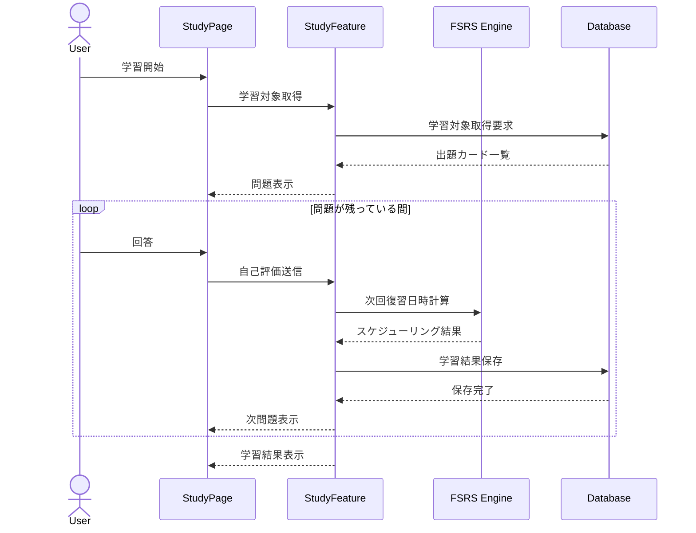

### 概要

- StudyFeatureが学習セッション全体を管理する。
- FSRS Engineは次回復習日時のみを計算する。
- Databaseは永続化のみ担当する。

---

## 18.9 オフライン同期

### シーケンス図

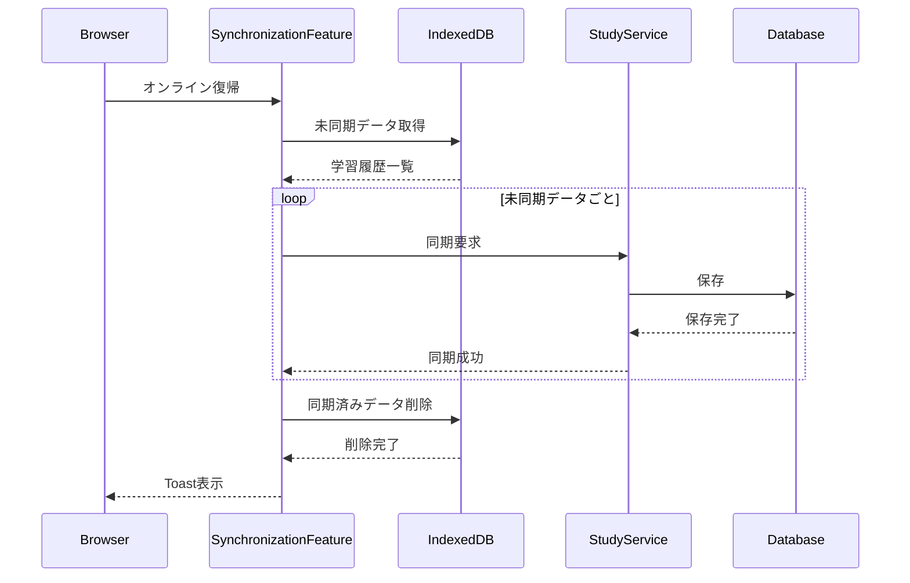

### 概要

- IndexedDBを同期キューとして利用する。
- 同期失敗時はキューを削除しない。
- 次回オンライン復帰時に再試行する。

---

## 18.10 公開デッキ複製

### シーケンス図

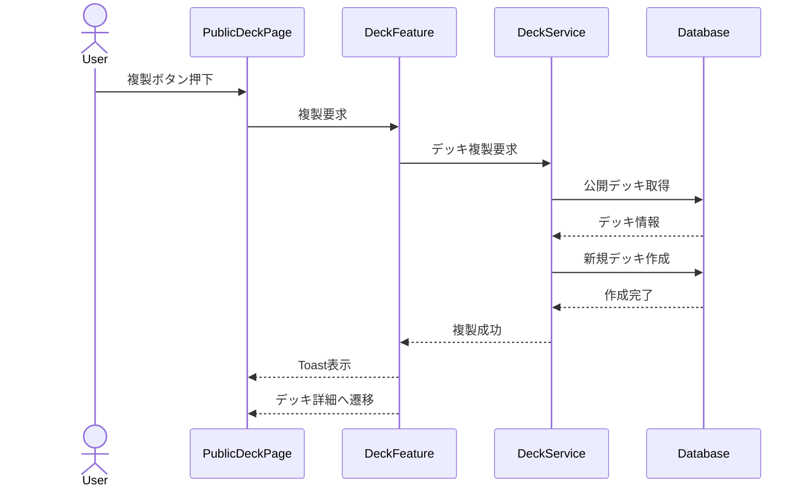

### 概要

- 公開デッキを参照元としてコピーする。
- 複製後は利用者所有の独立したデッキとなる。
- 元デッキとの同期関係は保持しない。

---

## 18.11 エラー発生

```text
Feature
 ↓
Service
 ↓
例外発生
 ↓
ErrorBoundary
 ↓
ErrorState
 ↓
利用者へ通知
```

---

## 18.12 認証失効

```text
API呼び出し
 ↓
認証失効
 ↓
Authentication
 ↓
ログアウト
 ↓
ログイン画面へ遷移
```

---

## 18.13 設計方針

### Page

- 画面構築のみ行う
- 業務ロジックを持たない

### Feature

- シーケンスの制御を行う
- 状態管理を行う

### Service

- 外部通信のみ行う

### Database

- 永続化のみ担当する

### IndexedDB

- オフライン時の一時保存および同期キューを担当する

### FSRS Engine

- 次回復習日時の計算のみ担当する
- 永続化処理は行わない

---

# 19. PWA構成図

## 19.1 目的

本章では、本システムのPWA（Progressive Web App）構成を定義する。

以下を目的とする。

- インストール可能なWebアプリを提供する
- オフライン時の学習継続を可能とする
- ネイティブアプリに近い利用体験を提供する
- 不安定な通信環境でも学習データを保護する
- 同期処理を明確化する

---

## 19.2 設計方針

### 基本原則

- PWAとしてインストール可能とする。
- オフライン状態でも学習を継続可能とする。
- 学習データはローカルへ保存する。
- オンライン復帰時に自動同期する。
- 利用者が同期状態を確認できるようにする。

---

# 19.3 全体構成

```text
┌──────────────────┐
│      User        │
└────────┬─────────┘
         │
         ▼
┌──────────────────┐
│      Browser     │
│      (PWA)       │
└────────┬─────────┘
         │
         ▼
┌──────────────────┐
│ Service Worker   │
└───────┬──────────┘
        │
        ├──────────────┐
        │              │
        ▼              ▼
┌────────────┐   ┌────────────┐
│ Cache API  │   │ IndexedDB  │
└────────────┘   └────────────┘
        │              │
        └──────┬───────┘
               │
               ▼
┌──────────────────┐
│      Server      │
└──────────────────┘
```

---

# 19.4 構成要素

## Browser

責務

- UI表示
- 画面遷移
- 入力受付
- PWA起動

---

## Service Worker

責務

- リソースキャッシュ
- オフライン判定
- バックグラウンド同期補助
- 更新通知

---

## Cache API

責務

- 静的リソース保存
- 画面表示高速化

---

## IndexedDB

責務

- 学習データ保存
- 未同期データ管理
- オフライン学習状態保持

---

## Server

責務

- 永続データ管理
- 同期処理
- 認証
- 統計処理

---

# 19.5 キャッシュ対象

## App Shell

```text
HTML
CSS
JavaScript
Fonts
Icons
Manifest
```

---

## 静的リソース

```text
Logo
Illustration
Audio Metadata
```

---

## APIレスポンス

必要最低限のみキャッシュする。

例

```text
Dashboard
Deck List
Settings
Statistics
```

---

## キャッシュしないもの

```text
認証情報
アクセストークン
個人情報
機密設定
```

---

# 19.6 オフライン対応画面

## 利用可能

```text
Dashboard
Deck List
Word List
Study
Statistics
Settings
```

---

## 制限あり

```text
Public Deck
```

公開デッキはキャッシュ済みデータのみ表示可能とする。

---

## 利用不可

```text
Authentication
```

新規ログインにはネットワーク接続を必要とする。

---

# 19.7 オフライン学習

## 学習開始

```text
User
 ↓
StudyPage
 ↓
IndexedDB
 ↓
Study Session生成
 ↓
学習開始
```

---

## 学習中

```text
回答
 ↓
FSRS計算
 ↓
IndexedDB保存
 ↓
次問題表示
```

---

## 学習終了

```text
結果生成
 ↓
IndexedDB保存
 ↓
未同期キュー登録
```

---

# 19.8 同期構成

```text
IndexedDB
      ↓
Synchronization Feature
      ↓
Server API
      ↓
Database
```

---

## 同期対象

- 学習履歴
- FSRS更新結果
- 単語状態
- 設定変更
- デッキ変更

---

# 19.9 同期状態

```text
Online
↓
Offline
↓
Pending
↓
Synchronizing
↓
Synchronized
```

---

## Online

正常通信可能。

---

## Offline

ネットワーク断。

---

## Pending

未同期データあり。

---

## Synchronizing

同期実行中。

---

## Synchronized

同期完了。

---

# 19.10 同期フロー

```text
Offline
 ↓
学習継続
 ↓
IndexedDB保存
 ↓
Online
 ↓
未同期データ取得
 ↓
Server同期
 ↓
同期完了
 ↓
キュー削除
```

---

# 19.11 同期失敗

```text
Server Error
 ↓
未同期キュー保持
 ↓
Toast通知
 ↓
再試行待機
```

---

## 再試行条件

- アプリ起動時
- オンライン復帰時
- 利用者による手動同期

---

# 19.12 更新配信

## 新バージョン検知

```text
Service Worker
 ↓
更新検知
 ↓
Toast表示
 ↓
再読み込み
 ↓
更新完了
```

---

## 表示例

```text
新しいバージョンがあります。

[更新する]
[後で]
```

---

# 19.13 インストール

## インストール条件

- HTTPS
- Manifest
- Service Worker

---

## インストール後

```text
Home Screen
 ↓
Standalone起動
 ↓
PWA利用
```

---

# 19.14 エラー時

## IndexedDB障害

```text
IndexedDB Error
 ↓
学習停止
 ↓
Error表示
 ↓
再読み込み誘導
```

---

## キャッシュ破損

```text
Cache Error
 ↓
Service Worker再登録
 ↓
再取得
```

---

# 19.15 PWA構成図

```text
PWA
├─ Manifest
├─ Service Worker
├─ Cache API
├─ IndexedDB
├─ Synchronization Feature
├─ Update Notification
└─ Offline Support
```

---

# 19.16 実装方針

### Service Worker

- 静的リソースをキャッシュする。
- 更新通知を行う。

### IndexedDB

- 学習データを保存する。
- 未同期キューを保持する。

### Synchronization Feature

- 自動同期を行う。
- 同期失敗時は再試行可能とする。

### UI

- オフライン状態を表示する。
- 同期状態を表示する。
- 更新通知を表示する。

### Security

- 機密情報をキャッシュしない。
- 認証情報をIndexedDBへ保存しない。

---

# 19. PWA設計

## 19.1 目的

本章では、本システムのPWA（Progressive Web App）としての構成およびオフライン対応方針を定義する。

以下を目的とする。

- インストール可能なWebアプリを提供する
- ネットワーク接続が不安定な環境でも学習を継続可能とする
- 学習データの消失を防止する
- サーバとローカルデータの整合性を維持する
- ネイティブアプリに近い操作性を実現する

---

## 19.2 設計方針

### 基本方針

- PWAとしてインストール可能とする。
- オフライン状態でも学習機能を利用可能とする。
- 学習データはローカルへ保存する。
- オンライン復帰時に自動同期する。
- 利用者へ同期状態を明示する。
- 静的リソースはキャッシュする。
- 機密情報はキャッシュしない。
- 同期競合時の解決方針を定義する。
- 同期対象データを未同期キューとして管理する。

---

## 19.3 全体構成

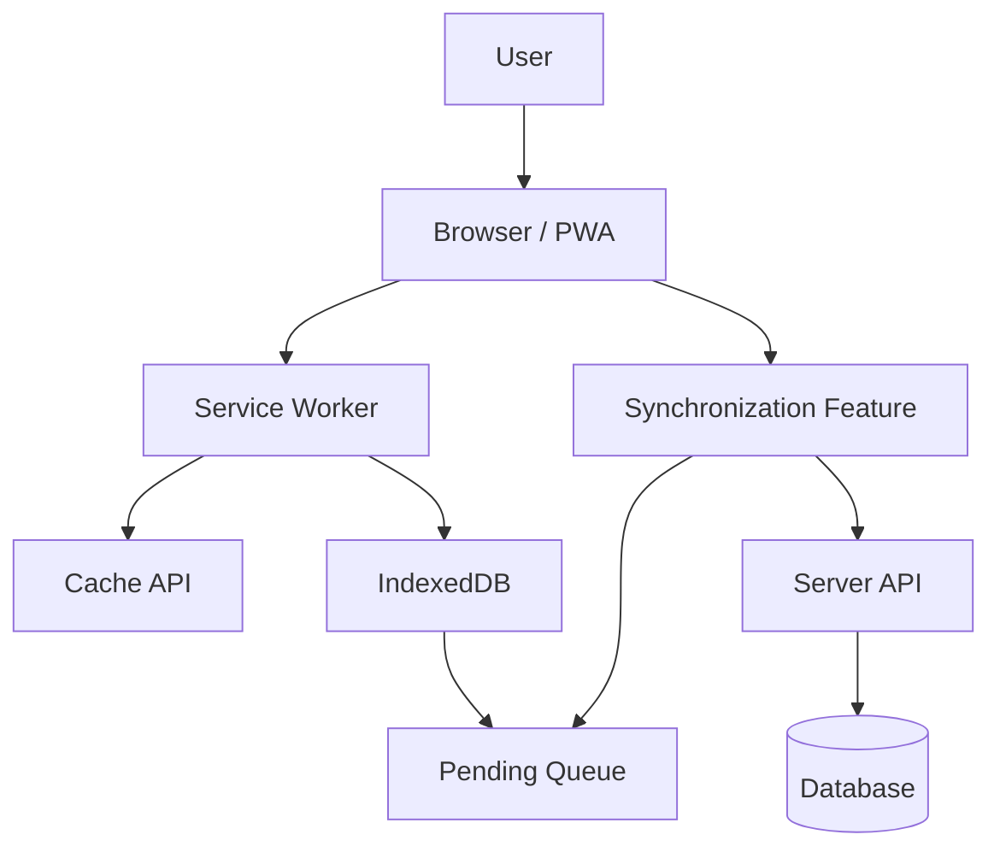

---

## 19.4 構成要素

### Browser

責務

- UI表示
- 入力受付
- ページ遷移
- PWA起動

---

### Service Worker

責務

- 静的リソースのキャッシュ
- オフライン対応
- 更新検知
- キャッシュ制御

---

### Cache API

責務

- App Shell保存
- 静的リソース保存
- 起動高速化

---

### IndexedDB

責務

- 学習データ保存
- 未同期データ管理
- オフライン学習継続
- 学習セッション一時保存

---

### Pending Queue

責務

- 未同期データ保持
- 同期順序管理
- 同期失敗時の再試行対象保持

---

### Synchronization Feature

責務

- 未同期データ取得
- 自動同期
- 手動同期
- 同期失敗時の再試行
- 同期競合解決

---

### Server API

責務

- 永続データ管理
- 認証
- 統計集計
- 公開デッキ管理

---

## 19.5 キャッシュ戦略

### Cache First

対象

```text
HTML
CSS
JavaScript
Fonts
Icons
Images
Manifest
```

目的

- 起動速度向上
- オフライン利用

---

### Network First

対象

```text
Dashboard
Deck List
Study Data
Statistics
Settings
```

目的

- 最新データ取得
- データ整合性維持

---

### Stale While Revalidate

対象

```text
Public Deck
Illustration
Metadata
```

目的

- 高速表示
- バックグラウンド更新

---

### Network Only

対象

```text
Authentication
Access Token
Logout
```

目的

- セキュリティ確保

---

## 19.6 オフライン対応範囲

### 利用可能

```text
Dashboard
Deck List
Word List
Study
Statistics
Settings
```

---

### 制限あり

```text
Public Deck
```

キャッシュ済みデータのみ利用可能とする。

---

### 利用不可

```text
Authentication
```

新規ログインにはネットワーク接続を必要とする。

---

## 19.7 オフライン学習シーケンス

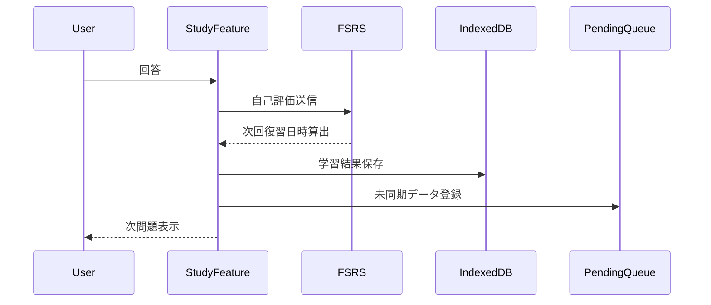

---

## 19.8 同期状態

```text
Online
↓
Offline
↓
Pending
↓
Synchronizing
↓
Synchronized
```

---

### Online

正常通信可能。

---

### Offline

ネットワーク接続不可。

---

### Pending

未同期データ保持中。

---

### Synchronizing

サーバ同期実行中。

---

### Synchronized

同期完了。

---

## 19.9 同期シーケンス

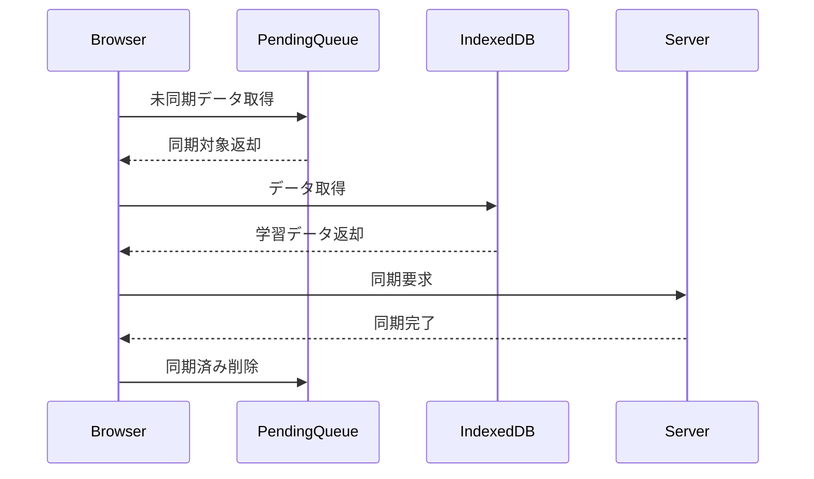

---

## 19.10 同期実行タイミング

### 自動同期

- アプリ起動時
- オンライン復帰時
- 学習終了時
- デッキ編集完了時
- 設定変更完了時

---

### 手動同期

設定画面から実行可能とする。

---

## 19.11 同期競合解決方針

### 基本方針

同一データがサーバおよびローカルの双方で更新された場合は、更新日時を用いて競合を解決する。

```text
Client Timestamp
↓
Server Timestamp
↓
最新更新データを採用
```

---

### 学習履歴

学習履歴は追記型データとして扱う。

```text
Local + Server
↓
マージ
```

---

### 設定情報

```text
最新更新日時を採用
```

---

### デッキ・単語情報

```text
最新更新日時を採用
```

---

### 削除データ

削除操作を優先する。

```text
Delete
↓
Update
```

削除済みデータに対する更新は破棄する。

---

## 19.12 未同期キュー設計

### 管理対象

```text
Pending Queue
├─ Study History
├─ FSRS Update
├─ Deck Update
├─ Word Update
└─ Settings Update
```

---

### キュー登録タイミング

- 学習終了
- FSRS更新
- デッキ更新
- 単語更新
- 設定更新

---

### キュー削除タイミング

- 同期成功
- 明示的破棄
- ログアウト

---

## 19.13 更新配信

### 更新検知

```text
新しいバージョンがあります。

[更新する]
[後で]
```

---

### 更新方針

- Service Worker更新時に通知する。
- 学習中は更新を強制しない。
- 利用者が任意のタイミングで更新できる。

---

## 19.14 インストール

### 条件

- HTTPS
- Manifest
- Service Worker

---

### インストール後

```text
Home Screen
↓
Standalone起動
↓
PWA利用開始
```

---

## 19.15 データ保持方針

### Cache API

保持対象

```text
App Shell
Images
Fonts
Icons
```

---

### IndexedDB

保持対象

```text
Deck
Word
Study Session
Study History
FSRS State
Pending Queue
Settings
```

---

### 削除タイミング

#### ログアウト

- 認証情報を削除する。
- 未同期データが存在する場合は確認を行う。

#### アプリ削除

- ブラウザ実装に従う。

---

## 19.16 障害復旧方針

### Cache破損

```text
Service Worker再登録
↓
キャッシュ削除
↓
リソース再取得
```

---

### IndexedDB障害

```text
エラー通知
↓
再読み込み
↓
復旧不能時は再ログイン案内
```

---

### 同期失敗

```text
Pending状態維持
↓
再試行待機
↓
手動同期可能
```

---

## 19.17 ブラウザサポート

### 対応ブラウザ

- Chrome
- Edge
- Safari
- Firefox

---

### 推奨環境

- 最新版
- 主要2バージョン以内

---

## 19.18 制約事項

### オフライン時

- 新規ログイン不可
- 公開デッキ検索不可
- サーバ統計更新不可

---

### ブラウザ依存

- Background Sync APIはブラウザ実装差異が存在する。
- ストレージ容量にはブラウザ制限が存在する。
- iOS Safariでは一部PWA機能に制約が存在する。

---

## 19.19 PWA構成

```text
PWA
├─ Manifest
├─ Service Worker
├─ Cache API
├─ IndexedDB
├─ Pending Queue
├─ Synchronization Feature
├─ Conflict Resolution
├─ Update Notification
├─ Offline Support
└─ Installation Support
```

---

## 19.20 実装方針

### Service Worker

- 静的リソースをキャッシュする。
- 更新通知を行う。
- キャッシュ戦略を適用する。

---

### IndexedDB

- 学習データを保存する。
- 未同期キューを保持する。

---

### Synchronization Feature

- 自動同期を行う。
- 手動同期を提供する。
- 再試行機構を持つ。
- 競合解決を行う。

---

### UI

- オフライン状態を表示する。
- 同期状態を表示する。
- 更新通知を表示する。

---

### Security

- 機密情報をキャッシュしない。
- 認証情報をIndexedDBへ保存しない。
- アクセストークンを永続保存しない。

---

## 20. 非機能設計

### 20.1 目的

本章では、本システムの非機能要件および設計方針を定義する。

以下を目的とする。

- 性能を担保する
- 可用性を確保する
- セキュリティを確保する
- 保守性を向上させる
- 拡張性を確保する

---

## 20.2 性能要件

### 初回表示

| 項目     | 目標    |
| -------- | ------- |
| 初回表示 | 3秒以内 |
| PWA起動  | 2秒以内 |
| 画面遷移 | 1秒以内 |

---

### 学習処理

| 項目     | 目標      |
| -------- | --------- |
| 問題切替 | 300ms以内 |
| 回答保存 | 500ms以内 |
| FSRS計算 | 100ms以内 |

---

### 同期処理

| 項目     | 目標    |
| -------- | ------- |
| 同期開始 | 1秒以内 |
| 同期完了 | 5秒以内 |

---

## 20.3 可用性

### オフライン利用

以下の機能を利用可能とする。

- 学習
- デッキ閲覧
- 単語閲覧
- 統計閲覧
- 設定変更

---

### 障害時

- 未同期データを保持する。
- 同期再試行を行う。
- データ消失を防止する。

---

## 20.4 信頼性

### データ保護

学習結果は以下へ保存する。

```text
IndexedDB
↓
Pending Queue
↓
Server
```

---

### 保存保証

- 学習終了時に保存する。
- オフライン時も保存する。
- 同期失敗時も保持する。

---

## 20.5 セキュリティ

### 認証

- Google認証を利用する。
- HTTPSを必須とする。

---

### 保存禁止

以下は永続保存しない。

```text
Access Token
Refresh Token
Session Cookie
```

---

### XSS対策

- 入力値をエスケープする。
- HTMLを直接描画しない。

---

### CSRF対策

- SameSite Cookieを利用する。
- 認証ライブラリの保護機構を利用する。

---

## 20.6 保守性

### 設計原則

- Feature単位で実装する。
- 共通UIを再利用する。
- 状態管理を分離する。
- 型安全を確保する。

---

## 20.7 拡張性

将来的に以下の追加を可能とする。

- AI機能
- 文法学習
- 長文読解
- ソーシャル機能
- ランキング機能

既存アーキテクチャを変更せず追加できる構成とする。

---

## 20.8 監視・ログ

### 記録対象

- 認証失敗
- 同期失敗
- IndexedDB障害
- 想定外例外

---

### 記録しないもの

- パスワード
- アクセストークン
- 学習内容の機密情報

---

## 20.9 アクセシビリティ

- キーボード操作へ対応する。
- スクリーンリーダーへ配慮する。
- WCAG AA相当を目標とする。
- モバイル操作へ配慮する。

---

## 20.10 対応環境

### ブラウザ

- Chrome
- Edge
- Safari
- Firefox

### デバイス

- Desktop
- Tablet
- Smartphone

---

## 20.11 バックアップ方針

```text
IndexedDB
↓
Server同期
↓
Database
```

データを二重化し、単一障害点によるデータ消失を防止する。

---

## 20.12 実装方針

- PWAを前提とする。
- オフラインファーストを採用する。
- 型安全を重視する。
- データ消失を防止する。
- セキュリティを優先する。

---

# 21. 用語集

## 21.1 目的

本章では、本システムで使用する用語および略語の定義を行う。

以下を目的とする。

- 用語の解釈を統一する
- 開発者間の認識差異を防止する
- 文書間の整合性を維持する
- 保守性を向上させる

---

## 21.2 システム用語

| 用語       | 説明                                                                         |
| :----------: | ---------------------------------------------------------------------------- |
| 本システム | 英単語学習プラットフォーム全体を指す。                                       |
| 利用者     | 本システムを利用するユーザーを指す。                                         |
| PWA        | Progressive Web App。Web技術で構築されたインストール可能なアプリケーション。 |
| Dashboard  | 学習状況や統計情報を表示するホーム画面。                                     |
| Feature    | 業務機能単位で分割されたアプリケーション機能。                               |
| Page       | 画面単位のコンポーネント。                                                   |
| Component  | UIを構成する部品。                                                           |
| Service    | API通信や外部サービス連携を担当する機能。                                    |
| Provider   | Contextや共通状態を提供するコンポーネント。                                  |
| Store      | アプリケーション状態を管理する機能。                                         |

---

## 21.3 学習用語

| 用語                            | 説明                               |
| :-------------------------------: | ---------------------------------- |
| デッキ（Deck）                  | 英単語をまとめる学習単位。         |
| 単語（Word）                    | 学習対象となる英単語データ。       |
| 学習セッション（Study Session） | 一連の学習処理を表す単位。         |
| 学習履歴（Study History）       | 学習結果として記録される履歴情報。 |
| 自己評価（Rating）              | 利用者が回答後に行う理解度評価。   |
| 復習（Review）                  | 既に学習した単語を再学習すること。 |
| 新規カード（New Card）          | 初めて学習する単語。               |
| 学習対象                        | 学習時に出題対象となる単語。       |
| 除外単語                        | 削除せずに出題対象から外した単語。 |

---

## 21.4 FSRS関連用語

| 用語           | 説明                                                                       |
| :--------------: | -------------------------------------------------------------------------- |
| FSRS           | Free Spaced Repetition Scheduler。忘却曲線を考慮した間隔反復アルゴリズム。 |
| Again          | 「全く覚えていない」を示す自己評価。                                       |
| Hard           | 「難しいが思い出せた」を示す自己評価。                                     |
| Good           | 「適切に思い出せた」を示す自己評価。                                       |
| Easy           | 「容易に思い出せた」を示す自己評価。                                       |
| Stability      | 記憶の保持期間を表す指標。                                                 |
| Difficulty     | 単語の難易度を表す指標。                                                   |
| Retrievability | 現時点で思い出せる確率を表す指標。                                         |
| Due Date       | 次回復習日時。                                                             |

---

## 21.5 データ関連用語

| 用語       | 説明                                                   |
| :----------: | ------------------------------------------------------ |
| Entity     | 永続化対象となるデータモデル。                         |
| DTO        | Data Transfer Object。データ受け渡し用のオブジェクト。 |
| Repository | 永続データへのアクセスを抽象化した機能。               |
| Migration  | データ構造変更のための移行処理。                       |
| Schema     | データ構造の定義。                                     |
| Metadata   | データに付随する補足情報。                             |

---

## 21.6 オフライン関連用語

| 用語                | 説明                                         |
| :-------------------: | -------------------------------------------- |
| IndexedDB           | ブラウザ上で利用可能なローカルデータベース。 |
| Cache API           | 静的リソースを保存するブラウザ機能。         |
| Pending Queue       | 未同期データを保持するキュー。               |
| Synchronization     | サーバとローカルデータを同期する処理。       |
| Conflict Resolution | 同期競合時の解決処理。                       |
| Offline             | ネットワーク接続が利用できない状態。         |
| Online              | ネットワーク接続が利用可能な状態。           |

---

## 21.7 認証・セキュリティ用語

| 用語           | 説明                                     |
| :--------------: | ---------------------------------------- |
| Authentication | 利用者本人を識別する処理。               |
| Authorization  | 利用者が実行可能な操作を制御する処理。   |
| Session        | ログイン状態を保持する仕組み。           |
| Access Token   | 認証済み利用者を識別するためのトークン。 |
| HTTPS          | 通信を暗号化するプロトコル。             |
| XSS            | 悪意あるスクリプトを実行させる攻撃。     |
| CSRF           | 利用者の意図しない操作を実行させる攻撃。 |

---

## 21.8 UI関連用語

| 用語            | 説明                                       |
| :---------------: | ------------------------------------------ |
| Modal           | 利用者の判断を求めるダイアログ。           |
| Toast           | 一時的な通知メッセージ。                   |
| Inline Message  | 入力欄付近へ表示するメッセージ。           |
| Loading Overlay | 処理中であることを示す表示。               |
| Empty State     | データが存在しない状態。                   |
| Error State     | エラーが発生した状態。                     |
| Skeleton        | データ読込中に表示するプレースホルダーUI。 |

---

## 21.9 開発技術用語

| 用語             | 説明                                                                  |
| :----------------: | --------------------------------------------------------------------- |
| React            | コンポーネントベースのUIライブラリ。                                  |
| Next.js          | Reactベースのフルスタックフレームワーク。                             |
| TypeScript       | 型システムを持つJavaScript。                                          |
| App Router       | Next.jsのファイルベースルーティング機構。                             |
| Server Component | サーバ側で描画されるReactコンポーネント。                             |
| Client Component | ブラウザ側で実行されるReactコンポーネント。                           |
| SSR              | Server Side Rendering。サーバ側でHTMLを生成する方式。                 |
| CSR              | Client Side Rendering。ブラウザ側で画面を生成する方式。               |
| API              | Application Programming Interface。機能提供のためのインターフェース。 |

---

## 21.10 略語一覧

| 略語  | 正式名称                           |
| :-----: | ---------------------------------- |
| PWA   | Progressive Web App                |
| FSRS  | Free Spaced Repetition Scheduler   |
| API   | Application Programming Interface  |
| UI    | User Interface                     |
| UX    | User Experience                    |
| DTO   | Data Transfer Object               |
| SSR   | Server Side Rendering              |
| CSR   | Client Side Rendering              |
| HTML  | HyperText Markup Language          |
| CSS   | Cascading Style Sheets             |
| HTTPS | HyperText Transfer Protocol Secure |
| XSS   | Cross-Site Scripting               |
| CSRF  | Cross-Site Request Forgery         |

---

## 21.11 文書内表記ルール

### 日本語表記

初回出現時は以下の形式とする。

```text
日本語（English）
```

例

```text
学習セッション（Study Session）
未同期キュー（Pending Queue）
```

---

### 略語表記

初回出現時は正式名称を併記する。

例

```text
Progressive Web App（PWA）
Free Spaced Repetition Scheduler（FSRS）
```

2回目以降は略語のみ使用可能とする。

---

## 21.12 設計上の前提・制約事項

本システムでは、以下の前提および制約を設ける。

- PWA対応ブラウザを前提とする。
- JavaScript有効環境を前提とする。
- IndexedDB利用可能環境を前提とする。
- Web Speech APIは環境依存である。
- Dictionary APIの仕様変更可能性を考慮する。
- AI機能は将来拡張とする。

---

# 22. 更新履歴

| 版数 | 日付    | 内容     | 担当     |
| ---- | ------- | -------- | -------- |
| 1.1 | 2026-06-22 | 設計書の改善 | 堀内悠斗 |
| 1.0  | 2026-06-22 | 初版作成 | 堀内悠斗 |
