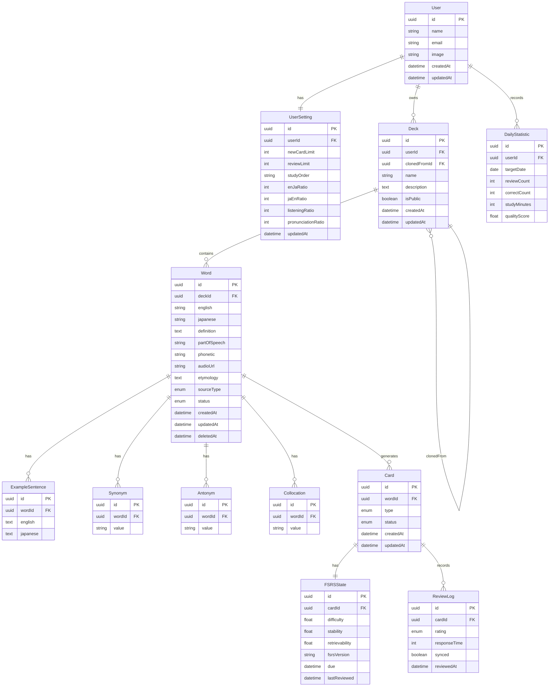

# 1. システム概要

## 1.A システム名称

<!-- FSRS English Learning Platform -->
English Learning Tool

## 1.B 開発目的

従来の英単語学習では、学習者ごとの記憶状態を考慮した復習タイミングの管理が難しく、短期間で忘却してしまうことが多い。また、英→日の一方向のみの学習では、英単語の理解や運用能力を十分に養えないという課題がある。

本システムでは、FSRS-5（Free Spaced Repetition Scheduler）アルゴリズムを採用し、忘却曲線に基づいて最適な復習タイミングを提示することで、効率的な長期記憶の形成を支援する。

さらに、英→日、日本語→英語、リスニング、発音といった複数の学習形態を統合し、単なる暗記に留まらない多面的な英語学習環境を提供する。

また、PCおよびスマートフォンの両方から利用可能なPWAとして提供し、場所や端末を問わず継続的な学習を支援する。

## 1.C 対象ユーザー

- 主利用者：開発者本人
- 将来的な一般公開を想定

## 1.D 対応端末

- PC
- スマートフォン
- タブレット

## 1.E システム構成

```text
Client (PWA)
 ├─ Next.js
 ├─ TypeScript
 ├─ Tailwind CSS
 ├─ shadcn/ui
 ├─ Service Worker
 └─ IndexedDB

Server
 ├─ Next.js Route Handler
 ├─ Auth.js
 └─ Prisma ORM

Database
 └─ MySQL

External Services
 ├─ Google OAuth
 ├─ Dictionary API
 ├─ Web Speech API
 ├─ Browser SpeechSynthesis
 └─ Optional AI API
```

---

# 2. 業務要件

## 2.A 業務内容

本システムは以下の業務を支援する。

- 英単語学習
- 発音学習
- リスニング学習
- 学習履歴管理
- 学習進捗管理
- 統計分析
- FSRSによる復習管理

### 学習業務フロー

```text
ログイン
↓
デッキ選択
↓
学習モード選択
↓
問題出題
↓
回答
↓
自己評価（Again / Hard / Good / Easy）
↓
FSRS計算
↓
統計更新
↓
学習終了
```

---

## 2.B 規模

### 利用者数

- 初期：1ユーザー
- 将来：1,000ユーザー程度

### 単語数

- 1ユーザーあたり最大5,000語

### デッキ数

- 1ユーザーあたり最大100デッキ

### 例文数

- 1単語あたり最大20件

### 学習履歴

- 全件保存

---

## 2.C 時期・時間

### 開発期間

2026年6月～2026年7月

### 学習時間

- 1回あたり5～60分程度

### 利用時間

- 24時間利用可能

---

## 2.D 管理指標

### 学習指標

- 総学習回数
- 総レビュー回数
- 学習時間
- 継続学習日数
- 正答率
- 学習品質スコア
- 単語別正答率
- デッキ別正答率

### FSRS指標

- Difficulty
- Stability
- Retrievability
- Dueカード数
- 新規カード数
- 復習カード数

---

## 2.E 対象範囲

### 対象

- 英単語学習
- 発音学習
- リスニング学習
- 学習履歴管理
- 統計分析
- FSRSスケジューリング
- オフライン学習
- デッキ共有
- デッキ複製

### 対象外

- 英会話レッスン
- 英作文添削
- リアルタイム通話
- 決済機能

※ AI機能については将来的な拡張機能として位置付ける。

---

# 3. 機能要件

## 3.A 機能一覧

### 認証機能

| ID    | 機能             |
| ----- | ---------------- |
| F-001 | Googleログイン   |
| F-002 | ログアウト       |
| F-003 | ユーザー情報管理 |

### デッキ管理機能

| ID    | 機能             |
| ----- | ---------------- |
| F-101 | デッキ作成       |
| F-102 | デッキ編集       |
| F-103 | デッキ削除       |
| F-104 | 公開・非公開設定 |
| F-105 | デッキ複製       |
| F-106 | デッキ検索       |
| F-107 | 公開デッキ閲覧   |

### 単語管理機能

| ID    | 機能                 |
| ----- | -------------------- |
| F-201 | 単語登録             |
| F-202 | 単語編集             |
| F-203 | 単語削除（論理削除） |
| F-204 | 単語除外             |
| F-205 | 単語除外解除         |
| F-206 | CSVインポート        |
| F-207 | CSVエクスポート      |
| F-208 | 辞書API取得          |
| F-209 | 例文管理             |
| F-210 | 語源管理             |
| F-211 | 類義語管理           |
| F-212 | 対義語管理           |
| F-213 | コロケーション管理   |
| F-214 | 英英定義管理         |
| F-215 | 発音情報管理         |

### 学習機能

| ID    | 機能                 |
| ----- | -------------------- |
| F-301 | 英→日学習            |
| F-302 | 日→英学習            |
| F-303 | リスニング学習       |
| F-304 | 発音学習             |
| F-305 | FSRSレビュー         |
| F-306 | 学習結果保存         |
| F-307 | 新規カード上限設定   |
| F-308 | レビュー上限設定     |
| F-309 | 学習順序設定         |
| F-310 | 学習モード配分設定   |
| F-311 | 学習セッション管理   |
| F-312 | 復習延期（Postpone） |

### 音声機能

| ID    | 機能         |
| ----- | ------------ |
| F-401 | 単語音声再生 |
| F-402 | 例文音声再生 |
| F-403 | 音声認識     |
| F-404 | 発話認識支援 |
| F-405 | 発音評価     |

### 統計機能

| ID    | 機能             |
| ----- | ---------------- |
| F-501 | 学習回数表示     |
| F-502 | 正答率表示       |
| F-503 | 継続日数表示     |
| F-504 | 学習時間表示     |
| F-505 | 単語別分析       |
| F-506 | デッキ別分析     |
| F-507 | 苦手単語分析     |
| F-508 | FSRS分析         |
| F-509 | 日次学習推移表示 |
| F-510 | 学習モード別分析 |

### オフライン機能

| ID    | 機能                 |
| ----- | -------------------- |
| F-601 | PWAインストール      |
| F-602 | オフライン学習       |
| F-603 | ローカルキャッシュ   |
| F-604 | オンライン復帰時同期 |
| F-605 | 同期競合解決         |

---

## 3.B 画面一覧

| 画面ID  | 画面名         |
| ------- | -------------- |
| SCR-001 | ログイン       |
| SCR-002 | ダッシュボード |
| SCR-003 | 学習開始       |
| SCR-004 | 英→日学習      |
| SCR-005 | 日→英学習      |
| SCR-006 | リスニング学習 |
| SCR-007 | 発音学習       |
| SCR-008 | 学習結果       |
| SCR-009 | 統計画面       |
| SCR-010 | 単語一覧       |
| SCR-011 | 単語編集       |
| SCR-012 | デッキ一覧     |
| SCR-013 | デッキ編集     |
| SCR-014 | CSVインポート  |
| SCR-015 | 設定画面       |
| SCR-016 | 公開デッキ一覧 |
| SCR-017 | 公開デッキ詳細 |
| SCR-018 | 学習履歴       |

---

## 3.C 情報・データ

### 単語情報

- 英単語
- 日本語訳
- 英英定義
- 品詞
- 発音記号
- 音声URL
- 語源
- 類義語
- 対義語
- コロケーション
- データ取得元

### 例文情報

- 英文例文
- 日本語訳
- 複数保存可能

### 学習カード

学習種別ごとに独立したカードを生成する。

```text
Word
 ├ EN_TO_JA
 ├ JA_TO_EN
 ├ LISTENING
 └ PRONUNCIATION
```

### FSRS状態

- Difficulty
- Stability
- Retrievability
- Due
- Last Reviewed
- FSRS Version

# 4. データ要件

## 4.A エンティティ一覧

| エンティティ    | 説明           |
| --------------- | -------------- |
| User            | 利用者情報     |
| UserSetting     | 学習設定情報   |
| Deck            | 単語帳         |
| Word            | 英単語情報     |
| ExampleSentence | 例文情報       |
| Synonym         | 類義語         |
| Antonym         | 対義語         |
| Collocation     | コロケーション |
| Card            | 学習カード     |
| FSRSState       | FSRS状態       |
| ReviewLog       | 学習履歴       |
| DailyStatistic  | 日次統計情報   |

---

## 4.B データモデル方針

### ユーザー

- 1ユーザーは複数のデッキを所有できる。
- 1ユーザーは1つの学習設定を持つ。
- 1ユーザーは複数の日次統計情報を持つ。

### デッキ

- デッキは公開または非公開を設定できる。
- 公開デッキは他ユーザーが閲覧および複製できる。
- 公開デッキの編集は所有者のみ可能とする。
- 1デッキは複数の単語を保持できる。
- デッキは複製元デッキIDを保持できる。

### 単語

- 単語は1つのデッキに所属する。
- 単語は複数の例文を保持できる。
- 単語は複数の類義語・対義語・コロケーションを保持できる。
- 単語ごとに学習種別別のカードを生成する。
- 単語は状態（Status）を持つ。
- 単語はデータ取得元（SourceType）を保持する。
- 除外された単語は出題対象から除外するが、学習履歴およびFSRS状態は保持する。
- 削除された単語は論理削除として扱い、既定では表示しない。

### 学習カード

1つの単語につき、以下の4種類のカードを生成する。

```text
Word
 ├ EN_TO_JA
 ├ JA_TO_EN
 ├ LISTENING
 └ PRONUNCIATION
```

- 各カードは独立したFSRS状態を持つ。
- 各カードは状態（Status）を持つ。
- 特定の学習モードのみを停止できる。

### FSRS状態

- 各カードは独立したFSRS状態を持つ。
- 将来的なFSRSアルゴリズム更新に備え、FSRSのバージョン情報を保持する。

### 学習履歴

- レビュー結果を全件保存する。
- オフライン学習時の同期状態を保持する。
- 統計分析に利用する。

### 日次統計

- ユーザーごとの日単位の集計データを保持する。
- ダッシュボードおよび統計画面の高速化を目的とする。

---

## 4.C ER図



---

## 4.D 状態定義

### WordStatus

| 状態     | 説明       |
| -------- | ---------- |
| ACTIVE   | 学習対象   |
| EXCLUDED | 学習対象外 |
| DELETED  | 論理削除   |

#### ACTIVE

- 通常の学習対象。
- FSRSレビューの対象となる。

#### EXCLUDED

- 出題対象から除外する。
- 学習履歴・FSRS状態は保持する。
- 後から復帰可能とする。

#### DELETED

- 論理削除状態。
- 通常画面には表示しない。
- 管理画面から復元可能とする。

---

### CardStatus

| 状態      | 説明     |
| --------- | -------- |
| ACTIVE    | 学習対象 |
| SUSPENDED | 一時停止 |
| DELETED   | 論理削除 |

#### ACTIVE

- 通常の学習対象。

#### SUSPENDED

- 特定学習モードのみ停止する。
- FSRS状態は保持する。

#### DELETED

- 論理削除。
- 通常の学習対象から除外する。

---

### SourceType

| 状態           | 説明          |
| -------------- | ------------- |
| MANUAL         | 手動入力      |
| CSV            | CSVインポート |
| DICTIONARY_API | 辞書API取得   |
| AI             | AI生成        |

---

### CardType

| 状態          | 説明       |
| ------------- | ---------- |
| EN_TO_JA      | 英→日      |
| JA_TO_EN      | 日→英      |
| LISTENING     | リスニング |
| PRONUNCIATION | 発音       |

---

### Rating

| 状態  | 説明             |
| ----- | ---------------- |
| AGAIN | 思い出せなかった |
| HARD  | 思い出せたが困難 |
| GOOD  | 思い出せた       |
| EASY  | 容易に思い出せた |

---

## 4.E 学習設定

### FSRSレーティング

| 評価  | 意味                   |
| ----- | ---------------------- |
| Again | 思い出せなかった       |
| Hard  | 思い出せたが困難だった |
| Good  | 思い出せた             |
| Easy  | 容易に思い出せた       |

### 正答率

| 評価  | 得点 |
| ----- | ---- |
| Again | 0    |
| Hard  | 1    |
| Good  | 1    |
| Easy  | 1    |

```text
正答率 =
想起成功回数 / 総レビュー回数 × 100
```

### 学習品質スコア

| 評価  | 得点 |
| ----- | ---- |
| Again | 0.0  |
| Hard  | 0.5  |
| Good  | 1.0  |
| Easy  | 1.0  |

```text
学習品質スコア =
獲得得点の合計 / 総レビュー回数 × 100
```

### 学習量設定

利用者は以下を設定できる。

- 1日の新規カード上限
- 1日のレビュー上限
- 学習順序
- 学習モードごとの上限値
- 学習モードごとの配分比率

#### 初期値

```text
新規カード上限：20枚/日
レビュー上限：100件/日
学習順序：Review → Learning → New

英→日：40%
日→英：30%
リスニング：20%
発音：10%
```

学習対象が不足する場合、余剰枠は他の学習モードへ自動再配分する。

---

## 4.F データ削除ポリシー

### デッキ削除

以下のデータをカスケード削除する。

- 単語
- 例文
- 類義語
- 対義語
- コロケーション
- 学習カード
- FSRS状態
- 学習履歴

### 単語削除

以下のデータをカスケード削除する。

- 例文
- 類義語
- 対義語
- コロケーション
- 学習カード
- FSRS状態
- 学習履歴

ただし、アプリケーション上では論理削除を基本とし、一定期間後に物理削除を実施できるものとする。

---

## 4.G オフライン同期ポリシー

- ReviewLogはIndexedDBへ一時保存する。
- ネットワーク復帰時にサーバへ同期する。
- 同一データが既に存在する場合はReviewLogのUUIDを基準として重複登録を防止する。
- 同期失敗時は再送キューへ格納する。
- 同期状態は `synced` フラグで管理する。

---

# 5. 非機能要件

## 5.A ユーザビリティ及びアクセシビリティ

### ユーザビリティ

- PC・スマートフォン・タブレットで利用可能とする。
- 学習開始まで3クリック以内を目標とする。
- 主要操作はキーボードのみでも実施可能とする。
- 単語検索およびデッキ切替を容易に行えるUIとする。
- 学習中は可能な限り操作を単純化し、学習フローを中断させない。

### アクセシビリティ

- レスポンシブデザインに対応する。
- ダークモードに対応する。
- 音声再生機能を提供する。
- 十分なコントラスト比を確保する。
- フォントサイズ変更時にもレイアウトが破綻しないこと。
- スクリーンリーダーで主要機能が利用可能であることを目標とする。

---

## 5.B システム方式

### フロントエンド

- Next.js
- TypeScript
- Tailwind CSS
- shadcn/ui
- PWA
- IndexedDB

### バックエンド

- Next.js Route Handler
- Auth.js
- Prisma ORM

### データベース

- MySQL 8以上

### ホスティング

- Vercel

### 外部サービス

- Google OAuth
- Dictionary API
- Browser SpeechSynthesis
- Web Speech API

---

## 5.C 規模

### 利用者数

- 初期：1ユーザー
- 将来：1,000ユーザー程度

### 単語数

- 1ユーザーあたり最大5,000語

### デッキ数

- 1ユーザーあたり最大100デッキ

### 例文数

- 1単語あたり最大20件

### 学習履歴

- 全件保存

---

## 5.D 性能

| 項目 | 目標 |
|------|------|
| 初回画面表示 | 3秒以内 |
| 画面遷移 | 1秒以内 |
| 単語検索 | 1秒以内 |
| 学習カード表示 | 1秒以内 |
| レビュー保存 | 1秒以内 |
| オフライン復帰時同期 | 30秒以内 |

### 同時利用者数

- 初期：1ユーザー
- 将来：100ユーザー程度の同時利用を想定する。

---

## 5.E 信頼性

- 学習履歴を永続保存する。
- FSRS状態を永続保存する。
- 自動バックアップを実施する。
- オフライン時はIndexedDBへ保存する。
- オンライン復帰時に自動同期を行う。
- 同期失敗時は再試行キューへ登録する。
- 同期競合が発生した場合はサーバ側データを優先し、必要に応じてユーザーへ通知する。

### 可用性目標

- 稼働率99%以上

---

## 5.F 拡張性

将来的に以下の機能を追加可能な設計とする。

### 学習機能

- 熟語学習
- 英文法学習
- 英作文学習
- 長文読解学習

### AI機能

- AI例文生成
- AI学習アドバイス
- AIによる苦手分析
- AIによる学習計画提案

### ソーシャル機能

- 公開デッキ共有
- 学習ランキング
- 学習進捗共有
- デッキ共同編集

### 分析機能

- 詳細統計ダッシュボード
- 学習データエクスポート
- 学習傾向分析
- 機械学習による復習最適化

---

## 5.G 互換性

### 対応ブラウザ

- Google Chrome（最新版）
- Microsoft Edge（最新版）
- Safari（最新版）

### 対応OS

- Windows
- macOS
- Android
- iOS

### PWA要件

- インストール可能
- オフライン起動可能
- ホーム画面追加可能
- バックグラウンド同期対応

---

## 5.H 継続性

- 稼働率99%以上を目標とする。
- オフライン学習に対応する。
- オンライン復帰時に自動同期を行う。
- ブラウザを閉じても学習状態を保持する。
- 障害発生時に学習履歴を失わないことを目標とする。

---

# 6. セキュリティ要件

## 6.A 情報セキュリティ

### 認証

- Google OAuth認証を採用する。
- Auth.jsによるセッション管理を行う。

### 認可

- 公開デッキは閲覧可能とする。
- 非公開デッキは所有者のみ閲覧可能とする。
- 編集操作は所有者のみ可能とする。
- APIアクセス時に認可チェックを実施する。

### 通信

- HTTPSを必須とする。
- CookieにはSecure属性を付与する。
- CookieにはHttpOnly属性を付与する。

### 攻撃対策

- SQL Injection対策（Prisma）
- XSS対策（React）
- CSRF対策（Auth.js）
- Rate Limit対策
- 入力値バリデーション
- ファイルアップロード検証

### 個人情報保護

保存する個人情報は以下に限定する。

- ユーザー名
- メールアドレス
- アイコン画像

パスワードは保存しない。

---

## 6.B 稼働環境

### クライアント

- Windows
- macOS
- Android
- iOS

### サーバ

- Node.js LTS
- MySQL 8以上

### 推奨ブラウザ

- Google Chrome
- Microsoft Edge
- Safari

---

## 6.C テスト

### 単体テスト

- FSRS計算
- 単語CRUD
- デッキCRUD
- 学習設定

### 結合テスト

- 認証
- 学習
- 単語管理
- FSRS更新
- 同期処理

### セキュリティテスト

- 認可テスト
- XSSテスト
- CSRFテスト
- 入力検証テスト

### オフラインテスト

- オフライン学習
- 同期テスト
- 同期競合テスト

### 受入テスト

- 学習フロー
- 統計表示
- デッキ共有
- PWAインストール

---

# 7. 移行要件

本システムは新規開発システムであるため、既存システムからの移行は行わない。

## 単語登録方法

- CSVインポート
- 辞書API取得
- 手動登録

## CSV取込要件

最低限、以下の項目を取り込めるものとする。

- 英単語
- 日本語訳
- 英英定義
- 品詞
- 発音記号
- 語源
- 類義語
- 対義語
- コロケーション
- 例文

不足項目については手動補完可能とする。

---

# 8. 運用要件

## バックアップ

- 1日1回実施
- データベースバックアップを取得する。
- 障害発生時に復元可能であること。

## ログ管理

以下のログを保存する。

### 学習ログ

- 学習開始
- 学習終了
- レビュー結果
- 学習時間

### システムログ

- エラーログ
- 認証ログ
- 同期ログ

### 保持期間

- 学習ログ：無期限
- システムログ：90日

## 保守

- ライブラリアップデート
- セキュリティアップデート
- バグ修正
- 機能追加
- データベースメンテナンス

---

# 9. 更新履歴

| 版数 | 日付 | 内容 | 担当 |
|------|------|------|------|
| 0.1 | 2026-06-22 | 要件整理開始 | 堀内悠斗 |
| 0.5 | 2026-06-22 | データモデル追加 | 堀内悠斗 |
| 1.0 | 2026-06-12 | 初版作成 | 堀内悠斗 |

---

# 付録A 用語集

| 用語 | 定義 |
|------|------|
| FSRS | Free Spaced Repetition Scheduler |
| Deck | 単語帳 |
| Card | 学習カード |
| Review | 復習 |
| Due | 次回復習日時 |
| Difficulty | 記憶難易度 |
| Stability | 記憶安定度 |
| Retrievability | 想起可能性 |
| PWA | Progressive Web Application |
| IndexedDB | ブラウザ内データベース |
| OAuth | 外部認証プロトコル |

---

# 付録B 将来検討事項

## 優先度：高

- 公開デッキ共有
- 熟語学習
- AI苦手分析

## 優先度：中

- AI例文生成
- 学習ランキング
- 学習計画提案

## 優先度：低

- デッキ共同編集
- ソーシャル機能
- 機械学習による復習最適化