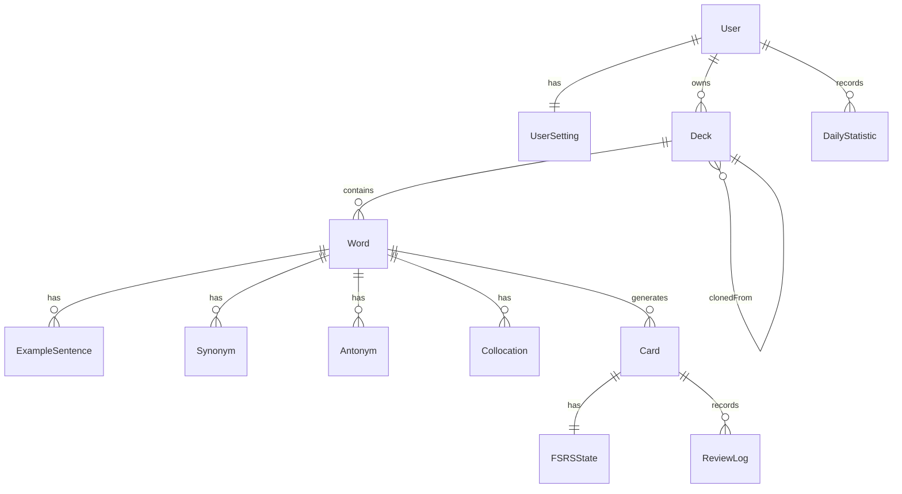

# 1. ER図



---

# 2. テーブル定義

## 2.A User

| カラム    | 型       | 制約     |
| --------- | -------- | -------- |
| id        | UUID     | PK       |
| name      | VARCHAR  | NOT NULL |
| email     | VARCHAR  | UNIQUE   |
| image     | VARCHAR  | NULL     |
| createdAt | DATETIME | NOT NULL |
| updatedAt | DATETIME | NOT NULL |

---

## 2.B UserSetting

| カラム             | 型       | 制約     |
| ------------------ | -------- | -------- |
| id                 | UUID     | PK       |
| userId             | UUID     | FK       |
| newCardLimit       | INT      | NOT NULL |
| reviewLimit        | INT      | NOT NULL |
| studyOrder         | VARCHAR  | NOT NULL |
| enJaRatio          | INT      | NOT NULL |
| jaEnRatio          | INT      | NOT NULL |
| listeningRatio     | INT      | NOT NULL |
| pronunciationRatio | INT      | NOT NULL |
| updatedAt          | DATETIME | NOT NULL |

---

## 2.C Deck

| カラム       | 型       | 制約     |
| ------------ | -------- | -------- |
| id           | UUID     | PK       |
| userId       | UUID     | FK       |
| clonedFromId | UUID     | FK NULL  |
| name         | VARCHAR  | NOT NULL |
| description  | TEXT     | NULL     |
| isPublic     | BOOLEAN  | NOT NULL |
| createdAt    | DATETIME | NOT NULL |
| updatedAt    | DATETIME | NOT NULL |

---

## 2.D Word

| カラム       | 型       | 制約     |
| ------------ | -------- | -------- |
| id           | UUID     | PK       |
| deckId       | UUID     | FK       |
| english      | VARCHAR  | NOT NULL |
| japanese     | TEXT     | NOT NULL |
| definition   | TEXT     | NULL     |
| partOfSpeech | VARCHAR  | NULL     |
| phonetic     | VARCHAR  | NULL     |
| audioUrl     | VARCHAR  | NULL     |
| etymology    | TEXT     | NULL     |
| sourceType   | ENUM     | NOT NULL |
| status       | ENUM     | NOT NULL |
| createdAt    | DATETIME | NOT NULL |
| updatedAt    | DATETIME | NOT NULL |
| deletedAt    | DATETIME | NULL     |

---

## 2.E ExampleSentence

| カラム   | 型   | 制約     |
| -------- | ---- | -------- |
| id       | UUID | PK       |
| wordId   | UUID | FK       |
| english  | TEXT | NOT NULL |
| japanese | TEXT | NOT NULL |

---

## 2.F Synonym

| カラム | 型      | 制約     |
| ------ | ------- | -------- |
| id     | UUID    | PK       |
| wordId | UUID    | FK       |
| value  | VARCHAR | NOT NULL |

---

## 2.G Antonym

| カラム | 型      | 制約     |
| ------ | ------- | -------- |
| id     | UUID    | PK       |
| wordId | UUID    | FK       |
| value  | VARCHAR | NOT NULL |

---

## 2.H Collocation

| カラム | 型      | 制約     |
| ------ | ------- | -------- |
| id     | UUID    | PK       |
| wordId | UUID    | FK       |
| value  | VARCHAR | NOT NULL |

---

## 2.I Card

| カラム    | 型       | 制約     |
| --------- | -------- | -------- |
| id        | UUID     | PK       |
| wordId    | UUID     | FK       |
| type      | ENUM     | NOT NULL |
| status    | ENUM     | NOT NULL |
| createdAt | DATETIME | NOT NULL |
| updatedAt | DATETIME | NOT NULL |

---

## 2.J FSRSState

| カラム         | 型       | 制約     |
| -------------- | -------- | -------- |
| id             | UUID     | PK       |
| cardId         | UUID     | FK       |
| difficulty     | FLOAT    | NOT NULL |
| stability      | FLOAT    | NOT NULL |
| retrievability | FLOAT    | NOT NULL |
| fsrsVersion    | VARCHAR  | NOT NULL |
| due            | DATETIME | NOT NULL |
| lastReviewed   | DATETIME | NULL     |

---

## 2.K ReviewLog

| カラム       | 型       | 制約     |
| ------------ | -------- | -------- |
| id           | UUID     | PK       |
| cardId       | UUID     | FK       |
| rating       | ENUM     | NOT NULL |
| responseTime | INT      | NOT NULL |
| synced       | BOOLEAN  | NOT NULL |
| reviewedAt   | DATETIME | NOT NULL |

---

## 2.L DailyStatistic

| カラム       | 型    | 制約     |
| ------------ | ----- | -------- |
| id           | UUID  | PK       |
| userId       | UUID  | FK       |
| targetDate   | DATE  | NOT NULL |
| reviewCount  | INT   | NOT NULL |
| correctCount | INT   | NOT NULL |
| studyMinutes | INT   | NOT NULL |
| qualityScore | FLOAT | NOT NULL |

---

# 3. 列挙型定義

## 3.A WordStatus

```text id="oh5mry"
ACTIVE
EXCLUDED
DELETED
```

---

## 3.B CardStatus

```text id="6pv29t"
ACTIVE
SUSPENDED
DELETED
```

---

## 3.C SourceType

```text id="cqukvf"
MANUAL
CSV
DICTIONARY_API
AI
```

---

## 3.D CardType

```text id="v3twq5"
EN_TO_JA
JA_TO_EN
LISTENING
PRONUNCIATION
```

---

## 3.E Rating

```text id="2kcc4z"
AGAIN
HARD
GOOD
EASY
```

---

# 4. 学習カード生成仕様

1つの単語につき以下のカードを生成する。

```text id="3eim1a"
Word
 ├ EN_TO_JA
 ├ JA_TO_EN
 ├ LISTENING
 └ PRONUNCIATION
```

各カードは独立したFSRS状態を保持する。

---

# 5. FSRS仕様

## 保持情報

* Difficulty
* Stability
* Retrievability
* Due
* Last Reviewed
* FSRS Version

---

## レーティング

| 評価  | 意味             |
| ----- | ---------------- |
| Again | 思い出せなかった |
| Hard  | 思い出せたが困難 |
| Good  | 思い出せた       |
| Easy  | 容易に思い出せた |

---

# 6. 統計算出仕様

## 正答率

| 評価  | 得点 |
| ----- | ---- |
| Again | 0    |
| Hard  | 1    |
| Good  | 1    |
| Easy  | 1    |

```text id="0h59lf"
正答率 =
想起成功回数 /
総レビュー回数 × 100
```

---

## 学習品質スコア

| 評価  | 得点 |
| ----- | ---- |
| Again | 0.0  |
| Hard  | 0.5  |
| Good  | 1.0  |
| Easy  | 1.0  |

```text id="st3vut"
学習品質スコア =
獲得得点の合計 /
総レビュー回数 × 100
```

---

# 7. 初期設定値

```text id="f7r8u2"
新規カード上限：20枚/日
レビュー上限：100件/日

学習順序：
Review → Learning → New

英→日：40%
日→英：30%
リスニング：20%
発音：10%
```

---

# 8. オフライン同期アルゴリズム

```text id="x9a4v8"
ReviewLog保存
↓
IndexedDB格納
↓
オンライン復帰
↓
UUID重複確認
↓
サーバ送信
↓
synced=true
```

---

# 9. API仕様

## 認証API

```text id="ypn1gx"
GET  /api/auth/*
```

---

## デッキAPI

```text id="kr8eio"
GET    /api/decks
POST   /api/decks
GET    /api/decks/:id
PATCH  /api/decks/:id
DELETE /api/decks/:id
```

---

## 単語API

```text id="kzq7e8"
GET    /api/words
POST   /api/words
GET    /api/words/:id
PATCH  /api/words/:id
DELETE /api/words/:id
```

---

## 学習API

```text id="i3m0pn"
POST /api/reviews
GET  /api/study/session
```

---

## 統計API

```text id="nwv4kg"
GET /api/statistics
GET /api/statistics/daily
GET /api/statistics/deck
GET /api/statistics/word
```

---

## 同期API

```text id="e65ljm"
POST /api/sync/review-logs
POST /api/sync/statistics
```

---

# 10. 更新履歴

| 版数 | 日付    | 内容     | 担当     |
| ---- | ------- | -------- | -------- |
| 1.0  | 2026-06 | 初版作成 | 堀内悠斗 |
